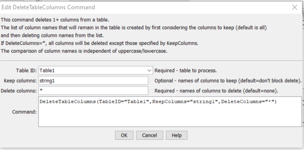

# TSTool / Command / DeleteTableColumns #

*   [Overview](#overview)
*   [Command Editor](#command-editor)
*   [Command Syntax](#command-syntax)
*   [Examples](#examples)
*   [Troubleshooting](#troubleshooting)
*   [See Also](#see-also)

-------------------------

## Overview ##

The `DeleteTableColumns` deletes specified columns from a table.
The list of column names to delete is is determined from the `DeleteColumns` parameter,
except that any columns specified by the `KeepColumns` are not deleted.

## Command Editor ##

The command is available in the following TSTool menu:

*   ***Commands(Table) / Manipulate Table Values***

The following dialog is used to edit the command and illustrates the syntax of the command.

**<p style="text-align: center;">

</p>**

**<p style="text-align: center;">
`DeleteTableColumns` Command Editor (<a href="../DeleteTableColumns.png">see also the full-size image</a>)
</p>**

## Command Syntax ##

The command syntax is as follows:

```text
DeleteTableColumns(Parameter="Value",...)
```
**<p style="text-align: center;">
Command Parameters
</p>**

| **Parameter**&nbsp;&nbsp;&nbsp;&nbsp;&nbsp;&nbsp;&nbsp;&nbsp;&nbsp;&nbsp;&nbsp;&nbsp;&nbsp;&nbsp;&nbsp;&nbsp;&nbsp;&nbsp;&nbsp;&nbsp;&nbsp;&nbsp;&nbsp;&nbsp;&nbsp;&nbsp; | **Description** | **Default**&nbsp;&nbsp;&nbsp;&nbsp;&nbsp;&nbsp;&nbsp;&nbsp;&nbsp;&nbsp; |
| --------------|-----------------|----------------- |
|`TableID`<br>**required**|The table identifier for the table to process. Can specify with `${Property}`.|None - must be specified.|
|`KeepColumns`<br>**required**|The names of columns to keep, separated by commas. Can use `${Property}` to specify column names.  Each column name can also contain `*` wildcard.|None - must be specified.|
|`DeleteColumns`<br>**required**|The names of columns to delete, separated by commas. Can use `${Property}` to specify column names.  Each column name can also contain `*` wildcard.|None - must be specified.|

## Examples ##

See the [automated tests](https://github.com/OpenCDSS/cdss-app-tstool-test/tree/master/test/commands/DeleteTableColumns).

A simple comma-separated-value data as follows can be read with [`ReadTableFromDelimitedFile`](../ReadTableFromDelimitedFile/ReadTableFromDelimitedFile.md):

```
# Simple table for testing
"string1","double1","integer1"
"String1",1.0,1
"String2",2.0,2
"String3",3.0,3
```

The command file to read the above file and remove the first and last two columns is as follows:

```
ReadTableFromDelimitedFile(TableID="Table1",InputFile="testtable.csv")
DeleteTableColumns(TableID="Table1",DeleteColumns="double1,integer1")

```

## Troubleshooting ##

## See Also ##

*   [`DeleteTableRows`](../DeleteTableRows/DeleteTableRows.md) command
*   [`ReadTableFromDelimitedFile`](../ReadTableFromDelimitedFile/ReadTableFromDelimitedFile.md) command
*   [`RenameTableColumns`](../RenameTableColumns/RenameTableColumns.md) command
