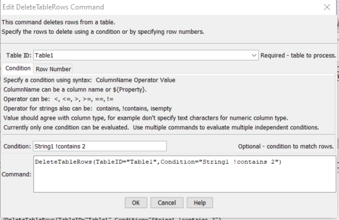
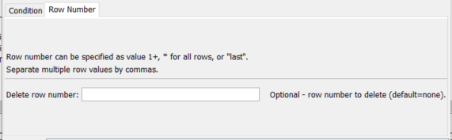
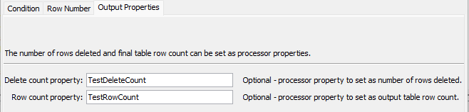

# TSTool / Command / DeleteTableRows #

*   [Overview](#overview)
*   [Command Editor](#command-editor)
*   [Command Syntax](#command-syntax)
*   [Examples](#examples)
*   [Troubleshooting](#troubleshooting)
*   [See Also](#see-also)

-------------------------

## Overview ##

The `DeleteTableRows` command deletes specified rows from a table using one of the following approaches:

*   ***Condition:***
    +   delete rows where a column value matches a condition
*   ***Row Number:***
    +   delete specific row numbers
    +   delete all rows
    +   delete first N or last N rows, useful when used with the
        [`SortTable`](../SortTable/SortTable.md) command
        to process the first or last item(s) in a table

Because the deletion is a destructive action,
only one of the above conditions is required to be specified.
The number of rows deleted and the table row count after the delete can be set as processor
properties so that the delete can be checked.

## Command Editor ##

The command is available in the following TSTool menu:

*   ***Commands(Table) / Manipulate Table Values***

The following dialog is used to edit the command and illustrates the syntax of the command.

**<p style="text-align: center;">

</p>**

**<p style="text-align: center;">
`DeleteTableRows` Command Editor for Condition Parameter (<a href="../DeleteTableRows_Condition.png">see full-size image</a>)
</p>**

**<p style="text-align: center;">

</p>**

**<p style="text-align: center;">
`DeleteTableRows` Command Editor for Row Number Parameters (<a href="../DeleteTableRows_RowNum.png">see full-size image</a>)
</p>**

**<p style="text-align: center;">

</p>**

**<p style="text-align: center;">
`DeleteTableRows` Command Editor for Output Properties Parameters (<a href="../DeleteTableRows_OutputProperties.png">see full-size image</a>)
</p>**

## Command Syntax ##

The command syntax is as follows:

```text
DeleteTableRows(Parameter="Value",...)
```
**<p style="text-align: center;">
Command Parameters
</p>**

| **Tab** | **Parameter**&nbsp;&nbsp;&nbsp;&nbsp;&nbsp;&nbsp;&nbsp;&nbsp;&nbsp;&nbsp;&nbsp;&nbsp;&nbsp;&nbsp;&nbsp;&nbsp;&nbsp;&nbsp;&nbsp;&nbsp;&nbsp;&nbsp;&nbsp;&nbsp;&nbsp;&nbsp; | **Description** | **Default**&nbsp;&nbsp;&nbsp;&nbsp;&nbsp;&nbsp;&nbsp;&nbsp;&nbsp;&nbsp; |
| --------|------|-----------------|----------------- |
| ***All*** | `TableID`<br>**required**|The table identifier for the table to process. Can specify with `${Property}`.|None - must be specified.|
| ***Condition*** | `Condition`|A condition to match rows to be deleted. Can use `${Property}` to specify row number.  See additional information in the [Tables appendix](../../appendix-tables/tables.md#condition-evaluation-for-rows).||
| ***Row Number*** |`DeleteRowNumbers`|The row number(s) to delete:<ul><li>comma-separated list of row numbers (1+)</li><li>`last` to delete the last row</li><li>`*` to delete all rows.</li></ul><br> Can use `${Property}`.||
| | `First` | <ul><li>If a number `N` is specified, the first `N` rows will be deleted.</li><li>If a number `-N` is specified, all rows except the first `N` will be deleted.</li></ul> | |
| | `Last` | <ul><li>If a number `N` is specified, the last `N` rows will be deleted.</li><li>If a number `-N` is specified, all rows except the last `N` will be deleted.</li></ul> | |
| ***Output Properties*** | `DeleteCountProperty` | The name of a property to set to the number of rows deleted. | |
| | `RowCountProperty` | The name of a property to set to the number of table rows after the delete. | |

## Examples ##

See the [automated tests](https://github.com/OpenCDSS/cdss-app-tstool-test/tree/master/test/commands/DeleteTableRows).

A simple comma-separated-value data as follows can be read with [`ReadTableFromDelimitedFile`](../ReadTableFromDelimitedFile/ReadTableFromDelimitedFile.md):

```
# Simple table for testing
"string1","double1","integer1"
"String1",1.0,1
"String2",2.0,2
"String3",3.0,3
```

The command file to read the above file and remove the first and last rows is as follows:

```
ReadTableFromDelimitedFile(TableID="Table1",InputFile="testtable.csv")
DeleteTableRows(TableID="Table1",DeleteRowNumbers="1")
DeleteTableRows(TableID="Table1",DeleteRowNumbers="last")
```

## Troubleshooting ##

See the main [TSTool Troubleshooting](../../troubleshooting/troubleshooting.md) documentation.

## See Also ##

*   [`DeleteTableColumns`](../DeleteTableColumns/DeleteTableColumns.md) command
*   [`ReadTableFromDelimitedFile`](../ReadTableFromDelimitedFile/ReadTableFromDelimitedFile.md) command
*   [`SortTable`](../SortTable/SortTable.md) command
