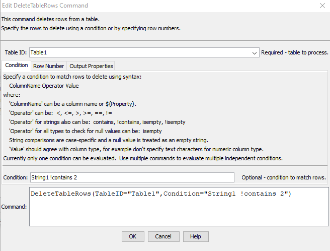

# TSTool / Command / DeleteTableRows #

* [Overview](#overview)
* [Command Editor](#command-editor)
* [Command Syntax](#command-syntax)
* [Examples](#examples)
* [Troubleshooting](#troubleshooting)
* [See Also](#see-also)

-------------------------

## Overview ##

The `DeleteTableRows` command deletes specified rows from a table using one of the following approaches:

* ***Condition***
	+ delete rows where a column value matches a condition
* ***Row Number***
	+ delete specific row numbers
	+ delete all rows

Because the deletion is a destructive action,
one of the above conditions is required to be specified.

## Command Editor ##

The following dialog is used to edit the command and illustrates the syntax of the command.

**<p style="text-align: center;">

</p>**

**<p style="text-align: center;">
`DeleteTableRows` Command Editor for Condition Parameter (<a href="../DeleteTableRows_Condition.png">see also the full-size image</a>)
</p>**

**<p style="text-align: center;">

</p>**

**<p style="text-align: center;">
`DeleteTableRows` Command Editor for Row Number Parameter (<a href="../DeleteTableRows_RowNum.png">see also the full-size image</a>)
</p>**

## Command Syntax ##

The command syntax is as follows:

```text
DeleteTableRows(Parameter="Value",...)
```
**<p style="text-align: center;">
Command Parameters
</p>**

| **Parameter**&nbsp;&nbsp;&nbsp;&nbsp;&nbsp;&nbsp;&nbsp;&nbsp;&nbsp;&nbsp;&nbsp;&nbsp;&nbsp;&nbsp;&nbsp;&nbsp;&nbsp;&nbsp;&nbsp;&nbsp;&nbsp;&nbsp;&nbsp;&nbsp;&nbsp;&nbsp; | **Description** | **Default**&nbsp;&nbsp;&nbsp;&nbsp;&nbsp;&nbsp;&nbsp;&nbsp;&nbsp;&nbsp; |
| --------------|-----------------|----------------- |
|`TableID`<br>**required**|The table identifier for the table to process. Can specify with `${Property}`.|None - must be specified.|
|`Condition`|A condition to match rows to be deleted. Can use `${Property}` to specify row number.  See additional information in the [Tables appendix](../../appendix-tables/tables.md#condition-evaluation-for-rows).|Condition or row number must be specified.|
|`DeleteRowNumbers`|The row number(s) to delete:<ul><li>Comma-separated list of row numbers (1+)</li><li>`last` to delete the last row</li><li>`*` to delete all rows.</li></ul><br> Can use `${Property}`.|Condition or row number must be specified.|

## Examples ##

See the [automated tests](https://github.com/OpenCDSS/cdss-app-tstool-test/tree/master/test/commands/DeleteTableRows).

A simple comma-separated-value data as follows can be read with [`ReadTableFromDelimitedFile`](../ReadTableFromDelimitedFile/ReadTableFromDelimitedFile.md):

```
# Simple table for testing
"string1","double1","integer1"
"String1",1.0,1
"String2",2.0,2
"String3",3.0,3
```

The command file to read the above file and remove the first and last rows is as follows:

```
ReadTableFromDelimitedFile(TableID="Table1",InputFile="testtable.csv")
DeleteTableRows(TableID="Table1",DeleteRowNumbers="1")
DeleteTableRows(TableID="Table1",DeleteRowNumbers="last")
```

## Troubleshooting ##

## See Also ##

* [`DeleteTableColumns`](../DeleteTableColumns/DeleteTableColumns.md) command
* [`ReadTableFromDelimitedFile`](../ReadTableFromDelimitedFile/ReadTableFromDelimitedFile.md) command
