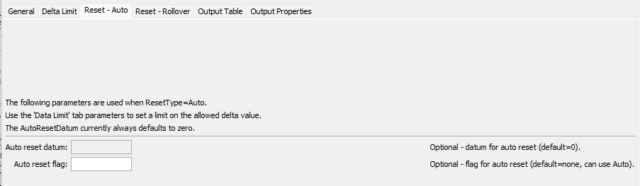
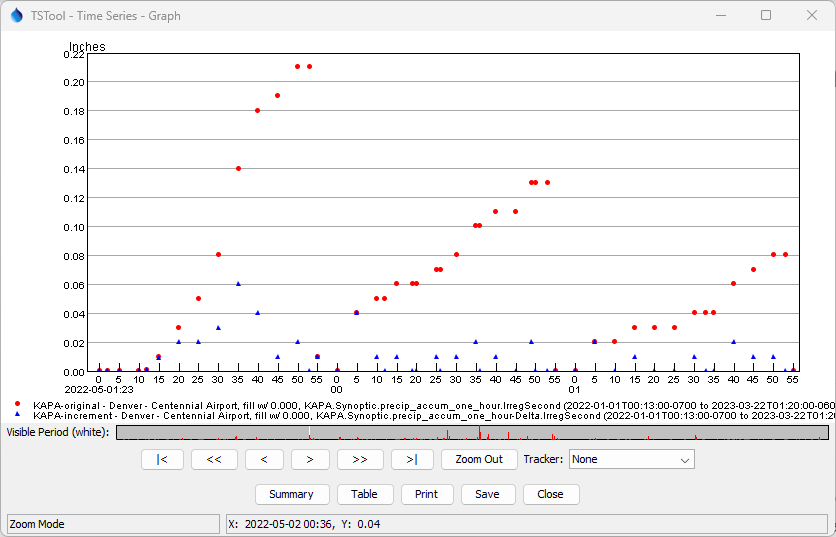

# TSTool / Command / Delta #

*   [Overview](#overview)
    +   [Simple Delta](#simple-delta)
    +   [Cumulative Time Series with Reset](#cumulative-time-series-with-reset)
        -   [Automatic Reset with Zero Dagum](#automatic-reset-with-zero-datum)
        -   [Automatic Reset with Variable Datum](#automatic-reset-with-variable-datum)
        -   [Rollover Reset with Bounding Values](#rollover-reset-with-bounding-values)
*   [Command Editor](#command-editor)
*   [Command Syntax](#command-syntax)
*   [Examples](#examples)
    +   [Example for `ResetType=Auto`](#example-for-resettypeauto)
*   [Troubleshooting](#troubleshooting)
*   [See Also](#see-also)

-------------------------

## Overview ##

The `Delta` command creates a new time series from an input time series.
The resulting values are computed as the difference (delta) between each value and the previous value.
Examples of use include:

*   Disaggregating a cumulative time series into increments.
*   Performing data quality control by detecting unexpected values.

The output value in the simplest case with default command parameters is
the current value minus the previous value.
The result is set to missing if this value cannot be computed due to missing input values,
and can also be set to missing if certain conditions met by optional data checks
(see the `DeltaLimitAction` and `IntervalLimitAction` parameters).

Irregular-interval time series that result in differences not being computed will have
missing values inserted in output at appropriate locations to maintain a consistent
timeline with the original data. 
If appropriate, use fill commands to fill the data prior to or after calling the `Delta` command.

The `Delta` command will create as many output time series as there are input time series.

Alternatively, the [`CheckTimeSeries`](../CheckTimeSeries/CheckTimeSeries.md) command can be used to check time series
for changes that exceed a threshold; however,
the `Delta` command handles the complexity of time series
that reset to a new starting value.
The output from `Delta` can be used with the
[`CheckTimeSeries`](../CheckTimeSeries/CheckTimeSeries.md) command to check for changes above a criteria.

### Simple Delta ###

A simple delta is calculated as:

*   If the current and previous values are not missing:
    
    *delta* = *value_current* - *value_previous*

*   If either of the current or previous values are missing,
    the output time series missing is set to the missing value of the output time series (e.g., `NaN`):

    *delta* = *missing*

Consequently, if the previous value is larger than the previous, the delta will be a positive value.

The following is an example of a daily (regular interval) streamflow time series
with spring runoff and an unusual September flood event.

```
# Example for illustrating a simple delta using a streamflow time series:
# - use a station with a large storm
SetInputPeriod(InputStart="2013-05-01",InputEnd="2013-10-31")
# ABBREV=CLAFTCCO, USGS site ID=06752000 - CACHE LA POUDRE AT CANYON MOUTH NEAR FORT COLLINS
usgs:06752000.DWR.Streamflow-Avg.Day~HydroBaseWeb
#
# Simple delta.
Delta(Alias="%L-delta")
```

**<p style="text-align: center;">

</p>**

**<p style="text-align: center;">
Streamflow Time Series input for Simple Delta (<a href="../overview-simple-streamflow-graph.png">see full-size image</a>)
</p>**

The corresponding simple delta output time series shown below includes positive and negative values,
with the flood event controlling the y-axis scale.

**<p style="text-align: center;">

</p>**

**<p style="text-align: center;">
Simple Delta (<a href="../overview-simple-streamflow-delta-graph.png">see full-size image</a>)
</p>**

Additional parameters such as `DataLimit` and `IntervalLimit` can be used to check for unexpected values
and set the output as missing,
but must be applied with care so as to not discard valid large delta values.

### Cumulative Time Series with Reset ###

A simple delta can be computed for cumulative time series as discussed in the previous section.
However, cumulative time series may periodically reset (typically to zero) and require special attention.

This command can be used to create increments from a cumulative time series.
For example, an annual precipitation accumulation can be converted into the precipitation increments.
The increments can then be aggregated into interval data such as daily, monthly, and annual totals,
and can be further analyzed.
Data quality issues in the cumulative time series can also be evaluated.

A cumulative time series may reset periodically, for example, due to one or more of the following cases:

*   **Sensor rollover:**
    +   hardware-based rollover, for example, a precipitation sensor that counts bucket tips,
        with a counter range that rolls over (e.g., 0 to 2048 tips)
    +   analog values (e.g., counter) or engineering values (e.g., inches or mm) may be reported
    +   the maximum value may not be reached before rollover due to maintenance (see the next itme)
*   **Maintenance reset:**
    +   a cumulative time series reset may be tied to a maintenance schedule where
        sensors are recalibrated and field stations are inspected,
        typically during a dry season
    +   the sensor value is typically reset to zero for cumulative data like precipitation
    +   additional information like data flag indicating maintenance may be available
        (but is not currently used by this command)
*   **Time rollover:**
    +   reset each day, season, or year
    +   may occur automatically or as part of a data workflow,
        for example "water year" accumulations

The determination of whether a reset is due to reaching a rollover maximum or is
due to another condition such as maintenance can be handled in software,
but a number of special conditions and constraints apply, as discussed below.

#### Automatic Reset with Zero Datum ####

If the cumulative time series is allowed to increase without bound before reset,
the `ResetType=Auto` parameter can be used to automatically detect resets.
By default, the reset is assumed to be relative to a zero datum value
(the `ResetAutoDatum` parameter can be used to specify a different datum).
For example, annual rain or snow cumulative precipitation can be processed to determine incremental precipitation.
Because no upper bound is set, it is not possible to add a delta above value before the reset,
as can be done with `ResetType=Rollover`.
Therefore, the value after the reset is the value.

The following example is for flood warning system cumulative precipitation data.

**<p style="text-align: center;">

</p>**

**<p style="text-align: center;">
Precipitation Time Series input for Variable Reset (<a href="../overview-reset-auto-precipitation-graph.png">see full-size image</a>)
</p>**

Computing a delta using `ResetType=Auto`, `ExpectedTrend=Increasing`,
and default `AutoResetDatum` value of `0` shows the following output.

```
# Examples for documentation.
SetInputPeriod(InputStart="2020-01-01 00:00",InputEnd="CurrentToMinute")
#
# The following is a good example of rollover with maintenance.
6410.NovaStar5.PrecipAccum.IrregSecond~nsdataws-larimer
#
# Delta using defaults.
Delta(ExpectedTrend="Increasing",ResetType="Auto",Alias="%L-delta")
```

**<p style="text-align: center;">

</p>**

**<p style="text-align: center;">
Precipitation Time Series input for Variable Reset (<a href="../overview-reset-auto-precipitation-delta-graph.png">see full-size image</a>)
</p>**

The delta spike around 2021-01-25 is due to the cumulative precipitation values `1.46`, `1.42`, `1.46`,
which is interpreted as a reset to zero (delta value `1.42`) and then increase.
This error can be detected using `DeltaLimit` because the bad delta value
in this case is larger than an expected delta (precipitation sensor bucket tip increment).
The [`CheckTimeSeries`](../CheckTimeSeries/CheckTimeSeries.md) command can also be
used on the original time series to check for small decreases that indicate problems.
Resets typically occur after a large accumulation.

The delta spike around 2022-03-22 indicates a possible problem with station transmitter,
where the sensor recorded increasing precipitation but the values were
only transmitted after several months.
Specifying the `IntervalLimit` parameter can identify this issue
and ideally the original data can be corrected.

#### Automatic Reset with Variable Datum ####

If the cumulative time series is allowed to increase (or decrease) without bound before reset,
the `ResetType=Auto` parameter can be used to automatically detect resets.

The following example from a flood warning system illustrates an example of this case.
The `AutoResetDatum=Auto` parameter indicates that the reset datum is variable.
**Currently this case (`AutoResetDatum=Auto`) is not handled by the `Delta` command.**
If the datum for the 2021-02 reset is assumed to be the value after the reset,
then some delta value may be lost.
Using `ResetType=Auto` and default zero datum value with `DeltaLimit` will identify values
that don't reset to zero.
A simple delta may be OK if the values on either side of the reset are "flat",
which will result in no loss of delta values.

```
# Examples for documentation.
SetInputPeriod(InputStart="2020-01-01 00:00",InputEnd="CurrentToMinute")
#
# The following is an example of reset with inconsistent base value.
6130.NovaStar5.PrecipAccum.IrregSecond~nsdataws-larimer
```

**<p style="text-align: center;">

</p>**

**<p style="text-align: center;">
Precipitation Time Series input for Variable Reset (<a href="../overview-reset-auto-variable-precipitation-graph.png">see full-size image</a>)
</p>**

#### Rollover Reset with Bounding Values ####

This is appropriate, for example, where the cumulative value correspond to sensor counts such as
precipitation sensor bucket tips.

If the cumulative time series is allowed to increase (or decrease) with reset using known bounding values, specify:

*   `ExpectedTrend=Increasing` - to indicate an increasing accumulation (the following assumes increasing)
*   `RestType=Rollover` - to indicate that rollover is expected
*   `ResetMax` - maximum data value (rollover will use *`ResetMax` - previous value* as an "upper delta")
*   `ResetMin` - minimum data value (rollover will add this to the above "upper delta")
*   `RolloverDeltaLimit`:
    +   if *`ResetMax` minus the previous value* is <= `RolloverDeltaLimit`, a rollover will occur as described above
    +   otherwise, a manual reset is assumed because values have not reached the `ResetMax`
        and the delta value is the difference between the value and `ResetMin`
*   `RolloverFlag` - use to mark rollover resets
*   `ManualResetFlag` - use to mark manual resets

The normal case for rollover is that he input time series value will have a small value that follows a large value.
The delta is computed as:

*   The difference between `ResetMax` and the previous value.
*   Plus the difference between the value and `ResetMin`.

The normal case for a manual reset is that the delta after the reset is set to the value minus the datum.

The following example is for `ResetMin=0`, `ReetMax=20`, and `RolloverDeltaLimit=.3`,
which cause both rollover and manual resets to occur.

**<p style="text-align: center;">

</p>**

**<p style="text-align: center;">
Example Data Showing Rollover (`R` flag) and Manual Reset (`r flag) (<a href="../overview-reset-rollover-table.png">see full-size image</a>)
</p>**

Specific cases outside of normal data are:

*   The previous value (before the reset) is > `ResetMax`.
    In this case the contribution from the out of
    range previous value is not added to the delta and `Flag` value is assigned.
    A warning will be generated.
*   The current value (at reset) is out of range.
    A warning will be generated.

**The above special cases result in somewhat arbitrary difference values because
the inputs do not conform to expected values.
Out of range values indicate erroneous data that should be corrected before being used in further analysis.
Additional checks may be implemented in the future to detect and deal with bad data.**

The `DeltaLimit` and `IntervalLimit` parameters can be used to identify potential data issues.
The `IntervalLimit` parameter may not be appropriate if data collection stations are taken out of service
for some seasons.


## Command Editor ##

The command is available in the following TSTool menu:

*   ***Commands / Create Time Series***

The following dialog is used to edit the command and illustrates the syntax of the command.

**<p style="text-align: center;">

</p>**

**<p style="text-align: center;">
`Delta` Command Editor for General Parameters (<a href="../Delta-General.png">see full-size image</a>)
</p>**

**<p style="text-align: center;">

</p>**

**<p style="text-align: center;">
`Delta` Command Editor for Delta Limit Parameters (<a href="../Delta-DeltaLimit.png">see full-size image</a>)
</p>**

**<p style="text-align: center;">

</p>**

**<p style="text-align: center;">
`Delta` Command Editor for Reset (Auto) Parameters (<a href="../Delta-ResetAuto.png">see full-size image</a>)
</p>**

**<p style="text-align: center;">

</p>**

**<p style="text-align: center;">
`Delta` Command Editor for Reset (Rollover) Parameters (<a href="../Delta-ResetRollover.png">see full-size image</a>)
</p>**

**<p style="text-align: center;">

</p>**

**<p style="text-align: center;">
`Delta` Command Editor for Output Table Parameters (<a href="../Delta-OutputTable.png">see full-size image</a>)
</p>**

**<p style="text-align: center;">

</p>**

**<p style="text-align: center;">
`Delta` Command Editor for Output Properties Parameters (<a href="../Delta-OutputProperties.png">see full-size image</a>)
</p>**

## Command Syntax ##

The command syntax is as follows:

```text
Delta(Parameter="Value",...)
```
**<p style="text-align: center;">
Command Parameters
</p>**

|**Tab**|**Parameter**&nbsp;&nbsp;&nbsp;&nbsp;&nbsp;&nbsp;&nbsp;&nbsp;&nbsp;&nbsp;&nbsp;|**Description**|**Default**&nbsp;&nbsp;&nbsp;&nbsp;&nbsp;&nbsp;&nbsp;&nbsp;&nbsp;&nbsp;&nbsp;&nbsp;&nbsp;&nbsp;&nbsp;&nbsp;&nbsp;&nbsp;&nbsp;&nbsp;&nbsp;&nbsp;&nbsp;&nbsp;&nbsp;&nbsp;&nbsp;|
|--|--------------|-----------------|-----------------|
|***All***|`TSList`|Indicates the list of time series to be processed, one of:<br><ul><li>`AllMatchingTSID` – all time series that match the TSID (single TSID or TSID with wildcards) will be processed.</li><li>`AllTS` – all time series before the command.</li><li>`EnsembleID` – all time series in the ensemble will be processed (see the EnsembleID parameter).</li><li>`FirstMatchingTSID` – the first time series that matches the TSID (single TSID or TSID with wildcards) will be processed.</li><li>`LastMatchingTSID` – the last time series that matches the TSID (single TSID or TSID with wildcards) will be processed.</li><li>`SelectedTS` – the time series are those selected with the [`SelectTimeSeries`](../SelectTimeSeries/SelectTimeSeries.md) command.</li></ul> | `AllTS` |
||`TSID`|The time series identifier or alias for the time series to be processed, using the `*` wildcard character to match multiple time series.  Can be specified using `${Property}`.|Required if `TSList=*TSID`|
||`EnsembleID`|The ensemble to be processed, if processing an ensemble. Can be specified using `${Property}`.|Required if `TSList=*EnsembleID`|
|***General***|`ExpectedTrend`|Indicates the expected trend of data for cumulative time series, used when values can reset:<ul><li>`Decreasing` – values should decrease and then reset (**has not been fully tested**)</li><li>`Increasing` – values should increase and then reset</li><li>`Variable` – variable pattern increasing and decreasing and don’t reset at fixed thresholds|`Variable`|
||`ResetType`| The reset type:<ul><li>`Auto` - automatically reset when a cumulative time series trend direction changes (see the ***Reset - Auto*** tab)</li><li>`Rollover` - automatically reset when a cumulative time series trend direction changes and values are bounded (see the ***Reset - Rollover*** tab)</li><li>`Unknown` - reset behavior is unknown (delta is simple calculation of current minus previous)</li></ul> | `Unknown` |
||`AnalysisStart`|The date/time to start analyzing data.  Can be specified using `${Property}`.|Full period is analyzed.|
||`AnalysisEnd`|The date/time to end analyzing data.  Can be specified using `${Property}`.|Full period is analyzed.|
||`Flag`|A string to flag problem values.  Use a `+` in front of the flag to append. These flags can be overridden by more specific flag parameters.<br>If specified as `Auto`, the following, default flags will be used with `ResetType=Rollover`:<ul><li>`R` – indicates reset previous value out of range > `ResetMax`</li><li>`r` – indicates reset previous value out of range < `ResetMin`</li><li>`V` – indicates value out of range > `ResetMax`</li><li>`v` – indicates value out of range < `ResetMin`</li></ul><br>Can be specified using `${Property}`.|Do not flag problem values.|
||`Alias`|Alias to assign to created time series.  A literal string can be specified or use %-specifiers to set the alias dynamically (e.g., `%L-delta`) to use the location part of the identifier.|None (but is highly recommended).|
||`CopyDataFlags` | Whether to copy the data flags from the input time series to the delta time series (`True`) or not (`False`). Other flags can be specified with a leading `+` to append flags. | `False` |
|***Delta Limit*** | `DeltaLimit` | Use this and the following parameters to check for larger than expected delta values. The absolute value for the delta that is allowed.  Larger delta values will result in a record in the output table (see the ***Output Table*** tab) and an action can be taken (see below). | |
| | `DeltaLimit`<br>`Action` | The action to be taken when a delta value is larger than `DeltaLimit`:<ul><li>`Keep` - keep the out of range delta value</li><li>`SetMissing` - replace the out of range value with the missing data value</li></ul> | `Keep` |
| | `DeltaLimit`<br>`Flag` | The data flag to set when a delta value is larger than `DeltaLimit`.  Use a `+` in front of the flag to append. Can be specified using `${Property}`. | No flag is set. |
| | `IntervalLimit` | Use this and the following parameters to check for larger than expected interval between previous and current values, only used with irregular interval time series. A larger than expected interval will result in a record in the output able (see the ***Output Table*** tab) and an action can be taken (see below). Can be specified using `${Property}`.| |
| | `IntervalLimit`<br>`Action` | The action to be taken when an interval value is larger than `IntervalLimit`:<ul><li>`Keep` - keep the delta value</li><li>`SetMissing` - replace the delta value with the missing data value</li></ul> | `Keep` |
| | `IntervalLimit`<br>`Flag` | The data flag to set when an interval is larger than `IntervalLimit`.  Use a `+` in front of the flag to append. Can be specified using `${Property}`. | `Keep` |
|***Reset - Auto***<br>For `RestType=` `Auto` |`AutoReset`<br>`Datum`| When the data values reset, calculate the first delta value after the reset relative to the specified datum.  Only used with `ExpectedTrend=Increasing`. Can be specified using `${Property}`.| `0` (zero).|
| | `AutoResetFlag` | Flag to set for automatic resets.  Use a `+` in front of the flag to append.  Can be specified with `${Property}`. | `+A` is used if `Auto` is specified. |
|***Reset - Rollover***<br>For `ResetType=` `Rollover` |`ResetMin`| The minimum expected data value, used when data are expected to roll over at `ResetMax` and reset to `ResetMin`, for example raw precipitation values that reset to zero when an accumulation sensor reaches its maximum value.|Data bounds are not checked. Can be specified using `${Property}`.|
||`ResetMax`| The maximum expected data value, used when data are expected to roll over at `RestMax` and reset to `ResetMin`, for example raw precipitation values that reset to zero when an accumulation sensor reaches its maximum value.| Reset bounds are not checked. Can be specified using `${Property}`. |
||`RolloverDelta`<br>`Limit` | If specified: <ul><li>rollover reset will occur if the `ResetMax` - delta (previous) is <= `RolloverDeltaLimit`, used to differentiate between rollover and manual resets</li><li>otherwise, manual reset will occur</li></ul> | Rollover is allowed for any delta reset. |
||`RolloverFlag` | Flag to set for rollovers.  Use a `+` in front of the flag to append.  Can be specified with `${Property}`. | `+R` is used if `Auto` is specified. |
||`ManualReset`<br>`Flag` | Flag to set for manual resets.  Use a `+` in front of the flag to append.  Can be specified with `${Property}`. | `+r` is used if `Auto` is specified. |
||`Reset`<br>`Proximity`<br>`Limit` | **Future feature.** The allowed delta that occurs prior to or after a reset, within the `ResetProximityLimitInterval`, used to check for bad data around a manual reset, such as calibration data. Can be specified using `${Property}`.  | |
||`Reset`<br>`Proximity`<br>`LimitInterval` | **Future feature.** The interval used to check for `ResetProximityLevel` around a manual reset, such as calibration data that should not be included in data values. Can be specified using `${Property}`.  | |
||`Reset`<br>`Proximity`<br>`LimitFlag` | **Future feature.** The flag to set when a `ProximityLimit` condition is met.  Use a `+` in front of the flag to append.  Can be specified using `${Property}`. | |
|***Output Table*** |`TableID`|Identifier for output table to contain check results.  Specify an existing table or new table to create.  Can be specified using processor `${Property}`.|No table output.|
||`TableTSID`<br>`Column`|Table column name for time series TSID.|Required for table.|
||`TableTSID`<br>`Format`|The specification to format the time series identifier to insert into the `TSID` column.  Use the format choices and other characters to define a unique identifier.|Required for table.|
||`TableDateTime`<br>`Column`|Table column name for date/time.|Column is not output.|`DateTime`|
||`TableValue`<br>`Previous`<br>`Column`|Table column name for time series data values for date/time previous to the current value matching `DateTimeColumn` .|`ValuePrevious`|
||`TableValue`<br>`Column`|Table column name for time series data values matching `DateTimeColumn` .|`Value`|
||`TableDelta`<br>`Calculated`<br>`Column`|Table column name for delta after initial calculation.|`DeltaCalculated`|
||`TableAction`<br>`Column`|Table column name for action taken due to checks.|`Action`|
||`TableDelta`<br>`Column`|Table column name for delta after actions are taken (e.g., if set to missing).|`Delta`|
||`TableFlag`<br>`Column`|Table column name for the flag corresponding to the action. |`Flag`|
||`TableProblem`<br>`Column`|Table column name for data check problem messages.|`Problem`|
||`ProblemCount`<br>`Property`|Name of processor property to set with count of problems (table length).  Can use processor `${Property}` and time series `%` or `${ts:Property}`.|No property is set.|
||`ProblemCount`<br>`TimeSeries`<br>`Property`|Name of time series property to set with count of problems (table length).  Can use processor `${Property}` and time series `%` or `${ts:Property}`.|No property is set.|

## Examples ##

See the [automated tests](https://github.com/OpenCDSS/cdss-app-tstool-test/tree/master/test/commands/Delta).

See also the [Overview](#overview) section, which provides examples to explain the command functionality.

### Example for `ResetType=Auto` ###

The following example illustrates using `ResetType=Auto` and `ExpectedTrend=Increasing`,
in this case for cumulative precipitation that resets at minute 53 of each hour.

**<p style="text-align: center;">

</p>**

**<p style="text-align: center;">
`Delta` Graph for `ResetType=Auto` (<a href="../Delta-auto-graph.png">see full-size image</a>)
</p>**

**<p style="text-align: center;">

</p>**

**<p style="text-align: center;">
`Delta` Table for `ResetType=Auto` (<a href="../Delta-auto-table.png">see full-size image</a>)
</p>**

## Troubleshooting ##

See the main [TSTool Troubleshooting](../../troubleshooting/troubleshooting.md) documentation.

## See Also ##

*   [`CheckTimeSeries`](../CheckTimeSeries/CheckTimeSeries.md) command
*   [`SelectTimeSeries`](../SelectTimeSeries/SelectTimeSeries.md) command
