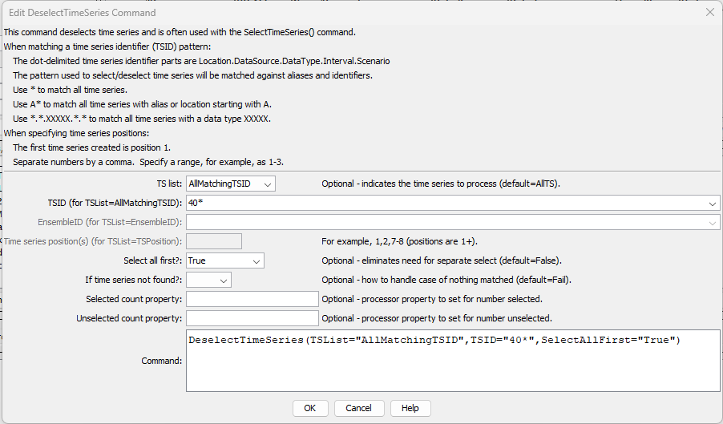

# TSTool / Command / DeselectTimeSeries #

*   [Overview](#overview)
*   [Command Editor](#command-editor)
*   [Command Syntax](#command-syntax)
*   [Examples](#examples)
*   [Troubleshooting](#troubleshooting)
*   [See Also](#see-also)

-------------------------

## Overview ##

The `DeselectTimeSeries` command deselects output time series, as if done interactively,
to indicate which time series SHOULD NOT be operated on by following commands.
The command minimizes the need for the [`Free`](../Free/Free.md) command when used in conjunction
with other commands that use a time series list based on selected time series
(`TSList=SelectedTS`).  See also the [`SelectTimeSeries`](../SelectTimeSeries/SelectTimeSeries.md) command.

## Command Editor ##

The command is available in the following TSTool menu:

*   ***Commands / Select, Free, Sort Time Series***

The following dialog is used to edit the command and illustrates the command syntax.

**<p style="text-align: center;">

</p>**

**<p style="text-align: center;">
`DeselectTimeSeries` Command Editor (<a href="../DeselectTimeSeries.png">see full-size image</a>)
</p>**

## Command Syntax ##

The command syntax is as follows:

```text
DeselectTimeSeries(Parameter="Value",...)
```
**<p style="text-align: center;">
Command Parameters
</p>**

|Parameter**&nbsp;&nbsp;&nbsp;&nbsp;&nbsp;&nbsp;&nbsp;&nbsp;&nbsp;&nbsp;&nbsp;&nbsp;&nbsp;&nbsp;&nbsp;&nbsp;&nbsp;&nbsp;&nbsp;&nbsp;&nbsp;&nbsp;&nbsp;&nbsp;&nbsp;&nbsp;&nbsp;&nbsp;|**Description**|**Default**&nbsp;&nbsp;&nbsp;&nbsp;&nbsp;&nbsp;&nbsp;&nbsp;&nbsp;&nbsp;&nbsp;&nbsp;&nbsp;&nbsp;&nbsp;&nbsp;&nbsp;&nbsp;&nbsp;&nbsp;&nbsp;&nbsp;&nbsp;&nbsp;&nbsp;&nbsp;&nbsp;|
|--------------|-----------------|-----------------|
|`TSList`|Indicates the list of time series to be processed, one of:<br><ul><li>`AllMatchingTSID` – all time series that match the TSID (single TSID or TSID with wildcards) will be processed.</li><li>`AllTS` – all time series before the command.</li><li>`EnsembleID` – all time series in the ensemble will be processed (see the EnsembleID parameter).</li><li>`FirstMatchingTSID` – the first time series that matches the TSID (single TSID or TSID with wildcards) will be processed.</li><li>`LastMatchingTSID` – the last time series that matches the TSID (single TSID or TSID with wildcards) will be processed.</li><li>`SelectedTS` – the time series are those selected with the [`SelectTimeSeries`](../SelectTimeSeries/SelectTimeSeries.md) command.</li><li>`TSPosition` – time series specified by position in the results list (see `TSPosition` parameter below).</li></ul> | `AllTS` |
|`TSID`|The time series identifier or alias for the time series to be processed, using the `*` wildcard character to match multiple time series.  Can be specified using `${Property}`.|Required if `TSList=*TSID`|
|`EnsembleID`|The ensemble to be processed, if processing an ensemble. Can be specified using `${Property}`.|Required if `TSList=*EnsembleID`|
|`TSPosition`|A list of time series positions (1+) in output, separated by commas.  Ranges can be specified as `Start-End`.|Required if `TSList=TSPosition`|
|`SelectAllFirst`|Indicates whether all time series should be selected before deselecting the specified time series:  `True` or `False`. |`False`|
|`IfNotFound`|Indicate how to handle the case of no time series being matched:<ul><li>`Ignore` – OK if time series matched</li><li>`Warn` – generate a warning message</li><li>`Fail` – generate a failure message</li></ul>|`Fail`|
|`SelectedCountProperty`|If specified, the corresponding time series property will be set to the number of selected time series after the command is executed.  This is useful in cases where following commands are wrapped in an [`If`](../If/If.md) command and should only be executed if the count is > 0.  Also use to check for count of 0 and warn with the [`Message`](../Message/Message.md) command.  Can be specified using processor `${Property}`.||
|`UnselectedCountProperty`|If specified, the corresponding time series property will be set to the number of unselected time series after the command is executed.  This is useful in cases where following commands are wrapped in an [`If`](../If/If.md) command and should only be executed based on the count value.  Also use to check for count of 0 and warn with the [`Message`](../Message/Message.md) command.  Can be specified using processor `${Property}`.||

## Examples ##

See the [automated tests](https://github.com/OpenCDSS/cdss-app-tstool-test/tree/master/test/commands/DeselectTimeSeries).

A sample command file is as follows:

```
NewPatternTimeSeries(Alias="401234",NewTSID="401234..Precip.Day",Description="Example data",SetStart="2000-01-01",SetEnd="2000-12-31",Units="IN",PatternValues="0,1,3,0,0,0")
DeselectTimeSeries(TSList=AllMatchingTSID,TSID="40*",SelectAllFirst=True)
```

## Troubleshooting ##

See the main [TSTool Troubleshooting](../../troubleshooting/troubleshooting.md) documentation.

## See Also ##

*   [`SelectTimeSeries`](../SelectTimeSeries/SelectTimeSeries.md) command
*   [`Free`](../Free/Free.md) command
