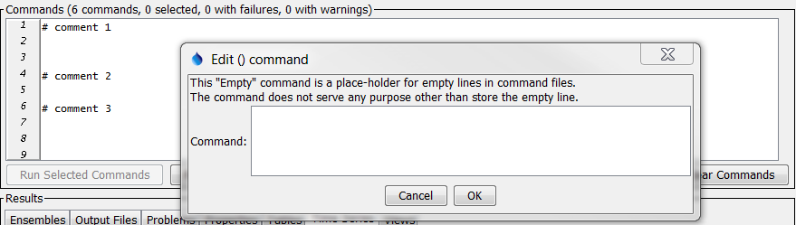

# TSTool / Command / Empty Command Line #

*   [Overview](#overview)
*   [Command Editor](#command-editor)
*   [Command Syntax](#command-syntax)
*   [Examples](#examples)
*   [Troubleshooting](#troubleshooting)
*   [See Also](#see-also)

-------------------------

## Overview ##

The `Empty` command is a placeholder for empty (blank) lines, which contain only whitespace characters (spaces and tabs).

## Command Editor ##

The command is available in the following TSTool menu:

*   ***Commands / General - Comments***

The following dialog is used to edit the command and illustrates the command syntax.

**

**

**

`Empty` Command Editor (<a href="../Empty.png">see full-size image</a>)

**

## Command Syntax ##

Empty (blank) lines in command files are converted to `Empty` commands.

## Examples ##

See the [automated tests](https://github.com/OpenCDSS/cdss-app-tstool-test/tree/master/test/commands/Empty).

## Troubleshooting ##

See the main [TSTool Troubleshooting](../../troubleshooting/troubleshooting.md) documentation.

## See Also ##

*   [`UnknownCommand`](../UnknownCommand/UnknownCommand.md) command - unknown commands that are not empty lines
