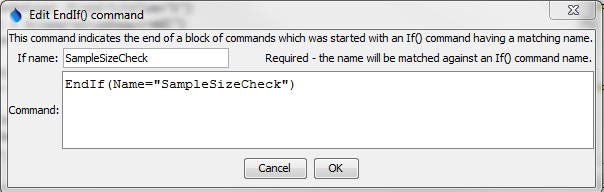

# TSTool / Command / EndIf #

*   [Overview](#overview)
*   [Command Editor](#command-editor)
*   [Command Syntax](#command-syntax)
*   [Examples](#examples)
*   [Troubleshooting](#troubleshooting)
*   [See Also](#see-also)

-------------------------

## Overview ##

The `EndIf` command ends a block of commands that start with an
[`If`](../If/If.md) command.
The [`If`](../If/If.md) and
`EndIf` commands must have the same value for the `Name` parameter to allow the command processor to determine the
start and end of the block.

## Command Editor ##

The command is available in the following TSTool menu:

*   ***Commands / General - Running and Properties***

The following dialog is used to edit the command and illustrates the command syntax.

**<p style="text-align: center;">

</p>**

**<p style="text-align: center;">
`EndIf` Command Editor (<a href="../EndIf.png">see also the full-size image</a>)
</p>**

## Command Syntax ##

The command syntax is as follows:

```text
EndIf(Parameter="Value",...)
```
**<p style="text-align: center;">
Command Parameters
</p>**

| **Parameter**&nbsp;&nbsp;&nbsp;&nbsp;&nbsp;&nbsp;&nbsp;&nbsp;&nbsp;&nbsp;&nbsp;&nbsp;&nbsp;&nbsp;&nbsp;&nbsp;&nbsp;&nbsp;&nbsp;&nbsp;&nbsp; | **Description** | **Default**&nbsp;&nbsp;&nbsp;&nbsp;&nbsp;&nbsp;&nbsp;&nbsp;&nbsp;&nbsp;&nbsp;&nbsp;&nbsp;&nbsp;&nbsp;&nbsp;&nbsp; |
| --------------|-----------------|----------------- |
| `Name`<br>**required** | The name that will be matched with the name of an [`If`](../If/If.md) command to indicate the block of commands in the if condition. | None - must be specified. |


## Examples ##

See the [automated tests](https://github.com/OpenCDSS/cdss-app-tstool-test/tree/master/test/commands/EndIf).

## Troubleshooting ##

See the main [TSTool Troubleshooting](../../troubleshooting/troubleshooting.md) documentation.

## See Also ##

*   [`If`](../If/If.md) command
