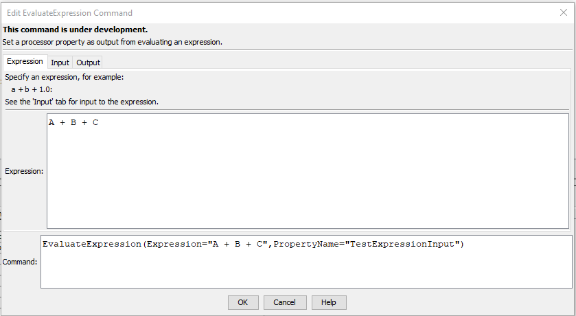
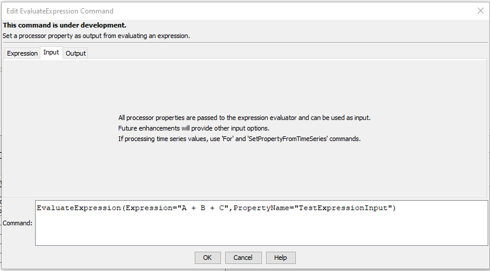
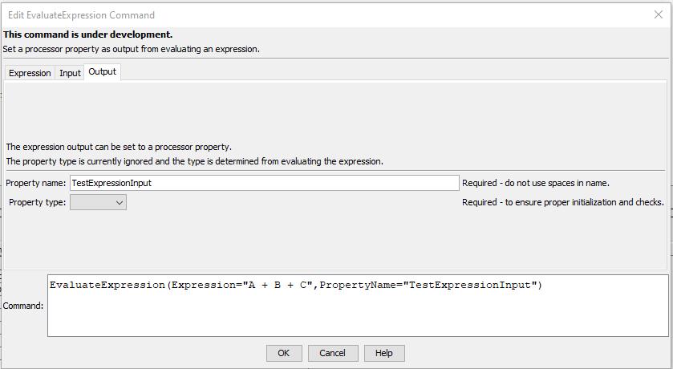

# TSTool / Command / EvaluateExpression #

*   [Overview](#overview)
*   [Command Editor](#command-editor)
*   [Command Syntax](#command-syntax)
*   [Examples](#examples)
*   [Troubleshooting](#troubleshooting)
*   [See Also](#see-also)

-------------------------

## Overview ##

**This command is under development.**

The `EvaluateExpression` command evaluates an expression
using the EvalEx library (see the [EvalEx documentation](https://ezylang.github.io/EvalEx/)).
This command can be used to evaluate an expression such as the following:

```
a*b + 1.0
```

The resulting value can be set as the following:

*   a property (set in this command)
*   time series value
*   table value

For example use a [`For`](../For/For.md) command to iterate over data in a time series,
evaluate an expression, and set in another time series or table.

Input for the expression are taken from command processor properties that are of types known to the EvalEx library,
as listed in the following table.
Additional input handling will be enabled in the future.
Properties can be set for use as input using the following (and other) commands:

*   Processor property:
    +   [`SetProperty`](../SetProperty/SetProperty.md)
*   Property from time series:
    +   [`SetPropertyFromTimeSeries`](../SetPropertyFromTimeSeries/SetPropertyFromTimeSeries.md)
*   Property from table:
    +   [`SetPropertyFromTable`](../SetPropertyFromTable/SetPropertyFromTable.md)

**<p style="text-align: center;">
TSTool Properties Passed as Input
</p>**

| **Type** | **Comment** |
| -- | -- |
| Boolean | Yes |
| DateTime | No |
| Double | Yes |
| Integer | Yes |
| String | Yes |
| Others (e.g., general objects) | No |

EvalEx [`DataType`](https://ezylang.github.io/EvalEx/concepts/datatypes.html) output is handled as described in the following table.

**<p style="text-align: center;">
EvalEx Result DataType and TSTool Properties
</p>**

| **DataType**&nbsp;&nbsp;&nbsp;&nbsp;&nbsp;&nbsp;&nbsp;&nbsp;&nbsp;&nbsp;&nbsp;&nbsp;&nbsp;&nbsp;&nbsp;&nbsp; | **Comment** |
| -- | -- |
| `ARRAY` | Set as `java.util.list`, not currently converted to TSTool Object type. |
| `BINARY` | Set as `java.lang.Object`, not currently converted to TSTool Object type. |
| `BOOLEAN` | Set as `java.lang.Boolean`, which matches TSTool Boolean property type. |
| `DATE_TIME` | Set as `java.lang.Instant`, not currently converted to TSTool DateTime property type. |
| `DURATION` | Set as `java.time.Duration`, not currently comverted to TSTool TimeInterval property type. ||
| `EXPRESSION_NODE` | Set as `com.ezylang.evalex.parser.ASTNode`, not currently converted to TSTool Object type. |
| `NULL` | Set as `null`. |
| `NUMBER` | Converted from `java.math.BigDecimal` to TSTool Double property type. |
| `STRING` | Set as `java.lang.String`, which matches TSTool String property type. |
| `STRUCTURE` | Set as `java.util.Map`, not currently converted to TSTool Object type. |

The expression output is set as a property similar to the [`SetProperty`](../SetProperty/SetProperty.md) command.
The `PropertyType` is currently ignored but may be enabled in the future to help with casting output to different data types.
Other commands can be used to set the property in other data objects, including:

*   Time series:
    *   [`ReplaceValue`](../ReplaceValue/ReplaceValue.md) command
    *   [`SetDataValue`](../SetDataValue/SetDataValue.md) command
    *   [`SetTimeSeriesProperty`](../SetTimeSeriesProperty/SetTimeSeriesProperty.md) command
*   Table:
    *   [`SetTableValues`](../SetTableValues/SetTableValues.md) command

After commands are run, the value of properties can be viewed in the TSTool ***Results / Properties*** tab,

## Command Editor ##

The command is available in the following TSTool menu:

*   ***Commands / General - Running and Properties***

The following dialog is used to edit the command and illustrates the command syntax for expression parameters.

**<p style="text-align: center;">

</p>**

**<p style="text-align: center;">
`EvaluateExpression` Command Editor for Expression Parameters (<a href="../EvaluateExpression_Expression.png">see full-size image</a>)
</p>**

The following dialog is used to edit the command and illustrates the command syntax for input parameters.

**<p style="text-align: center;">

</p>**

**<p style="text-align: center;">
`EvaluateExpression` Command Editor for Input Parameters (<a href="../EvaluateExpression_Input.png">see full-size image</a>)
</p>**

The following dialog is used to edit the command and illustrates the command syntax for output parameters.

**<p style="text-align: center;">

</p>**

**<p style="text-align: center;">
`EvaluateExpression` Command Editor for Output Parameters (<a href="../EvaluateExpression_Output.png">see full-size image</a>)
</p>**

## Command Syntax ##

The command syntax is as follows:

```text
EvaluateExpression(Parameter="Value",...)
```
**<p style="text-align: center;">
Command Parameters
</p>**

| **Tab** | **Parameter**&nbsp;&nbsp;&nbsp;&nbsp;&nbsp;&nbsp;&nbsp;&nbsp;&nbsp;&nbsp;&nbsp;&nbsp;&nbsp;&nbsp;&nbsp;&nbsp;&nbsp;&nbsp;&nbsp;&nbsp;&nbsp;&nbsp;&nbsp;&nbsp;&nbsp;&nbsp; | **Description** | **Default**&nbsp;&nbsp;&nbsp;&nbsp;&nbsp;&nbsp;&nbsp;&nbsp;&nbsp;&nbsp; |
| --------------|-----------------|----------------- | -- |
| ***Expression*** | `Expression`<br>**required** | The expression to evaluate, can use `${Property}` syntax. | None - must be specified. |
| ***Input*** | | Expression input is currently automatically determined from processor properties. | |
| ***Output*** | `PropertyName`<br>**required** | The output property name, can use`${Property}` syntax and nested property names are allowed. | None - must be specified. |
| | `PropertyType`| **Currently ignored.** Optional output property type, when casting the expression output to a different type, one of:<br><ul><li>`Boolean` – a boolean</li><li>`DateTime` – a date/time</li><li>`Double` – a floating point number</li><li>`Integer` – an integer</li><li>`String` – a string</li></ul>  See the [`SetInputPeriod`](../SetInputPeriod/SetInputPeriod.md) command for more information. | Type from the expression evaluation. .|

## Examples ##

See the [automated tests](https://github.com/OpenCDSS/cdss-app-tstool-test/tree/master/test/commands/EvaluateExpression).

## Troubleshooting ##

See the main [TSTool Troubleshooting](../../troubleshooting/troubleshooting.md) documentation.

## See Also ##

*   [`For`](../For/For.md) command
*   [`If`](../If/If.md) command
*   [`ReplaceValue`](../ReplaceValue/ReplaceValue.md) command
*   [`SetDataValue`](../SetDataValue/SetDataValue.md) command
*   [`SetProperty`](../SetProperty/SetProperty.md) command
*   [`SetPropertyFromTable`](../SetPropertyFromTable/SetPropertyFromTable.md) command
*   [`SetPropertyFromTimeSeries`](../SetPropertyFromTimeSeries/SetPropertyFromTimeSeries.md) command
*   [`SetTableValues`](../SetTableValues/SetTableValues.md) command
*   [`SetTimeSeriesProperty`](../SetTimeSeriesProperty/SetTimeSeriesProperty.md) command
