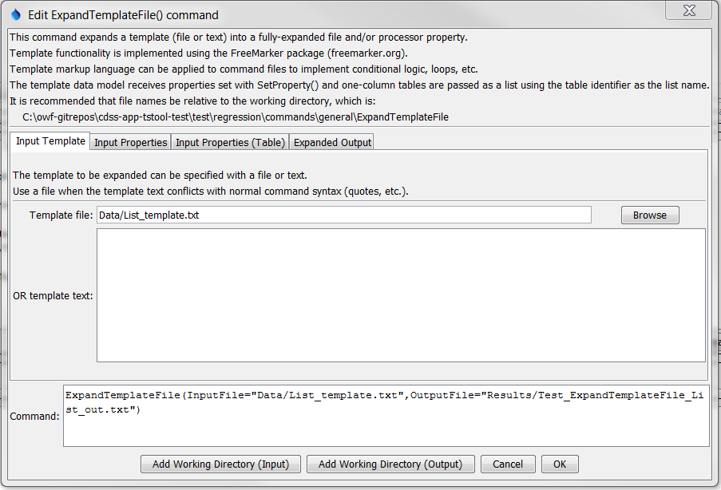
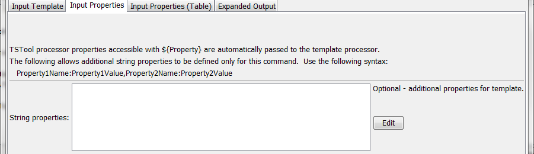
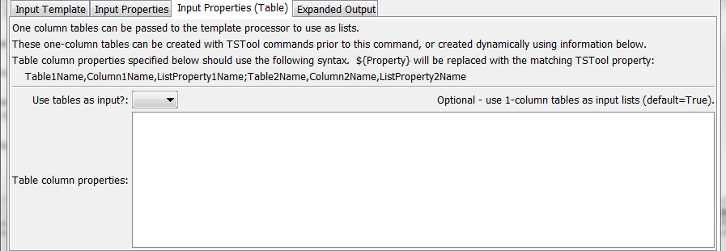
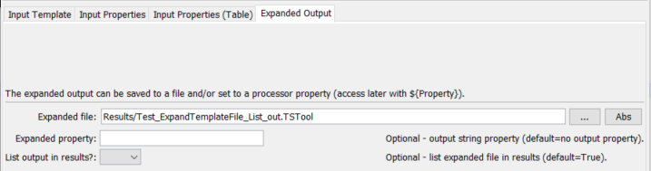

# TSTool / Command / ExpandTemplateFile #

*   [Overview](#overview)
*   [Command Editor](#command-editor)
*   [Command Syntax](#command-syntax)
*   [Examples](#examples)
*   [Troubleshooting](#troubleshooting)
*   [See Also](#see-also)

-------------------------

## Overview ##

The `ExpandTemplateFile` command processes a template specified with one of the following methods:

*   template input file that includes FreeMarker syntax (see `InputFile` command parameter):
    +   command file
    +   time series product file
    +   any text file
*   or template text (see the `InputText` command parameter)
*   with input data:
    +   TSTool properties (automatically passed and see the `StringProperties` command parameter)
    +   TSTool one-column tables (automatically passed and see the `TableColumnProperties` command parameter)

and creates a fully-expanded:

*   output file (see `OutputFile` command parameter)
*   and/or processor property (see `OutputProperty` command parameter)

Templates facilitate utilizing conditional logic, loops,
and other dynamic processing functionality that is not provided directly
by TSTool’s [`If`](../If/If.md) and [`For`](../For/For.md) commands.
For example, a template can be used to automate processing multiple time series identifiers.

One advantage of using the template approach is that problems in the expanded file are clearly indicated,
whereas a problem in logic that is represented as a loop might be difficult to troubleshoot.

The [FreeMarker software](https://freemarker.apache.org) is used to implement templates.
The following table lists the FreeMarker versions that are used with different versions of TSTool.

**<p style="text-align: center;">
TSTool and FreeMarker Versions
</p>**

| **TSTool Version** | **FreeMarker Version** |
| -- | -- |
| < 11.00.00 | 2.3.15 |
| 11.00.00+ | 2.3.21 |
| 14.9.7+ | 2.3.33 |

Support for other templating engines such as Apache Velocity can be added if needed.
Refer to the online FreeMarker documentation for information about the markup language used to create templates.
Because TSTool checks commands for errors and does not itself understand FreeMarker syntax,
templates must be edited with a text editor outside the normal TSTool command editors.
Attempts to edit a template command file in TSTool may result in error
indicators and some command editors may not allow changes to be saved,
such as when template notation is used for a filename and the command expects a parent folder name to exist.
TSTool may be enhanced in the future to provide template editing features.
Examples below illustrate how to use common FreeMarker features.

The FreeMarker built-in `normalizeNewlines` user directive is automatically used to ensure
that expanded files use newline characters appropriate for the operating system.
Otherwise the results may have all lines merged together
(not an issue for HTML used by web browsers but a big issue with TSTool).
The `normalizeNewlines` directive leads to temporary extra first and last lines in the template during processing,
which need to be accounted for when interpreting FreeMarker warning messages.
For example, a FreeMarker warning about line 21 would actually be line 20 in the original template file.
FreeMarker messages may be difficult to interpret.
Common errors include variable names spelled incorrectly or incorrect FreeMarker syntax.

The following information is automatically passed from TSTool to the `ExpandTemplateFile` command:

*   Properties set with the [`SetProperty`](../SetProperty/SetProperty.md) command are passed to the template processor.
    Consequently, the property names can be referenced with `${Property}` in
    the template without using a FreeMarker assign command.
    See also the `StringProperties` command parameter.
*   One-column tables are passed as FreeMarker lists,
    using the table identifier (`TableID`) as the list property name.
    Null values in the table are passed as an empty string so that list have the correct number of items for iteration.
    Use the [`CopyTable`](../CopyTable/CopyTable.md) command to create a one-column
    table that can be used as a list for template expansion or specify the `TableColumnProperties` command parameter.
    The `UseTables` command parameter can be used to turn off this transfer,
    for example in cases where an `ExpandTemplateFile` command is being repeated many times,
    does not use the tables, and is slowed down by converting the tables to FreeMarker lists.

## Command Editor ##

The command is available in the following TSTool menu:

*   ***Commands / Template Processing***

The following dialog is used to edit the command and illustrates the syntax of the command for input template parameters.

**<p style="text-align: center;">

</p>**

**<p style="text-align: center;">
`ExpandTemplateFile` Command Editor for Input Template Parameters (<a href="../ExpandTemplateFile.png">see full-size image</a>)
</p>**

The following dialog is used to edit the command and illustrates the syntax of the command for input property parameters.

**<p style="text-align: center;">

</p>**

**<p style="text-align: center;">
`ExpandTemplateFile` Command Editor for Input Property Parameters (<a href="../ExpandTemplateFile_Properties.png">see full-size image</a>)
</p>**

The following dialog is used to edit the command and illustrates the syntax of the command for table input property parameters.

**<p style="text-align: center;">

</p>**

**<p style="text-align: center;">
`ExpandTemplateFile` Command Editor for Table Input Property Parameters (<a href="../ExpandTemplateFile_TableProperties.png">see full-size image</a>)
</p>**

The following dialog is used to edit the command and illustrates the syntax of the command for expanded output parameters.

**<p style="text-align: center;">

</p>**

**<p style="text-align: center;">
`ExpandTemplateFile` Command Editor for Expanded Output Parameters (<a href="../ExpandTemplateFile_Out.png">see full-size image</a>)
</p>**

## Command Syntax ##

The command syntax is as follows:

```text
ExpandTemplateFile(Parameter="Value",...)
```
**<p style="text-align: center;">
Command Parameters
</p>**

|**Parameter**&nbsp;&nbsp;&nbsp;&nbsp;&nbsp;&nbsp;&nbsp;&nbsp;&nbsp;&nbsp;&nbsp;&nbsp;&nbsp;&nbsp;&nbsp;&nbsp;&nbsp;&nbsp;&nbsp;&nbsp;&nbsp;&nbsp;&nbsp;&nbsp;&nbsp;&nbsp;&nbsp;|**Description**|**Default**&nbsp;&nbsp;&nbsp;&nbsp;&nbsp;&nbsp;&nbsp;&nbsp;&nbsp;&nbsp;&nbsp;&nbsp;&nbsp;&nbsp;&nbsp;&nbsp;&nbsp;&nbsp;&nbsp;&nbsp;&nbsp;&nbsp;&nbsp;&nbsp;&nbsp;&nbsp;&nbsp;|
|--------------|-----------------|-----------------|
|`InputFile`|The name of the template file to process.  It is recommended that the filename include “template” and that a comment in the file include `@readOnly`, which will cause TSTool to warn users when saving the expanded result.  Can be specified using processor `${Property}`.|Specify if `InputText` is not specified.|
|`InputText`|The template text to expand.  If special characters in the template text conflict with command syntax, specify `InputFile` instead.|Specify if `InputFile` is not specified.|
|`StringProperties`|Specify additional string properties to be passed to the template processor, using syntax:<ul><li>`Property1Name:Property1Text,`<br>`Property2Name:Property2Text`||
|`TableColumnProperties`|Specify how to extract table columns for use as lists for the template processor.  This parameter can be used instead of creating 1-column tables with other TSTool commands.  The syntax of the parameter is as follows and `${Property}` can be used to replace with TSTool properties:<br>`Table1Name,Table1Column,`<br>`Property1Name;Table2Name,`<br>`Table2Column,Property2Name`<br>where `Table1Name` is the name of a table, `Table1Column` is the name of the column to extract, and `Property1Name` is the name of the list property accessible in the template.||
|`OutputFile`<br>**required**|The name of the expanded output file.  Can be specified using processor `${Property}`.|None – must be specified.|
|`OutputProperty`|The name of a property to receive the results of the template expansion.  This is appropriate when templates are used to expand single-line text, for example.|No property value will be set.|
|`UseTables`|Indicate whether 1-column tables should be passed to the template expander.  Doing so is a performance hit and should be avoided if tables are not used in the template.|`True`|
|`ListInResults`|Indicate whether the results of the expansion should be listed in the TSTool ***Results*** area.  This may be undesirable for “worker” files that users will normally not view.|`True`|

## Examples ##

See the [automated tests](https://github.com/OpenCDSS/cdss-app-tstool-test/tree/master/test/commands/ExpandTemplateFile).

### Example Using Simple Variable Assignment ###

The following example illustrates a simple template command file and expanded result.

```
# Simple test to expand a text file using FreeMarker
#@readOnly
<#assign message="Hello World">
${message}
```

```
# Simple test to expand a text file using FreeMarker
#@readOnly
Hello World
```

### Example of Passing Time Series Processor Properties to Templates ###

TSTool uses the `${Property}` notation to dynamically replace the string
with the corresponding property value (as a string).
FreeMarker uses the `${Variable}` notation to dynamically replace the string with the corresponding variable (as a string).
Because the same notation is used by both software components, care must be taken to ensure that values are properly interpreted.

TSTool automatically passes all TSTool properties to the `ExpandTemplateFile` command.
Consequently, one of the main ways to avoid conflicts is to ensure
that template command files do not use any of the properties defined in TSTool.
One way to check property names is to insert a [`WritePropertiesToFile`](../WritePropertiesToFile/WritePropertiesToFile.md)
command at the appropriate line in a command file and review the list of properties that are shown when editing the command.

To utilize TSTool processor properties in a template, do not use the FreeMarker
`assign` command and instead reference the property directly.
The following TSTool command file illustrates how to define a property that is used by the `ExpandTemplateFile` command:

```
# Simple test to expand a text file using FreeMarker
SetProperty(PropertyName="HelloWorldProp",PropertyType=String,PropertyValue="Hello World")
ExpandTemplateFile(InputFile="Data\ProcessorStringProperty.txt",OutputFile="Results/Test_ExpandTemplateFile_HelloWorld_out.txt")
```

The corresponding template command file is as follows:

```
# Simple test to expand a text file using FreeMarker
${HelloWorldProp}
```

The variables also can be used in assignment, similar to the following:

```
# Simple test to expand a text file using FreeMarker
<#assign message="${HelloWordProp}">
${message}
```

### Example of Protecting TSTool Properties in Template with a Literal FreeMarker String ###

It is possible to use TSTool property notation in a template and cause FreeMarker to ignore the property.
This will ensure that the property notation is present in the output, for TSTool to interpret at run-time.
The following example illustrates an input file that uses the FreeMarker `${r"..."}` raw literal string notation:

```
# Simple test to expand a text file using FreeMarker
# and also escape text so that it passes through to the expanded file
# @readOnly
<#assign message="Hello World">
${r"SomeCommand($SomeProperty)"}
```

The corresponding output file is as follows:

```
# Simple test to expand a text file using FreeMarker
# and also escape text so that it passes through to the expanded file
# @readOnly
Hello World
SomeCommand($SomeProperty)
```

### Example of Using a Comment in the Template, which is Omitted from Expanded Output ###

It often is desirable to have comments in the template file to explain the template,
but not have the comments propagated to the expanded output.
The following example illustrates an input file that uses the FreeMarker `$<#-- ... -->` notation for comments:

```
# Simple test to expand a text file using FreeMarker
# There should be no comment in the expanded output below this line
<#-- This is a comment in the template -->
<#assign message="Hello World">
${message}
```

The corresponding output file is as follows:

```
# Simple test to expand a text file using FreeMarker
# There should be no comment in the expanded output below this line
Hello World
```

### Example Using Variable Assignment and Loop Using List ###

The following example illustrates a template command file repeat a command for a list of location identifiers.
A block of multiple commands can be repeated, as appropriate.
Long lines are indented for illustration but would exist on a single
line without indentation in the template file.
Note that the `loc_index` FreeMarker syntax allows the loop counter to be used.

```
# Simple template to illustrate how to repeat commands with a list of
# location identifiers
# Create a time series for each location
# The following ensures that the created template is read-only, so users
# modify the template instead:
#@readOnly
<#assign setStart = "2000-01-01">
<#assign setEnd = "2000-03-15">
<#assign units = "CFS">
<#assign locList = ["loc1", "loc2", "loc3", "loc4"]>
<#list locList as loc>
NewPatternTimeSeries(Alias="${loc}",NewTSID="${loc}..Streamflow.Day",SetStart="${setStart}",SetEnd="${setEnd}",Units="${units}",PatternValues="${loc_index + 1},0")
</#list>
```

The expanded command file is as follows:

```
# Simple template to illustrate how to repeat commands with a list of
# location identifiers
# Create a time series for each location
# The following ensures that the created template is read-only, so users
# modify the template instead:
#@readOnly
NewPatternTimeSeries(Alias="loc1",NewTSID="loc1..Streamflow.Day",SetStart="2000-01-01",SetEnd="2000-03-15",Units="CFS",PatternValues="1,0")
NewPatternTimeSeries(Alias="loc2",NewTSID="loc2..Streamflow.Day",SetStart="2000-01-01",SetEnd="2000-03-15",Units="CFS",PatternValues="2,0")
NewPatternTimeSeries(Alias="loc3",NewTSID="loc3..Streamflow.Day",SetStart="2000-01-01",SetEnd="2000-03-15",Units="CFS",PatternValues="3,0")
NewPatternTimeSeries(Alias="loc4",NewTSID="loc4..Streamflow.Day",SetStart="2000-01-01",SetEnd="2000-03-15",Units="CFS",PatternValues="4,0")
```

### Example Using a One-Column Table for a List for Looping ###

The following example illustrates a template command file that reads the location list from a table.
Note that the list must be a one-column table.
If the original table has more than one column, read the original file and then use the
[`CopyTable`](../CopyTable/CopyTable.md) command to create a new one-column table.
A comma-separated-value (CSV) file is used for the list:

```
# Simple list to use during template expansion
"Location"
loc1
loc2
loc3
loc4
```

The template file is similar to the previous example; however,
the list of locations is now provided via the table (no `<#assign>` element for the list)
rather than having to hard-code in the template, which separates data from the processing logic:

```
# Simple template to illustrate how to repeat commands with a list of
# location identifiers
# Create a time series for each location
# The following ensures that the created template is read-only,
# so users modify the template instead:
# The list is provided by the processor as a one-column table with ID
# matching the list name
#@readOnly
<#assign setStart = "2000-01-01">
<#assign setEnd = "2000-03-15">
<#assign units = "CFS">
<#list locList as loc>
NewPatternTimeSeries(Alias="${loc}",NewTSID="${loc}..Streamflow.Day",SetStart="${setStart}",SetEnd="${setEnd}",Units="${units}",PatternValues="${loc_index + 1},0")
</#list>
```

The following command file reads the list of locations from the table and then expands the template file.
Note that the `TableID` must match the list name in the `<#list...>` element in the template.

```
# Test expanding a FreeMarker template for a list of time series, using a
# one-column table as the list
# Read a one-column table that will be passed to the template as a list
ReadTableFromDelimitedFile(TableID="locList",InputFile="Data\loclist.csv")
ExpandTemplateFile(InputFile="Data\ProcessorTable.txt",OutputFile="Results/Test_ExpandTemplateFile_ProcessorTable_out.txt")
```

### Example Using a Multiple-Column Table to Loop Through Two Lists ###

The previous example illustrated how a one-column table can be used to loop over a list.
However, often it is necessary to loop over one list and access the corresponding items from another list.
The following example illustrates how a template command file can perform this task.
Note that each list must be a one-column table in TSTool.
If the original table has more than one column, use the [`CopyTable`](../CopyTable/CopyTable.md)
command to create as many one-column tables as are necessary.
In this example, a comma-separated-value (CSV) file is used for the table:

```
# Simple list to use during template expansion
"Location","Value"
loc1,1.0
loc2,2.0
loc3,3.0
loc4,4.0
```

The template file to expand is similar to the one-column example;
however, the second list is also used to provide information when expanding the commands (see bold text below):

```
# Simple template to illustrate how to repeat commands with a list of
# location identifiers
# Create a time series for each location
# The following ensures that the created template is read-only,
# so users modify the template instead:
# The location list is provided by the processor as a one-column table
# with ID matching the list name
# The value list is provided by the processor as a corresponding one-column
# table with ID "valueList"
#@readOnly
<#assign setStart = "2000-01-01">
<#assign setEnd = "2000-03-15">
<#assign units = "CFS">
# The loc_index is referenced to zero
<#list locList as loc>
<#assign value = valueList[loc_index]>
NewPatternTimeSeries(Alias="${loc}",NewTSID="${loc}..Streamflow.Day",SetStart="${setStart}",SetEnd="${setEnd}",Units="${units}",PatternValues="${value}")
NewPatternTimeSeries(Alias="${loc}",NewTSID="${loc}..Streamflow.Day",SetStart="${setStart}",SetEnd="${setEnd}",Units="${units}",PatternValues="${valueList[loc_index]}")
</#list>
```

The following command file reads the list of locations from the table and then expands the template file.
Note that the `TableID` must match the list name in the <#list…> element and corresponding arrays in the template.

```
# Test expanding a FreeMarker template for a list of time series, using a
# two-column table as the list
# Read a one-column table that will be passed to the template as a list
ReadTableFromDelimitedFile(TableID="locList2",InputFile="Data\2column-table.csv")
CopyTable(TableID="locList2",NewTableID="locList",IncludeColumns="Location")
CopyTable(TableID="locList2",NewTableID="valueList",IncludeColumns="Value")
ExpandTemplateFile(InputFile="Data\ProcessorTable.txt",OutputFile="Results/Test_ExpandTemplateFile_ProcessorTable_out.txt")
```

### Example of Expanding a Template to a Processor Property ###

The following example illustrates how to expand a list into a SQL “in” clause,
which is used to query specific matching records.
A one-column table with identifier `locList` must have been created to supply the list of identifiers.
The property set with the `OutputProperty` command parameter can then be used in the SQL statement for the
[`ReadTableFromDataStore`](../ReadTableFromDataStore/ReadTableFromDataStore.md) command.

```
IN (<#list locList as loc><#if (loc_index > 0)>,</#if>'${loc}'</#list>)
```

### Example of Using `ExpandTemplateFile` in a Loop to Expand Multiple Files ###

A template file cannot be expanded to multiple files using the approach illustrated above.
However, by placing an `ExpandTemplateFile` command inside a template that uses a loop (a list),
it is possible to expand a template to multiple files.
One example of this is the automated generation of time series product files used with TSTool graphs,
where a graph is created for each location being processed.
Graphs that are formatted with time series product files allow a certain amount of dynamic information to be considered.
However, because the products are organized into product (page),
sub-product (graph on page), and data (time series in graph),
dynamic data may not be configurable at the desired level.
For example, time series legend text can be configured to automatically use the time series identifier;
however, this information is not appropriate for the page title because the
software cannot automatically decide which time series to use for the main title.

A solution is to use a template time series product (TSP) file that has a place-holder
variable for the title and then expand the TSP file as the command file is processed.
For troubleshooting and data management purposes,
it is recommended that the TSP files are saved in a folder separate from final output.
The same TSP filename could be reused; however,
the files are small and saving distinct files allows them to be used individually if necessary.

The following TSP file illustrates a simple graph:

```
# Template product file for graphs

[Product]

ProductType = "Graph"
TotalWidth = "600"
TotalHeight = "400"
MainTitleString = "${loc} Streamflow"

[SubProduct 1]

GraphType = "Line"

[Data 1.1]

TSID = "${loc}..Streamflow.Day"
TSAlias = "${loc}"
```

The following template command file illustrates how a property is set to control
expansion of a template time series product file (note that templates are stored
in a Data folder and final output in a Results folder for testing purposes but data management will vary by application):

```
# Simple template to illustrate how to repeat commands
# with a list of location identifiers, and produce individual graphs.
# The list is provided by the processor as a one-column table
# with ID matching the list name
# The @readOnly comment ensures that the created template is read-only,
# so users modify the template instead.
#@readOnly
<#assign setStart = "2000-01-01">
<#assign setEnd = "2000-03-15">
<#assign units = "CFS">
<#list locList as loc>
# Set the loc variable for the processor so that it can pass
# to the ExpandTemplateFile command below
SetProperty(PropertyName="loc",PropertyType="String",PropertyValue="${loc}")
# Create the time series
NewPatternTimeSeries(Alias="${loc}",NewTSID="${loc}..Streamflow.Day",SetStart="${setStart}",SetEnd="${setEnd}",Units="${units}",PatternValues="${loc_index + 1},0")
# Expand the time series product file (graph) for the time series
ExpandTemplateFile(InputFile="..\Data\ProcessorTable_TSP_template.tsp",OutputFile="${loc}.tsp")
# Process the graph
ProcessTSProduct(TSProductFile="${loc}.tsp",OutputFile="${loc}.tsp)
</#list>
```

The following expanded command file creates time series and graphs.
Although blocks of commands are repeated, the location identifier is different in each block of commands.
Any errors in processing can be pinpointed when the expanded command file is
loaded and generally are due to logic errors in the original template
(errors repeated throughout the expanded command file) or data availability
issues in specific time series (errors in one part of the expanded command file).

```
# Simple template to illustrate how to repeat commands
# with a list of location identifiers, and produce individual graphs.
# The list is provided by the processor as a one-column table
# with ID matching the list name
# The @readOnly comment ensures that the created template is read-only,
# so users modify the template instead.
#@readOnly
# Set the loc variable for the processor so that it can pass
# to the ExpandTemplateFile command below
SetProperty(PropertyName="loc",PropertyType="String",PropertyValue="loc1")
# Create the time series
NewPatternTimeSeries(Alias="loc1",NewTSID="loc1..Streamflow.Day",SetStart="2000-01-01",SetEnd="2000-03-15",Units="CFS",PatternValues="1,0")
# Expand the time series product file (graph) for the time series
ExpandTemplateFile(InputFile="..\Data\ProcessorTable_TSP_template.tsp",OutputFile="loc1.tsp")
# Process the graph
ProcessTSProduct(TSProductFile="loc1.tsp",OutputFile="loc1.tsp)
# Set the loc variable for the processor so that it can pass
# to the ExpandTemplateFile command below
SetProperty(PropertyName="loc",PropertyType="String",PropertyValue="loc2")
# Create the time series
NewPatternTimeSeries(Alias="loc2",NewTSID="loc2..Streamflow.Day",SetStart="2000-01-01",SetEnd="2000-03-15",Units="CFS",PatternValues="2,0")
# Expand the time series product file (graph) for the time series
ExpandTemplateFile(InputFile="..\Data\ProcessorTable_TSP_template.tsp",OutputFile="loc2.tsp")
# Process the graph
ProcessTSProduct(TSProductFile="loc2.tsp",OutputFile="loc2.tsp)
# Set the loc variable for the processor so that it can pass
# to the ExpandTemplateFile command below
SetProperty(PropertyName="loc",PropertyType="String",PropertyValue="loc3")
# Create the time series
NewPatternTimeSeries(Alias="loc3",NewTSID="loc3..Streamflow.Day",SetStart="2000-01-01",SetEnd="2000-03-15",Units="CFS",PatternValues="3,0")
# Expand the time series product file (graph) for the time series
ExpandTemplateFile(InputFile="..\Data\ProcessorTable_TSP_template.tsp",OutputFile="loc3.tsp")
# Process the graph
ProcessTSProduct(TSProductFile="loc3.tsp",OutputFile="loc3.tsp)
# Set the loc variable for the processor so that it can pass
# to the ExpandTemplateFile command below
SetProperty(PropertyName="loc",PropertyType="String",PropertyValue="loc4")
# Create the time series
NewPatternTimeSeries(Alias="loc4",NewTSID="loc4..Streamflow.Day",SetStart="2000-01-01",SetEnd="2000-03-15",Units="CFS",PatternValues="4,0")
# Expand the time series product file (graph) for the time series
ExpandTemplateFile(InputFile="..\Data\ProcessorTable_TSP_template.tsp",OutputFile="loc4.tsp")
# Process the graph
ProcessTSProduct(TSProductFile="loc4.tsp",OutputFile="loc4.tsp)
```

Also note that when the expanded command file is first opened in TSTool the
[`ProcessTSProduct`](../ProcessTSProduct/ProcessTSProduct.md) commands will have a failure indicated.
This is because the TSP file being used by the command has
not yet been created (it is created as the commands are run).
After the commands are run one time, the files will exist and
subsequent loads of the command file will not show the warnings.
This illustrates a potential issue, which is that templates can result in large numbers
of files and the files should be cleared at
appropriate times to ensure that old files are not used by mistake.

The FreeMarker language provides many features beyond those illustrated in these examples,
including conditional (“if”) statements.
However, the more complex the templates become, the more difficult they are to implement, troubleshoot, and maintain.
Enhancements to TSTool may help with a solution that otherwise might
require undesirable complexity.
For example, see the TSTool [`If`](../If/If.md) and [`For`](../For/For.md) commands.

## Troubleshooting ##

See the main [TSTool Troubleshooting](../../troubleshooting/troubleshooting.md) documentation.

## See Also ##

*   [`CopyTable`](../CopyTable/CopyTable.md) command
*   [`For`](../For/For.md) command
*   [`If`](../If/If.md) command
*   [`ProcessTSProduct`](../ProcessTSProduct/ProcessTSProduct.md) command
*   [`ReadTableFromDataStore`](../ReadTableFromDataStore/ReadTableFromDataStore.md) command
*   [`SetProperty`](../SetProperty/SetProperty.md) command
*   [`WritePropertiesToFile`](../WritePropertiesToFile/WritePropertiesToFile.md) command
