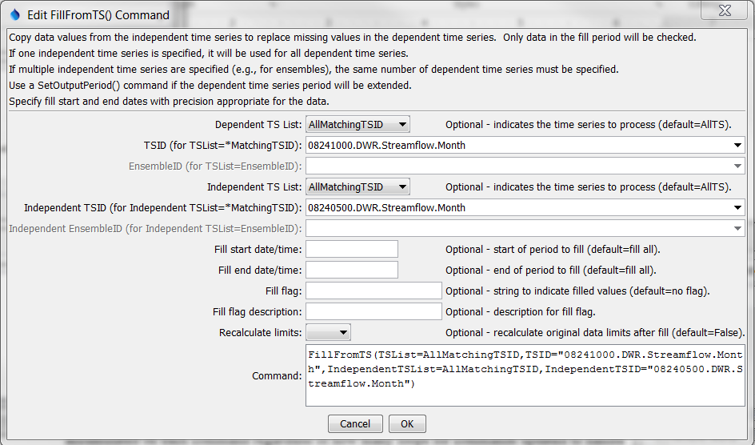

# TSTool / Command / FillFromTS #

* [Overview](#overview)
* [Command Editor](#command-editor)
* [Command Syntax](#command-syntax)
* [Examples](#examples)
* [Troubleshooting](#troubleshooting)
* [See Also](#see-also)

-------------------------

## Overview ##

The `FillFromTS` command fills missing data in a time series (or ensemble) by
transferring non-missing values from another time series (or ensemble).
This is useful when two time series typically have very similar values.
The filled time series is not automatically extended.
A period can be specified to limit the period that is checked for missing data.
See also the [`SetFromTS`](../SetFromTS/SetFromTS) command, which will transfer all values.
If multiple time series or an ensemble is being processed,
the number of independent time series must be one or the same number as the time series being filled.
Data transfer occurs by date/time, not sequentially.
This may be a problem if trying to fill from a time series that has
been shifted and leap years have caused an offset – an
enhancement may be made in the future to address this issue.  

## Command Editor ##

The following dialog is used to edit the command and illustrates the syntax of the command.
<a href="../FillFromTS.png">See also the full-size image.</a>



**<p style="text-align: center;">
`FillFromTS` Command Editor
</p>**

## Command Syntax ##

The command syntax is as follows:

```text
FillFromTS(Parameter="Value",...)
```
**<p style="text-align: center;">
Command Parameters
</p>**

|**Parameter**&nbsp;&nbsp;&nbsp;&nbsp;&nbsp;&nbsp;&nbsp;&nbsp;&nbsp;&nbsp;&nbsp;&nbsp;&nbsp;&nbsp;&nbsp;&nbsp;&nbsp;&nbsp;&nbsp;&nbsp;&nbsp;&nbsp;&nbsp;&nbsp;&nbsp;&nbsp;&nbsp;|**Description**|**Default**&nbsp;&nbsp;&nbsp;&nbsp;&nbsp;&nbsp;&nbsp;&nbsp;&nbsp;&nbsp;&nbsp;&nbsp;&nbsp;&nbsp;&nbsp;&nbsp;&nbsp;&nbsp;&nbsp;&nbsp;&nbsp;&nbsp;&nbsp;&nbsp;&nbsp;&nbsp;&nbsp;&nbsp;&nbsp;&nbsp;&nbsp;&nbsp;&nbsp;&nbsp;&nbsp;|
|--------------|-----------------|-----------------|
|`TSList`|Indicates the list of time series to be processed, one of:<br><ul><li>`AllMatchingTSID` – all time series that match the TSID (single TSID or TSID with wildcards) will be processed.</li><li>`AllTS` – all time series before the command.</li><li>`EnsembleID` – all time series in the ensemble will be processed (see the EnsembleID parameter).</li><li>`FirstMatchingTSID` – the first time series that matches the TSID (single TSID or TSID with wildcards) will be processed.</li><li>`LastMatchingTSID` – the last time series that matches the TSID (single TSID or TSID with wildcards) will be processed.</li><li>`SelectedTS` – the time series are those selected with the [`SelectTimeSeries`](../SelectTimeSeries/SelectTimeSeries) command.</li></ul> | `AllTS` |
|`TSID`|The time series identifier or alias for the time series to be processed, using the `*` wildcard character to match multiple time series.  Can be specified using `${Property}`.|Required if `TSList=*TSID`|
|`EnsembleID`|The ensemble to be processed, if processing an ensemble. Can be specified using `${Property}`.|Required if `TSList=*EnsembleID`|
|`IndependentTSList`|Indicates how to determine the list of independent time series (see the explanation of `TSList`).|`AllTS`|
|`IndependentTSID`|The time series identifier or alias for the independent time series (see the explanation of `TSID`).  Can be specified with processor `${Property}`.|Required when a `IndependentTSList=*TSID`|
|`IndependentEnsembleID`|The ensemble identifier for the independent time series (see the explanation of `EnsembleID`).  Can be specified with processor `${Property}`.|Required when `IndependentTSList=EnsembleID`|
|`FillStart`|The date/time to start filling.  Can be specified with processor `${Property}`.|Fill the entire period.|
|`FillEnd`|The date/time to end filling.  Can be specified with processor `${Property}`.|Fill the entire period.|
|`FillFlag`|If specified, data flags will be enabled for the time series and each filled value will be tagged with the specified string.  The flag can then be used later to label graphs, etc.  Prefix with `+` to append the flag.  Can be specified with processor `${Property}`.|No flag is assigned.|
|`FillFlagDesc`|Description for the fill flag, used in reports.  Can be specified with processor `${Property}`.|Automatically generated.|
|`RecalcLimits`|Available only for monthly time series.  Indicate whether the original data limits for the time series should be recalculated after the filling the time series.  Setting to `True` is appropriate if the independent time series provides additional data values.|`False` (only the values in the initial time series will be used for historical data).|

## Examples ##

See the [automated tests](https://github.com/OpenWaterFoundation/cdss-app-tstool-test/tree/master/test/regression/commands/general/FillFromTS).

## Troubleshooting ##

## See Also ##

* [`SelectTimeSeries`](../SelectTimeSeries/SelectTimeSeries) command
* [`SetFromTS`](../SetFromTS/SetFromTS) command
