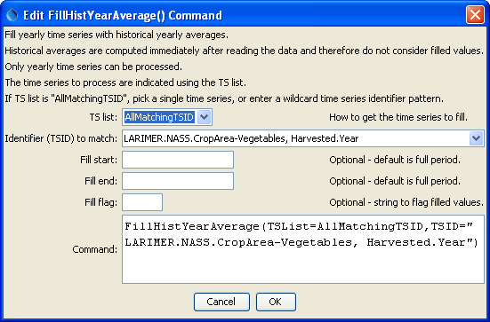

# TSTool / Command / FillHistYearAverage #

* [Overview](#overview)
* [Command Editor](#command-editor)
* [Command Syntax](#command-syntax)
* [Examples](#examples)
* [Troubleshooting](#troubleshooting)
* [See Also](#see-also)

-------------------------

## Overview ##

The `FillHistYearAverage` command fills missing data in yearly time series with the average annual value.
The average values are computed using the available data period (or specified averaging
period – see the
[`SetAveragePeriod`](../SetAveragePeriod/SetAveragePeriod.md) command)
immediately after the time series is read and are then applied when this command is encountered.

## Command Editor ##

The following dialog is used to edit the command and illustrates the syntax of the command.

**<p style="text-align: center;">

</p>**

**<p style="text-align: center;">
`FillHistYearAverage` Command Editor (<a href="../FillHistYearAverage.png">see also the full-size image</a>)
</p>**

## Command Syntax ##

The command syntax is as follows:

```text
FillHistYearAverage(Parameter="Value",...)
```
**<p style="text-align: center;">
Command Parameters
</p>**

|**Parameter**&nbsp;&nbsp;&nbsp;&nbsp;&nbsp;&nbsp;&nbsp;&nbsp;&nbsp;&nbsp;&nbsp;|**Description**|**Default**&nbsp;&nbsp;&nbsp;&nbsp;&nbsp;&nbsp;&nbsp;&nbsp;&nbsp;&nbsp;&nbsp;&nbsp;&nbsp;&nbsp;&nbsp;&nbsp;&nbsp;&nbsp;&nbsp;&nbsp;&nbsp;&nbsp;&nbsp;&nbsp;&nbsp;&nbsp;&nbsp;|
|--------------|-----------------|-----------------|
|`TSList`|Indicates the list of time series to be processed, one of:<br><ul><li>`AllMatchingTSID` – all time series that match the TSID (single TSID or TSID with wildcards) will be processed.</li><li>`AllTS` – all time series before the command.</li><li>`EnsembleID` – all time series in the ensemble will be processed (see the EnsembleID parameter).</li><li>`FirstMatchingTSID` – the first time series that matches the TSID (single TSID or TSID with wildcards) will be processed.</li><li>`LastMatchingTSID` – the last time series that matches the TSID (single TSID or TSID with wildcards) will be processed.</li><li>`SelectedTS` – the time series are those selected with the [`SelectTimeSeries`](../SelectTimeSeries/SelectTimeSeries.md) command.</li></ul> | `AllTS` |
|`TSID`|The time series identifier or alias for the time series to be processed, using the `*` wildcard character to match multiple time series.  Can be specified using `${Property}`.|Required if `TSList=*TSID`|
|`EnsembleID`|The ensemble to be processed, if processing an ensemble. Can be specified using `${Property}`.|Required if `TSList=*EnsembleID`|
|`FillStart`|Date/time indicating the start of filling, using a precision appropriate for the time series, or `OutputStart`.  Can be specified using processor `${Property}`.|Fill the entire time series.|
|`FillEnd`|Date/time indicating the end of filling, using a precision appropriate for the time series, or `OutputEnd`.  Can be specified using processor `${Property}`.|Fill the entire time series.|
|`FillFlag`|If specified as a single character, data flags will be enabled for the time series and each filled value will be tagged with the specified character.  The flag can then be used later to label graphs, etc.  The flag will be appended to existing flags if necessary.|No flag is assigned.|

## Examples ##

See the [automated tests](https://github.com/OpenCDSS/cdss-app-tstool-test/tree/master/test/regression/commands/general/FillHistYearAverage).

The following command files fill a time series from the State of Colorado’s
[State of Colorado’s HydroBase database](../../datastore-ref/CO-HydroBase/CO-HydroBase.md).

```
LARIMER.NASS.CropArea-Vegetables, Harvested.Year~HydroBase
FillHistYearAverage(TSList=AllMatchingTSID,
TSID="LARIMER.NASS.CropArea-Vegetables, Harvested.Year")
```

Time series data limits for the averages are printed to the log file,
similar to the following example (note that the period for averaging is always shown and may be different than the output period).

```
Min:               95.0000 ACRE on 1954
Max:             2684.0000 ACRE on 1959
Sum:            11090.0000 ACRE
Mean:            1008.1818 ACRE
Number Missing:     42 (79.25%)
Number Not Missing: 11 (20.75%)
Total period: 1945 to 1997
Non-missing data period: 1945 to 1997
```

## Troubleshooting ##

## See Also ##

* [`FillHistMonthAverage`](../FillHistMonthAverage/FillHistMonthAverage.md) command
* [`SelectTimeSeries`](../SelectTimeSeries/SelectTimeSeries.md) command
* [`SetAveragePeriod`](../SetAveragePeriod/SetAveragePeriod.md) command
