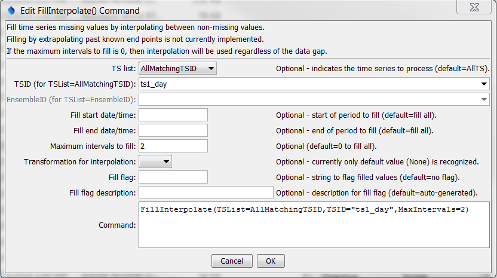

# Learn TSTool / Command / FillInterpolate #

* [Overview](#overview)
* [Command Editor](#command-editor)
* [Command Syntax](#command-syntax)
* [Examples](#examples)
* [Troubleshooting](#troubleshooting)
* [See Also](#see-also)

-------------------------

## Overview ##

The `FillInterpolate` command fills missing data in a time series by
interpolating between known values within the same time series.
The command currently will not extrapolate past end points.

## Command Editor ##

The following dialog is used to edit the command and illustrates the syntax of the command.
<a href="../FillInterpolate.png">See also the full-size image.</a>



**<p style="text-align: center;">
`FillInterpolate` Command Editor
</p>**

## Command Syntax ##

The command syntax is as follows:

```text
FillInterpolate(Parameter="Value",...)
```
**<p style="text-align: center;">
Command Parameters
</p>**

|**Parameter**&nbsp;&nbsp;&nbsp;&nbsp;&nbsp;&nbsp;&nbsp;&nbsp;&nbsp;&nbsp;&nbsp;&nbsp;&nbsp;|**Description**|**Default**&nbsp;&nbsp;&nbsp;&nbsp;&nbsp;&nbsp;&nbsp;&nbsp;&nbsp;&nbsp;&nbsp;&nbsp;&nbsp;&nbsp;&nbsp;&nbsp;&nbsp;&nbsp;&nbsp;&nbsp;&nbsp;&nbsp;&nbsp;&nbsp;&nbsp;&nbsp;&nbsp;|
|--------------|-----------------|-----------------|
|`TSList`|Indicates the list of time series to be processed, one of:<br><ul><li>`AllMatchingTSID` – all time series that match the TSID (single TSID or TSID with wildcards) will be processed.</li><li>`AllTS` – all time series before the command.</li><li>`EnsembleID` – all time series in the ensemble will be processed (see the EnsembleID parameter).</li><li>`FirstMatchingTSID` – the first time series that matches the TSID (single TSID or TSID with wildcards) will be processed.</li><li>`LastMatchingTSID` – the last time series that matches the TSID (single TSID or TSID with wildcards) will be processed.</li><li>`SelectedTS` – the time series are those selected with the [`SelectTimeSeries`](../SelectTimeSeries/SelectTimeSeries) command.</li></ul> | `AllTS` |
|`TSID`|The time series identifier or alias for the time series to be processed, using the `*` wildcard character to match multiple time series.  Can be specified using `${Property}`.|Required if `TSList=*TSID`|
|`EnsembleID`|The ensemble to be processed, if processing an ensemble. Can be specified using `${Property}`.|Required if `TSList=*EnsembleID`|
|`FillStart`|The starting date/time for the fill.  Can be specified using processor `${Property}`.|Available period.|
|`FillEnd`|The ending date/time for the fill.  Can be specified using processor `${Property}`.|Available period.|
|`MaxIntervals`|The maximum number of consecutive intervals to fill (0 indicates no limits on the number of consecutive intervals that can be filled).|`0`|
|`Transformation`|Indicate the data transformation to occur for interpolation.  Currently, None is the only option and is the default.  Earlier versions used Linear.|None (no transformation).|
|`FillFlag`|A string to flag data values that are filled.  Can be specified using processor `${Property}`.|None – do not flag filled data.|
|`FillFlagDesc`|Description for FillFlag.  Can be specified using processor `${Property}`.|Auto-generated.|

## Examples ##

See the [automated tests](https://github.com/OpenWaterFoundation/cdss-app-tstool-test/tree/master/test/regression/commands/general/FillInterpolate).

A sample command file to process a time series from the [State of Colorado’s HydroBase database](../../datastore-ref/CO-HydroBase/CO-HydroBase)
is as follows:

```text
# 06707500 - SOUTH PLATTE RIVER AT SOUTH PLATTE
06707500.DWR.Streamflow.Month~HydroBase
FillInterpolate(TSList=AllMatchingTSID,TSID="06707500.DWR.Streamflow.Month",MaxIntervals=3,Transformation=None)
```

## Troubleshooting ##

## See Also ##

* [`SelectTimeSeries`](../SelectTimeSeries/SelectTimeSeries) command
