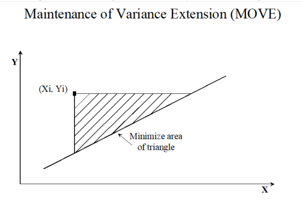
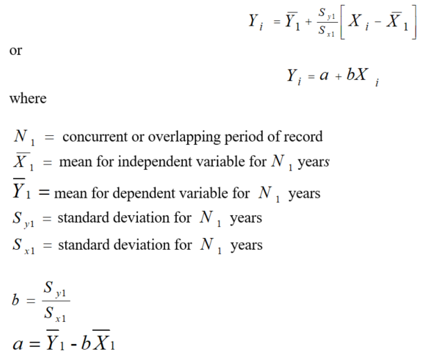

# TSTool / Command / FillMOVE1 #

*   [Overview](#overview)
*   [See Also](#see-also)

-------------------------

## Overview ##

The `FillMOVE1` command has not been enabled.
This documentation serves as a reference for the MOVE1 procedure.
Refer to the [`FillMOVE2`](../FillMOVE2/FillMOVE2.md) command, which is an improvement on the MOVE.1 approach.

Maintenance of variance extension (MOVE) procedures are methods of fitting straight lines to data.
The slope and intercept of the MOVE equations are computed differently
than in ordinary least squares (OLS) regression (see the [`FillRegression`](../FillRegression/FillRegression.md)
command for a discussion of OLS regression).
As shown below, an area of a triangle is minimized in the MOVE procedures rather than a vertical distance as in OLS regression.
The MOVE procedures do not provide the minimum-variance estimate of a single value
but an ensemble of points estimated by the MOVE procedures will have the same variability as the true values.

MOVE procedures are useful in extending the record at a streamflow gaging station where the
extended record will be subsequently used in another analysis such as frequency analysis.
MOVE procedures will provide about the same estimates as OLS regression near the mean of the data
but will provide smaller and larger estimates at the extremes of the data set.
The slope of the MOVE relation is steeper than OLS regression.
The MOVE procedures are based on only one independent variable and the assumption
is that there is a linear relation between the dependent and independent variables.
If the untransformed data are not linearly related,
then it is common to transform the data using a logarithmic transformation.

The MOVE.1 procedure uses just the data from the N1 years of concurrent data.
The MOVE.2 procedure (see the [`FillMOVE2`](../FillMOVE2/FillMOVE2.md) command) uses the Two-Station Comparison
procedure described in Appendix 7 of Bulletin 17B, Guidelines for Determining Flood Flow Frequency, USGS,
to compute improved estimates of the mean and variance for the dependent time series
and uses all the data at the dependent time series to estimate the mean and variance of the dependent time series.
The MOVE.2 procedure has been shown to be marginally better than MOVE.1.

**

**

The MOVE.1 equation is used to estimate values for the dependent time series from the independent time series:

**

**

Note that the slope of the line does not include the correlation coefficient.
This is the only difference between OLS regression and MOVE.1.

## See Also ##

*   [`FillMOVE2`](../FillMOVE2/FillMOVE2.md) command
*   [`FillRegression`](../FillRegression/FillRegression.md) command
*   Hirsch, R. M., 1982, “A Comparison of Four Streamflow Record Extension Techniques”, Water Resources Research, Vol. 18, No. 4, pages 1081-1088.
