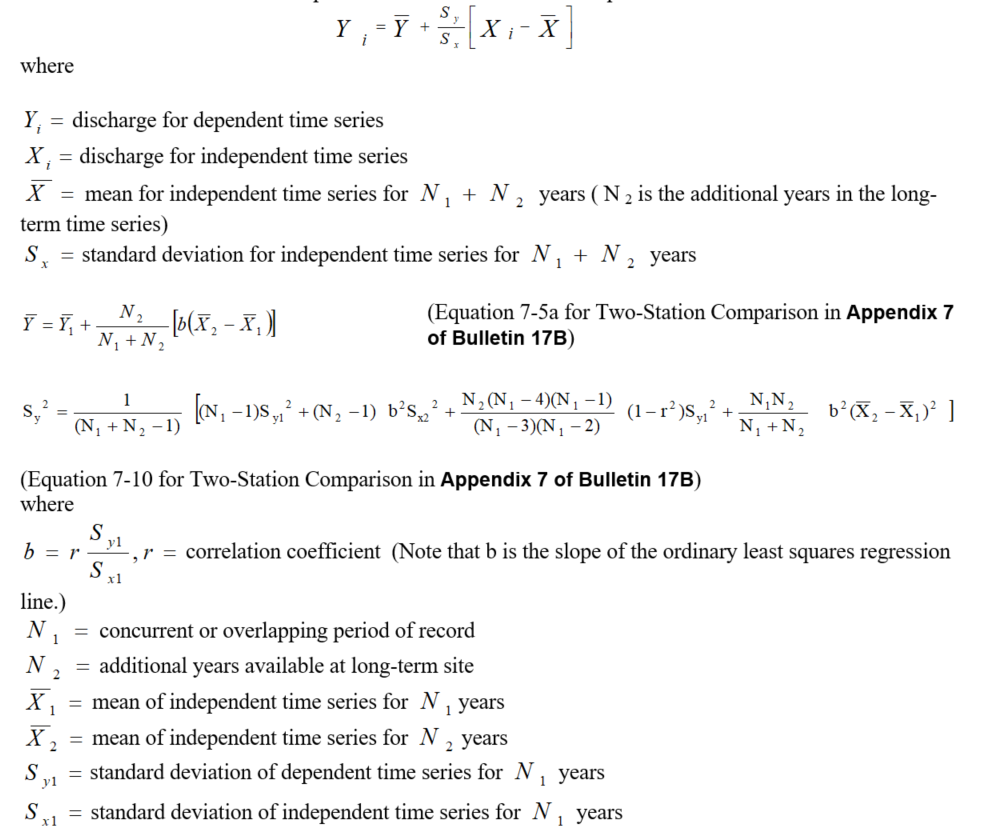
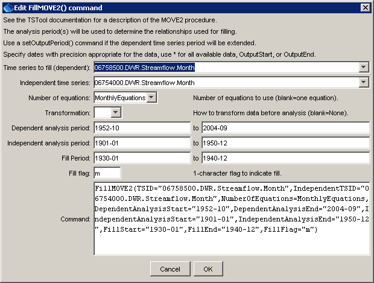

# TSTool / Command / FillMOVE2 #

* [Overview](#overview)
* [Command Editor](#command-editor)
* [Command Syntax](#command-syntax)
* [Examples](#examples)
* [Troubleshooting](#troubleshooting)
* [See Also](#see-also)

-------------------------

## Overview ##

The `FillMOVE2` command fills missing data in a time series using the MOVE.2 procedure
(see the [FillMove1](../FillMOVE1/FillMOVE1.md) command for background information).
The MOVE.2 procedure uses the Two-Station Comparison procedure described in Appendix 7 of Bulletin 17B,
Guidelines for Determining Flood Flow Frequency, USGS,
to compute improved estimates of the mean and variance at the dependent or short-term station and uses
all the data at the dependent time series to estimate the mean and variance of the dependent time series.
See also:  Hirsch, R. M., 1982, “A Comparison of Four Streamflow Record Extension Techniques”,
Water Resources Research, Vol. 18, No. 4, pages 1081-1088.
The MOVE.2 procedure has been shown to be marginally better than MOVE.1.
The following MOVE.2 equation is used to estimate values for the dependent time series from the independent time series:

**<p style="text-align: center;">

</p>**

## Command Editor ##

The following dialog is used to edit the command and illustrates the command syntax,

**<p style="text-align: center;">

</p>**

**<p style="text-align: center;">
`FillMOVE2` Command Editor (<a href="../FillMOVE2.png">see also the full-size image</a>)
</p>**

## Command Syntax ##

The command syntax is as follows:

```text
FillMOVE2(Parameter="Value",...)
```
**<p style="text-align: center;">
Command Parameters
</p>**

|**Parameter**&nbsp;&nbsp;&nbsp;&nbsp;&nbsp;&nbsp;&nbsp;&nbsp;&nbsp;&nbsp;&nbsp;&nbsp;&nbsp;&nbsp;&nbsp;&nbsp;&nbsp;&nbsp;&nbsp;&nbsp;&nbsp;&nbsp;&nbsp;&nbsp;&nbsp;&nbsp;&nbsp;&nbsp;&nbsp;&nbsp;&nbsp;&nbsp;&nbsp;|**Description**|**Default**&nbsp;&nbsp;&nbsp;&nbsp;&nbsp;&nbsp;&nbsp;&nbsp;&nbsp;&nbsp;&nbsp;&nbsp;&nbsp;&nbsp;&nbsp;&nbsp;&nbsp;&nbsp;&nbsp;&nbsp;&nbsp;&nbsp;&nbsp;&nbsp;&nbsp;&nbsp;&nbsp;|
|--------------|-----------------|-----------------|
| `TSID` | The time series identifier or alias for the time series to be filled (dependent time series). | None – must be specified. |
| `IndependentTSID` | The time series identifier or alias for the independent time series, to supply data. | None – must be specified. |
| `NumberOfEquations` | `OneEquation` or `MonthlyEquations`, indicating how many relationships are to be determined. | `OneEquation` |
| `Transformation` | `Log` or `None`, indicating the type of data transformation.  If the `Log` option is used, zero and negative values are set to `.001` (`-999` values are treated as missing data and are ignored), and the data values are transformed using log10. | `None` |
| `DependentAnalysisStart`, `DependentAnalysisEnd` | The period for N1 (overlapping data) that is used to analyze the dependent time series.  For example, this may be the unregulated period for streamflow data.  Typically, this is longer than the independent analysis period. | Analyze the full period. |
| `IndependentAnalysisStart`, `IndependentAnalysisEnd` | The period for N2 (non-overlapping data) that is used to analyze the independent time series.  For example, this may be the unregulated period for streamflow data. | Analyze the full period. |
| `FillStart` | The date/time to start filling. | Fill the full period. |
| `FillEnd` | The date/time to end filling. | Fill the full period. |
| `FillFlag` | A single character to be used to flag filled points on graphs and other output. | Do not flag filled data. |

## Examples ##

See the [automated tests](https://github.com/OpenCDSS/cdss-app-tstool-test/tree/master/test/regression/commands/general/FillMOVE2).

A sample command file illustrating how to fill time series from the State of Colorado’s HydroBase is as follows
(MOVE2 and ordinary least squares regression are used to allow comparing the results):

```
StartLog(LogFile="Results/commands.TSTool.log",Suffix="Date")
SetOutputPeriod(OutputStart="1901-01",OutputEnd="2004-12")
# 06758500 - SOUTH PLATTE RIVER NEAR WELDONA
06758500.DWR.Streamflow.Month~HydroBase
# 06754000 - SOUTH PLATTE RIVER NEAR KERSEY
06754000.DWR.Streamflow.Month~HydroBase
FillMOVE2(TSID="06758500.DWR.Streamflow.Month",IndependentTSID="06754000.DWR.Streamflow.Month",NumberOfEquations=MonthlyEquations,DependentAnalysisStart="1952-10",DependentAnalysisEnd="2004-09",IndependentAnalysisStart="1901-01",IndependentAnalysisEnd="1950-12",FillStart="1930-01",FillEnd="1940-12",FillFlag="m")
# 06758500 - SOUTH PLATTE RIVER NEAR WELDONA
06758500.DWR.Streamflow.Month~HydroBase
# 06754000 - SOUTH PLATTE RIVER NEAR KERSEY
06754000.DWR.Streamflow.Month~HydroBase
FillRegression(TSID="06758500.DWR.Streamflow.Month",
IndependentTSID="06754000.DWR.Streamflow.Month")
```

## Troubleshooting ##

## See Also ##

* [`FillMOVE1`](../FillMOVE1/FillMOVE1.md) command
* [`FillRegression`](../FillRegression/FillRegression.md) command
