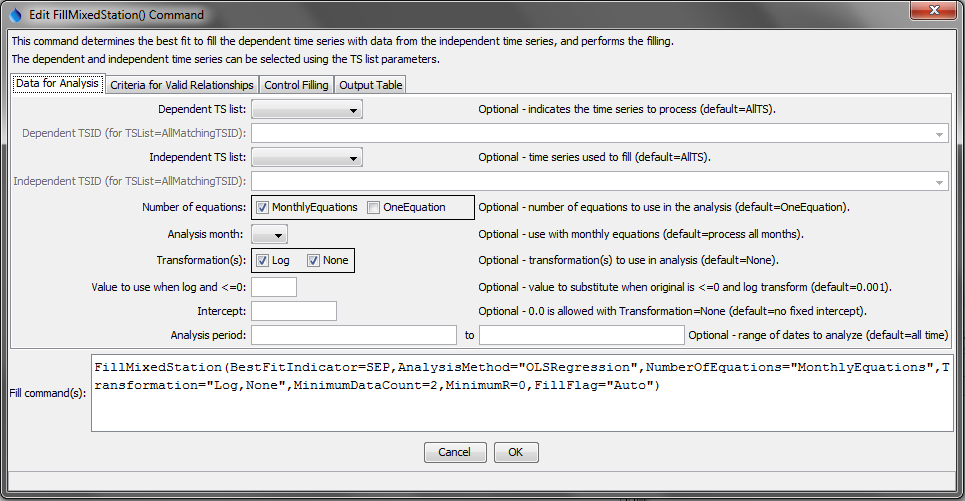
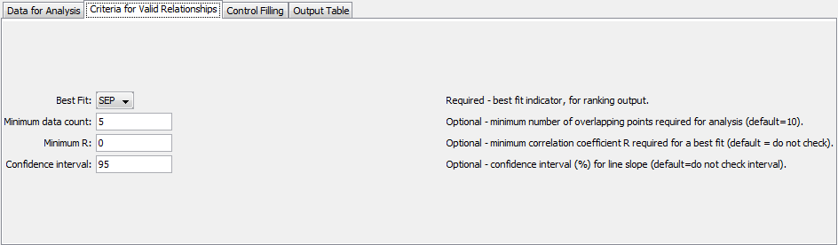
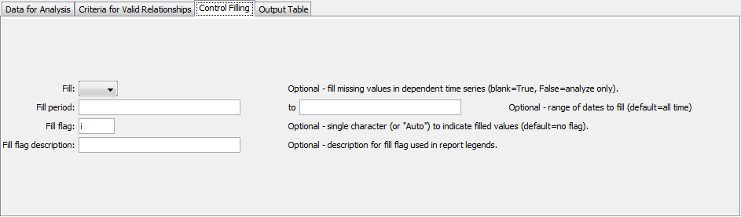
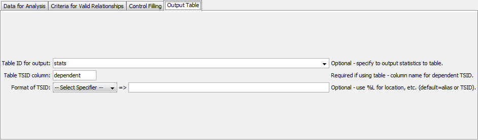
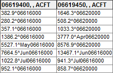
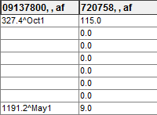
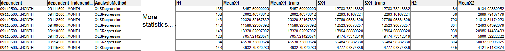

# TSTool / Command / FillMixedStation #

*   [Overview](#overview)
*   [Command Editor](#command-editor)
*   [Command Syntax](#command-syntax)
*   [Examples](#examples)
*   [Troubleshooting](#troubleshooting)
*   [See Also](#see-also)

-------------------------

## Overview ##

The `FillMixedStation` command fills missing data in a time series where one
or more independent time series are used to sequentially fill missing data.
This approach has been developed to automate analysis of regression filling and
to facilitate batch filling of many related time series.
This implementation is based on the Mixed Station Model implemented for
Colorado’s Decision Support Systems (Ayres Associates, 2000),
which was based on the similarly named approach implemented by the USGS (Alley and Burns, 1981).
However, due to performing calculations in double precision in TSTool, the results are not always identical.

The time series involved in the analysis are typically related,
such as being from nearby locations in a region.  The main uses of the command are

1.  To automatically fill every time series in a data set, using other time series in the data set.
    For example, for hydrologic modeling natural flow time series may have been
    estimated by processing measured streamflow, diversion, and reservoir time series.
    The natural flow time series can be filled for use in modeling.
2.  To perform an analysis without filling, to guide application of individual
    [`FillRegression`](../FillRegression/FillRegression.md) and other commands.

Important:  TSTool does not automatically exclude time series that have been filled in previous steps.
Consequently, care must be taken when specifying the list of independent time
series to NOT use time series that were filled in a previous step.
In the future, features may be enabled to examine the data flags to determine if data have been filled.

For each dependent time series being filled, the Mixed Station Analysis (MSA) selects
the independent time series and parameters that result in the best filling results, considering combinations of the following:

*   The list of independent time series being considered can be constrained to a subset of available time series.
*   Filling methods include ordinary least squares (OLS) regression (see the
    [`FillRegression`](../FillRegression/FillRegression.md) command for details).
    Support for MOVE2 may be added in the future (see the
    [`FillMOVE2`](../FillMOVE2/FillMOVE2.md) command for details).
*   One equation and/or monthly equations can be used.
*   The data can be transformed using log10, or no transformation can be applied.
*   A minimum number of overlapping data points (sample size `N1`) can be specified to indicate a valid relationship.
*   A minimum correlation coefficient r can be specified to indicate a valid relationship.
*   A minimum confidence level for the slope of the regression line can be specified (see T-Test discussion below).
*   The best fit indicator can be the correlation coefficient (R), or the standard error of prediction (SEP, described below).

Because extensive analysis may be necessary to evaluate all the combinations of parameters,
the `FillMixedStation` command will be slower than other commands that
specifically indicate how to perform the filling.
The number of combinations can also be limited by reducing the number of parameter
options and using stricter limitations on the number of overlapping points and
correlation coefficients that are required for a good regression result.

The full MSA process is as follows:

1.  For each dependent time series, perform a regression analysis using a unique combination
    of parameters (e.g., use an independent time series, OLS regression with one equation, no data transform).
    This results in 1+ regression results for each dependent time series.
2.  Qualifying results (those that meet the requirements of minimum number of overlapping
    points and correlation coefficient) are retained in a list for the dependent time series, for processing in the next step.
3.  The qualifying results are used to estimate each missing value.
    Typically, the SEP is used to select the relationship to use (the one that has lowest SEP).
4.  Missing data in the dependent time series are filled using the regression results for the selected relationship.
    If missing values remain, the next highest ranking regression result is used until all missing
    values are filled (or no additional qualifying regression results are available).
    Monthly filling occurs on each of the 12 months.
    This approach may use different stations for each filled value because of the goodness of fit
    of the relationship and because different stations may or may not have data that overlap the period to be filled.

### Implementation in Colorado’s Decision Support Systems ###

The Mixed Station Model implemented for the State of Colorado typically used the following input:

*   Log transform (`Transform=Log10`)
*   One and monthly relationships (`NumberOfEquations=MonthlyEquations`,`OneEquation`)
*   Rank on SEP (`BestFitIndicator=SEP`)
*   Minimum concurrent values = `5` (`MinimumDataCount=5`)
*   Confidence level = `95%` (`ConfidenceInterval=95`)
*   Fill all time series in data set (nothing selected in filling)

## Command Editor ##

The command is available in the following TSTool menu:

*   ***Commands / Fill Time Series Missing Data***

The following dialog is used to edit the command and illustrates the syntax of the command.

**<p style="text-align: center;">

</p>**

**<p style="text-align: center;">
`FillMixedStation` Command Editor for Analysis Parameters (<a href="../FillMixedStation_Data.png">see full-size image</a>)
</p>**

**<p style="text-align: center;">

</p>**

**<p style="text-align: center;">
`FillMixedStation` Command Editor for Criteria Parameters (<a href="../FillMixedStation_Criteria.png">see full-size image</a>)
</p>**

**<p style="text-align: center;">

</p>**

**<p style="text-align: center;">
`FillMixedStation` Command Editor for Fill Parameters (<a href="../FillMixedStation_Fill.png">see full-size image</a>)
</p>**

**<p style="text-align: center;">

</p>**

**<p style="text-align: center;">
`FillMixedStation` Command Editor for Output Parameters (<a href="../FillMixedStation_Output.png">see full-size image</a>)
</p>**

## Command Syntax ##

The command syntax is as follows:

```text
FillMixedStation(Parameter="Value",...)
```
**<p style="text-align: center;">
Command Parameters
</p>**

|**Parameter**&nbsp;&nbsp;&nbsp;&nbsp;&nbsp;&nbsp;&nbsp;&nbsp;&nbsp;&nbsp;&nbsp;&nbsp;&nbsp;&nbsp;&nbsp;&nbsp;&nbsp;&nbsp;&nbsp;&nbsp;&nbsp;&nbsp;&nbsp;&nbsp;&nbsp;|**Description**|**Default**&nbsp;&nbsp;&nbsp;&nbsp;&nbsp;&nbsp;&nbsp;&nbsp;&nbsp;&nbsp;&nbsp;&nbsp;&nbsp;&nbsp;&nbsp;&nbsp;&nbsp;&nbsp;&nbsp;&nbsp;&nbsp;&nbsp;&nbsp;&nbsp;&nbsp;&nbsp;&nbsp;|
|--------------|-----------------|-----------------|
| `DependentTSList` | Indicates the list of independent time series to be processed, one of:<ul><li>`AllMatchingTSID` – all time series that match the TSID (single TSID or TSID with wildcards) will be processed.</li><li>`AllTS` – all time series before the command will be processed.</li><li>`EnsembleID` – all time series in the ensemble will be processed.</li><li>`FirstMatchingTSID` – the first time series that matches the TSID (single TSID or TSID with wildcards) will be processed.</li><li>`LastMatchingTSID` – the last time series that matches the TSID (single TSID or TSID with wildcards) will be processed.</li><li>`SelectedTS` – the time series selected with the [`SelectTimeSeries`](../SelectTimeSeries/SelectTimeSeries.md) command will be processed.</li></ul> | `AllTS` |
| `DependentTSID` | The time series identifier or alias for the dependent time series to be processed, using the `*` wildcard character to match multiple time series. | Required if `DependentTSList=*TSID`. |
| `IndependentTSList` | Indicates the list of independent time series to be considered for each dependent time series, one of:<ul><li> `AllMatchingTSID` – all time series that match the TSID (single TSID or TSID with wildcards) will be processed.</li><li> `AllTS` – all time series before the command will be processed.</li><li> `EnsembleID` – all time series in the ensemble will be processed.</li><li> `FirstMatchingTSID` – the first time series that matches the TSID (single TSID or TSID with wildcards) will be processed.</li><li> `LastMatchingTSID` – the last time series that matches the TSID (single TSID or TSID with wildcards) will be processed.</li><li> `SelectedTS` – the time series selected with the [`SelectTimeSeries`](../SelectTimeSeries/SelectTimeSeries.md) command will be processed.</li></ul> | `AllTS` |
| `IndependentTSID` | The time series identifier or alias for the independent time series to be compared, using the `*` wildcard character to match multiple time series. | Required if `IndependentTSList=*TSID`. |
| `NumberOfEquations` | The number of equations to use for the analysis:  `OneEquation` and/or `MonthlyEquations`. | `OneEquation` |
| `AnalysisMonth` | The month that data should be considered for. | All months |
| `Transformation` | Indicates how to transform the data before analyzing.  Specify as None (no transformation) or `Log` (for `Log10`).  If the Log option is used, zero and negative values in data are set to `.001`. Missing data are ignored.  If multiple values are selected, separate with a comma and surround with double quotes. | None (no transformation) |
| `LEZeroLogValue` | Value to use for data values less than or equal to zero when using a log transformation. The Log10 of this value will be used in calculations.  Use `Missing` to ignore those values entirely. Caution: this will set `0` as a missing value in the time series. | `.0010` |
| `Intercept` | Specify as 0 to force the intercept of the best-fit line through the origin.  This is made available only for OLS regression analysis on untransformed data, to be consistent with the [`FillRegression`](../FillRegression/FillRegression.md) command. | Do not force the intercept through zero. |
| `AnalysisStart` | The date/time to start the analysis, to focus on a period appropriate for analysis.  For example, specify the unregulated period for streamflow. | Analyze the full period. |
| `AnalysisEnd` | The date/time to end the analysis. | Analyze the full period. |
| `BestFitIndicator` | Specifies the indicator to use when determining the best fit, one of:<ul><li>`R` – correlation coefficient (attempts to maximize)</li><li>`SEP` – Standard Error of Prediction, defined as the square root of the sum of differences between the known dependent value, and the value determined from the equation of best fit at the same point (attempts to minimize)</li></ul> | `SEP` |
| `MinimumDataCount` | The minimum number of overlapping data points that are required for a valid analysis (`N1` in [`FillRegression`](../FillRegression/FillRegression.md) documentation).  If the minimum count is not met, then the independent time series is ignored for the specific combination of parameters.  For example, if monthly equations are used, the independent time series may be ignored for the specific month; however, it may still be analyzed for other months. | `10` |
| `MinimumR` | The minimum correlation coefficient required for a best fit.  If the minimum is not met, then the results are not considered in the best fit ranking or filling. | |
| `ConfidenceLevel` | Required confidence level for the T-Test on the regression slope.  Relationships not passing the test are not allowed for filling. | No limit on confidence level. |
| `Fill` | Indicates whether filling should occur (`True`) or just analyze to compute statistics (`False`). The latter is useful for testing combinations of statistics prior to actually performing filling.  For example, use this command to analyze relationships, create an output table, and then use individual [`FillRegression`](../FillRegression/FillRegression.md) commands for filling specific time series. | `True` |
| `FillStart` | The date/time to start filling, if other than the full time series period.Fill the full period. | Fill the entire period. |
| `FillEnd` | The date/time to end filling, if other than the full time series period.Fill the full period. | Fill the entire period. |
| `FillFlag` | A single character that will be used to flag filled data. `Auto` will show whether a monthly or single equation was used to fill, as well as what rank the equation used to fill was. `I` will show the location of the equation used to fill. | Filled values will not be flagged. |
| `FillFlagDesc` | Description for the fill flag, used in reports. | Automatically generated. |
| `MinimumR` | The minimum correlation coefficient required for a best fit.  If the minimum is not met, then the results are not considered in the best fit ranking or filling. | No limit on R. |
| `TableID` | A table identifier for a table to receive output of the analysis. Note that creating the table requires a significant amount of memory, making it impractical for very large data sets. | Statistics are not written to the table. Refer to the log file for information. |
| `TableTSIDColumn` | The name of the column in the table that contains time series identifier information. This is used to match the table with time series being analyzed so that statistics can be written to the correct row. | Required if `TableID` is specified. |
| `TableTSIDFormat` | The specifier used to format the time series identifier in the TableTSIDColumn. The location part of the TSID, or the time series alias is typically used. | The alias will be used if available, or otherwise the full TSID will be used. |

## Examples ##

See the [automated tests](https://github.com/OpenCDSS/cdss-app-tstool-test/tree/master/test/commands/FillMixedStation).

The FillFlag parameter shows more information about how the time series were filled:

**<p style="text-align: center;">

</p>**

**<p style="text-align: center;">
Example of using the `I` fill flag (<a href="../FillMixedStation_FlagI.png">see full-size image</a>)
</p>**

**<p style="text-align: center;">

</p>**

**<p style="text-align: center;">
Example of using the `Auto` fill flag (<a href="../FillMixedStation_FlagAuto.png">see full-size image</a>)
</p>**

Various statistics for each combination of time series, such as count, mean, and standard deviation, can be output in a table:

**<p style="text-align: center;">

</p>**

**<p style="text-align: center;">
Example of `FillMixedStation` output table (<a href="../FillMixedStation_Table.png">see full-size image</a>)
</p>**

More information on the statistics in this table can be found in the [`FillRegression`](../FillRegression/FillRegression.md) command documentation.

The following example command file fills natural flow time series from a StateMod model file using the traditional CDSS parameters:

```
ReadStateMod(InputFile="np2008_BF.xbf")
FillMixedStation(BestFitIndicator=SEP,NumberOfEquations="MonthlyEquations,OneEquation",Transformation="Log",ConfidenceInterval=95,MinimumDataCount=5,MinimumR=0,FillFlag="i",TableID="stats",TableTSIDColumn="dependent")
```

## Troubleshooting ##

See the main [TSTool Troubleshooting](../../troubleshooting/troubleshooting.md) documentation.

## See Also ##

*   [`FillMOVE2`](../FillMOVE2/FillMOVE2.md) command
*   [`FillRegression`](../FillRegression/FillRegression.md) command
*   [`SelectTimeSeries`](../SelectTimeSeries/SelectTimeSeries.md) command
