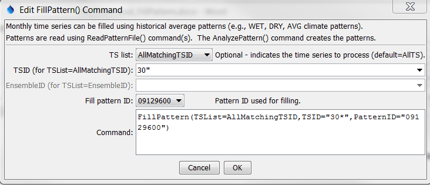

# TSTool / Command / FillPattern #

* [Overview](#overview)
* [Command Editor](#command-editor)
* [Command Syntax](#command-syntax)
* [Examples](#examples)
* [Troubleshooting](#troubleshooting)
* [See Also](#see-also)

-------------------------

## Overview ##

The `FillPattern` command fills missing data
in a time series using historical averages based on a pattern file.
For example, if May 1910 is missing and the pattern indicates that May 1910 is a `WET` month,
then the average of all `WET` Mays is used to fill the time series.
The pattern file indicates the `WET/DRY/AVG` patterns and the time series
to be filled supplies data to compute averages, for use in filling.
This feature is enabled for monthly data only.
Averages are computed as described for the
[`FillHistMonthAverage`](../FillHistMonthAverage/FillHistMonthAverage.md) command.
There is currently no way to limit the fill operation to a period (the entire time series is filled).
The pattern file is created with the
[`AnalyzePattern`](../AnalyzePattern/AnalyzePattern.md) command and a saved file must be read with a
[`ReadPatternFile`](../ReadPatternFile/ReadPatternFile.md) command.
See below for an example of a fill pattern file.
One or more patterns can be included in each pattern file,
similar to StateMod time series files ([see the StateMod Input Type appendix](../../datastore-ref/StateMod/StateMod.md)).
Multiple pattern files can be used, if appropriate.  

```
#  Years Shown = Water Years
#  Missing monthly data filled by the Mixed Station Method, USGS 1989
#  Time series identifier         = 09034500.CRDSS_USGS.QME.MONTH.1
#  Description                    = COLORADO RIVER AT HOT SULPHUR SPRINGS, CO.
# -e-b----------eb------eb------eb------eb------eb------eb------eb------eb------eb------eb------eb------eb------eb--------e
   10/1908  -      9/1996 ACFT  WYR
1909 09034500         AVG     AVG     AVG     WET     WET     AVG     AVG     AVG     WET     WET     WET     WET
1910 09034500         WET     WET     WET     WET     WET     WET     AVG     AVG     AVG     AVG     AVG     AVG
1911 09034500         AVG     AVG     WET     AVG     AVG     AVG     AVG     WET     WET     WET     AVG     WET
1912 09034500         WET     WET     WET     WET     WET     AVG     AVG     WET     WET     WET     WET     WET
...ommitted...
```

## Command Editor ##

The following dialog is used to edit the command and illustrates the syntax of the command.



**<p style="text-align: center;">
`FillPattern` Command Editor (<a href="../FillPattern.png">see also the full-size image</a>)
</p>**

## Command Syntax ##

The command syntax is as follows:

```text
FillPattern(Parameter="Value",...)
```
**<p style="text-align: center;">
Command Parameters
</p>**

|**Parameter**&nbsp;&nbsp;&nbsp;&nbsp;&nbsp;&nbsp;&nbsp;&nbsp;&nbsp;&nbsp;&nbsp;|**Description**|**Default**&nbsp;&nbsp;&nbsp;&nbsp;&nbsp;&nbsp;&nbsp;&nbsp;&nbsp;&nbsp;&nbsp;&nbsp;&nbsp;&nbsp;&nbsp;&nbsp;&nbsp;&nbsp;&nbsp;&nbsp;&nbsp;&nbsp;&nbsp;&nbsp;&nbsp;&nbsp;&nbsp;|
|--------------|-----------------|-----------------|
|`TSList`|Indicates the list of time series to be processed, one of:<br><ul><li>`AllMatchingTSID` – all time series that match the TSID (single TSID or TSID with wildcards) will be processed.</li><li>`AllTS` – all time series before the command.</li><li>`EnsembleID` – all time series in the ensemble will be processed (see the EnsembleID parameter).</li><li>`FirstMatchingTSID` – the first time series that matches the TSID (single TSID or TSID with wildcards) will be processed.</li><li>`LastMatchingTSID` – the last time series that matches the TSID (single TSID or TSID with wildcards) will be processed.</li><li>`SelectedTS` – the time series are those selected with the [`SelectTimeSeries`](../SelectTimeSeries/SelectTimeSeries.md) command.</li></ul> | `AllTS` |
|`TSID`|The time series identifier or alias for the time series to be processed, using the `*` wildcard character to match multiple time series.  Can be specified using `${Property}`.|Required if `TSList=*TSID`|
|`EnsembleID`|The ensemble to be processed, if processing an ensemble. Can be specified using `${Property}`.|Required if `TSList=*EnsembleID`|
|`PatternID`<br>**required**|The pattern identifier, matching a pattern read with [`ReadPatternFile`](../ReadPatternFile/ReadPatternFile.md) commands.|None – must be specified|.

## Examples ##

See the [automated tests](https://github.com/OpenCDSS/cdss-app-tstool-test/tree/master/test/regression/commands/general/FillPattern).

A sample command file to process data from the [State of Colorado’s StateMod model](../../datastore-ref/StateMod/StateMod.md) is as follows.
The example fills all diversion time series with identifier starting with `30`, using the pattern `09034500`
(a stream gage for the region that was analyzed to determine patterns).

```text
# Read StateMod time series to fill
ReadStateMod(InputFile="..\StateMod\sjm_prelim.ddh")
# Read the file containing the patterns
ReadPatternFile(PatternFile="fill.pat")
# Fill time series having identifiers that start with "30"
FillPattern(TSList=AllMatchingTSID,TSID="30*",PatternID="09034500")
# Write the results
WriteStateMod(TSList=AllTS,OutputFile="..\StateMod\sjm.ddh")
```

The above example fills all diversion time series with identifier starting with `30`,
using the pattern `09034500` (a stream gage for the region).

## Troubleshooting ##

## See Also ##

* [`AnalyzePattern`](../AnalyzePattern/AnalyzePattern.md) command
* [`FillHistMonthAverage`](../FillHistMonthAverage/FillHistMonthAverage.md) command
* [`ReadPatternFile`](../ReadPatternFile/ReadPatternFile.md) command
* [`SelectTimeSeries`](../SelectTimeSeries/SelectTimeSeries.md) command
