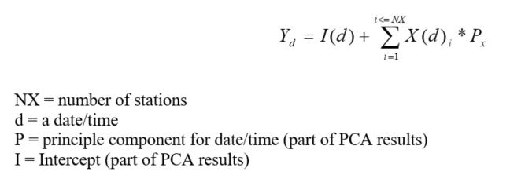
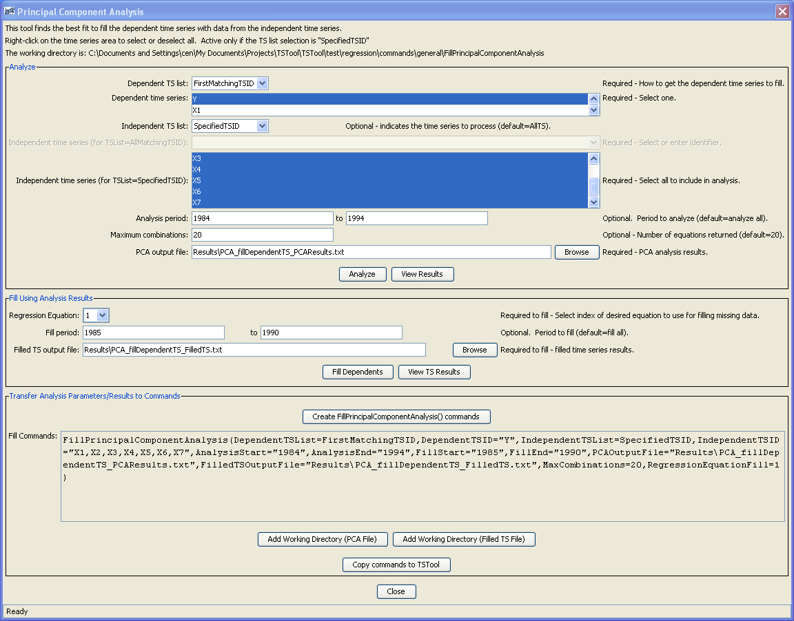
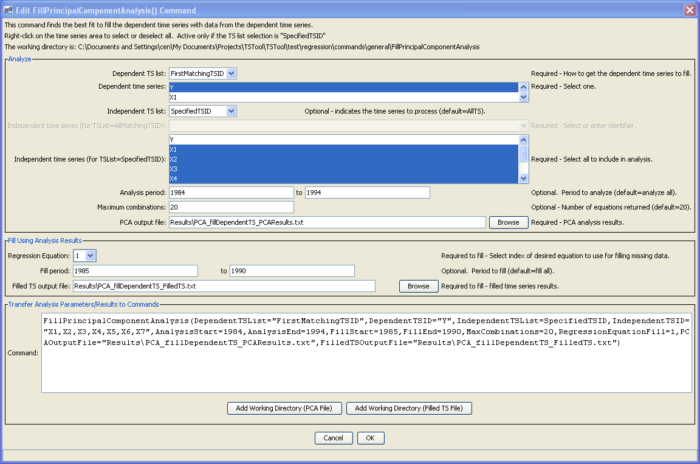

# TSTool / Command / FillPrincipalComponentAnalysis #

*   [Overview](#overview)
*   [Principal Component Analysis Tool](#principal-component-analysis-tool)
*   [Command Editor](#command-editor)
*   [Command Syntax](#command-syntax)
*   [Examples](#examples)
*   [Troubleshooting](#troubleshooting)
*   [See Also](#see-also)

-------------------------

## Overview ##

**The `FillPrincipalComponentAnalysis` command is a prototype command developed several years ago that has been disabled
due to a lack of testing and maintenance.  It can be reenabled or perhaps integrated with another tool such as R
if sufficient resources are available.
This documentation is retained for reference.**

The `FillPrincipalComponentAnalysis` command creates a list of potential regression equations for
a single dependent time series and multiple independent time series and uses the best fit to fill the dependent time series.
Both the regression analysis and filled time series are written to output files.

Principal Component Analysis (PCA) transforms a number of possibly correlated variables
into a smaller number of uncorrelated variables called principal components.
In general these principal components allow discerning between important data and noise in a data set.
Missing data in the dependent time series can be predicted using PCA results.

**<p style="text-align: center;">

</p>**

The command is typically edited as follows:

*   The PCA tool is divided into 3 main sections.  The top section assists the user in creating a principal component analysis.
    A single dependent time series and multiple independent time series can be specified.
    Once the user has created an analysis by clicking the ***Analyze*** button,
    the ***View Results*** button becomes enabled to view the resulting file contents.
*   Once the analysis has been completed,
    the ***Fill Using Analysis Results*** section becomes enabled for the next step when utilizing this dialog.
    The regression equations are numbered starting with 1, as seen in the output file from the analysis.
    These numbers correspond with the ***Regression Equation*** selection.
    When filling the dependent time series,
    all missing data from the entire period of record will be filled unless otherwise specified.
    The results are written to the file specified in ***Filled TS Output*** file and can be viewed by clicking the ***View TS Results*** button.
*   Finally, a command which can be run within TSTool can be created and copied to the
    main TSTool commands area by using the final section, ***Transfer Analysis Parameters/Results to Commands***.
*   If desired, once the command exists, edit the command directly by double clicking it within the TSTool interface.

## Principal Component Analysis Tool ##

The following dialog is used to create and utilize principal component analysis.

**<p style="text-align: center;">

</p>**

**<p style="text-align: center;">
Principal Component Analysis Tools (<a href="../PCA-tool.png">see also the full-size image</a>)
</p>**

## Command Editor ##

The command is available in the following TSTool menu:

*   ***Commands / Fill Time Series Missing Data***

The following dialog is used to edit the command.

**<p style="text-align: center;">

</p>**

**<p style="text-align: center;">
`FillPrincipalComponentAnalysis` Command Editor (<a href="../FillPrincipalComponentAnalysis.png">see also the full-size image</a>)
</p>**

## Command Syntax ##

The command syntax is as follows:

```text
FillPrincipalComponentAnalysis(Parameter="Value",...)
```
**<p style="text-align: center;">
Command Parameters
</p>**

|**Parameter**&nbsp;&nbsp;&nbsp;&nbsp;&nbsp;&nbsp;&nbsp;&nbsp;&nbsp;&nbsp;&nbsp;&nbsp;&nbsp;&nbsp;&nbsp;&nbsp;&nbsp;&nbsp;&nbsp;&nbsp;&nbsp;&nbsp;&nbsp;&nbsp;&nbsp;&nbsp;&nbsp;&nbsp;&nbsp;|**Description**|**Default**&nbsp;&nbsp;&nbsp;&nbsp;&nbsp;&nbsp;&nbsp;&nbsp;&nbsp;&nbsp;&nbsp;&nbsp;&nbsp;&nbsp;&nbsp;&nbsp;&nbsp;&nbsp;&nbsp;&nbsp;&nbsp;&nbsp;&nbsp;&nbsp;&nbsp;&nbsp;&nbsp;|
|--------------|-----------------|-----------------|
| `DependentTSList` | Indicate how the list of time series to process should be determined, currently on the following is allowed:<ul><li>`FirstMatchingTSID` – First time series in list that has identifier matching the given TSID parameter. | None – must be specified. |
| `DependentTSID` | Dependent time series identifier or alias. | None – must be specified. |
| `IndependentTSList` | Indicate how the list of time series to process should be determined, one of:<ul><li> `AllTS` – all time series</li><li> `lMatchingTSID` – all time series that have identifiers matching the given TSID parameter.</li><li> `FirstMatchingTSID` – First time series in list that has identifier matching the given TSID parameter.</li><li> `LastMatchingTSID` – Last time series in list that has identifier matching the given TSID parameter.</li><li> `SelectedTS` – all time series that have been selected with [`SelectTimeSeries`](../SelectTimeSeries/SelectTimeSeries.md) commands. | `AllTS` |
| `IndependentTSID` | Independent time series identifier or alias. | None – must be specified unless `AllTS` is specified as the `IndependentTSList` parameter. |
| `AnalysisStart` | The date/time to start the analysis – use to focus on only a period appropriate for analysis.  For example specify the unregulated period for streamflow. | Analyze the full period. |
| `AnalysisEnd` | The date/time to end the analysis – use to focus on only a period appropriate for analysis. | Analyze the full period. |
| `FillStart` | The date/time to start the filling functionality. | Fill the full period. |
| `FillEnd` | The date/time to end the filling functionality. | Fill the full period. |
| `FilledTSOutputFile` | Output file in which to write filled time series. | None – must be specified. |
| `PCAOutputFile` | Output file in which to write regression equations (analysis results). | None – must be specified. |
| `RegressionEquationFill` | Index of regression equation to use for filling (1 is the top fit determined by PCA) | `1` |
| `MaxCombinations` | Number of regression equations to return in the `PCAOutputFile`. | `20` |

## Examples ##

See the [automated tests](https://github.com/OpenCDSS/cdss-app-tstool-test/tree/master/test/commands/FillPrincipalComponentAnalysis).

A sample command file to fill time series is as follows:

```
# Test Fill TS using Principal Component Analysis
# First create time series
TS Y = NewPatternTimeSeries(NewTSID="Dependent...Year",SetStart="1983",SetEnd="1993",
PatternValues="15.95,16.78,26.39,19.07,19.10,13.10,17.05,20.23,37.02,-999,15.04")
TS X1 = NewPatternTimeSeries(NewTSID="X1...Year",SetStart="1983",SetEnd="1993",
PatternValues="6.11,5.83,2.18,10.65,10.9,8.2,12.84,17.52,29.41,13.62,8.54")
TS X2 = NewPatternTimeSeries(NewTSID="X2...Year",SetStart="1983",SetEnd="1993",
PatternValues="9.44,4.59,10.28,8.53,7.25,5.30,6.58,6.14,11.77,7.87,4.72")
TS X3 = NewPatternTimeSeries(NewTSID="X3...Year",SetStart="1983",SetEnd="1993",
PatternValues="18.43,10.55,30.37,18.67,21.46,13.41,15.59,23.15,35.51,23.55,13.66")
TS X4 = NewPatternTimeSeries(NewTSID="X4...Year",SetStart="1983",SetEnd="1993",
PatternValues="9.02,4.61,15.39,6.06,11.26,5.67,7.24,10.24,13.27,12.44,7.01")
TS X5 = NewPatternTimeSeries(NewTSID="X5...Year",SetStart="1983",SetEnd="1993",
PatternValues="13.15,13.82,25.91,25.16,21.18,16.10,19.96,29.29,48.35,24.21,14.29")
TS X6 = NewPatternTimeSeries(NewTSID="X6...Year",SetStart="1983",SetEnd="1993",
PatternValues="32.87,13.75,23.74,26.65,18.82,15.47,19.02,26.10,41.93,23.15,13.78")
TS X7 = NewPatternTimeSeries(NewTSID="X7...Year",SetStart="1983",SetEnd="1993",
PatternValues="5.32,2.72,4.09,4.47,3.83,2.81,2.91,3.90,8.46,5.12,2.76")
#
# Write PCA Analysis
#
# Fill dependent ts using PCA Analysis
#
FillPrincipalComponentAnalysis(DependentTSList=AllMatchingTSID,DependentTSID="Dependent...Year",IndependentTSList=AllMatchingTSID,IndependentTSID="X*",PCAOutputFile="Data\PCA_fillDependentTS.txt",FilledTSOutputFile="Results\PCA_fillDependentTS.txt",RegressionEquationFill=1")
```

## Troubleshooting ##

See the main [TSTool Troubleshooting](../../troubleshooting/troubleshooting.md) documentation.

## See Also ##

*   [`FillMixedStation`](../FillMixedStation/FillMixedStation.md) command
*   [`FillMOVE2`](../FillMOVE2/FillMOVE2.md) command
*   [`FillRegression`](../FillRegression/FillRegression.md) command
