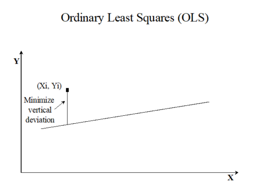
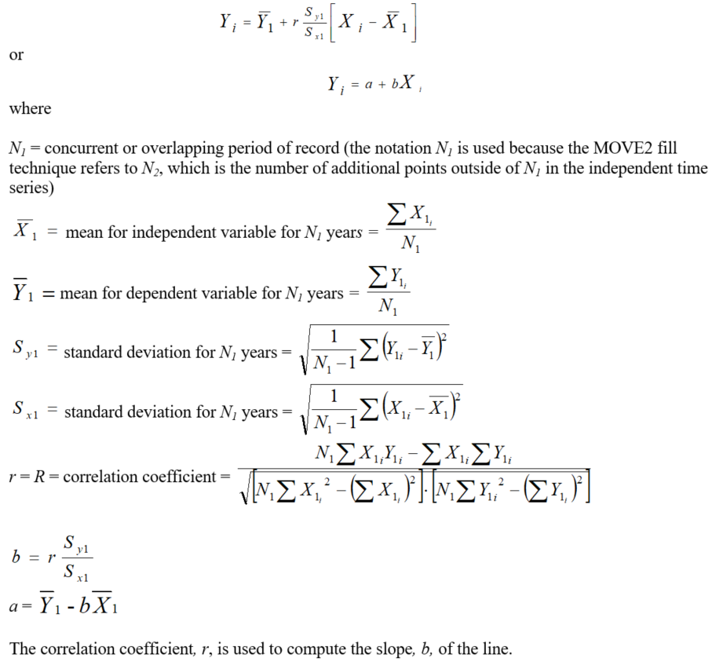
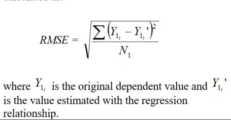
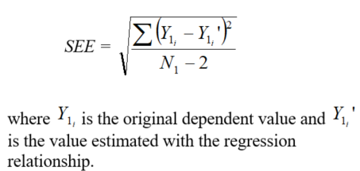
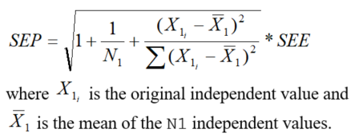
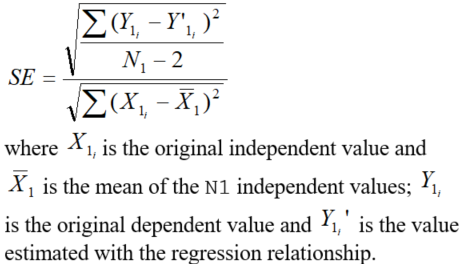
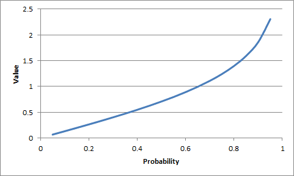
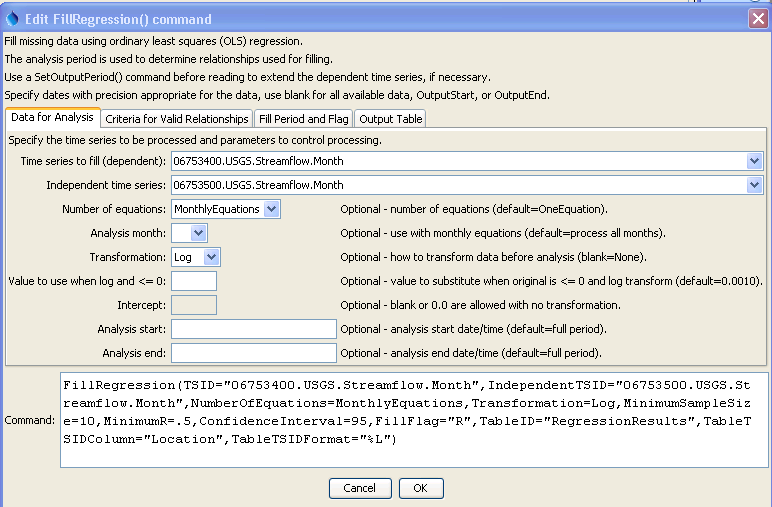
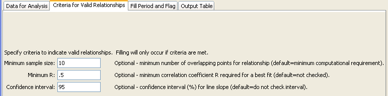
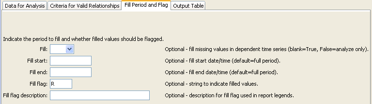

# TSTool / Command / FillRegression #

*   [Overview](#overview)
*   [Command Editor](#command-editor)
*   [Command Syntax](#command-syntax)
*   [Examples](#examples)
*   [Troubleshooting](#troubleshooting)
*   [See Also](#see-also)

-------------------------

## Overview ##

The `FillRegression` command fills missing data in a time series using ordinary least squares (OLS) regression
and provides a variety of options for transforming the data and controlling the analysis.
In OLS regression, the vertical distance from the data point to the regression line is minimized.
OLS regression provides the minimum-variance estimate for a single value or observation.
However, if an ensemble of points is estimated from OLS regression,
the estimated values will have lesser variability than the true values.

**<p style="text-align: center;">

</p>**

See also the [`FillMOVE2`](../FillMOVE2/FillMOVE2.md) command, which utilizes additional variance
from independent time series to determine the regression relationship,
and the [`FillMixedStation`](../FillMixedStation/FillMixedStation.md) command,
which automates the analysis of many time series to determine a “best estimate” filling approach.
Regression can be applied only to regular interval time series.
The dependent time series will be filled using the independent time series.
The periods of record and output period for the time series should be verified
to make sure that the time series periods overlap sufficiently.
Regression relationships are developed using the analysis period for the time series and are applied to the fill period.
Refer to the output statistics table, log file, and time series properties for analysis details.
Several parameters are available to ensure that filling uses reasonable relationships.

**Important:  TSTool does allow filled values to be flagged.
However, other commands do not exclude these values from computations when determining relationships for subsequent fill steps.
Therefore, it is important to perform regression data filling as early in data
processing as possible so that data manipulation does not introduce derived values and bias.**

The following OLS equation is used to estimate values for the dependent time series from the independent time series:

**<p style="text-align: center;">

</p>**

A number of statistics are computed and are available for output to a table, as described below
(see the `TableID` and related command parameters for how to specify the table output).
Creating a statistics table and then writing the table to a file is useful for checking the analysis and software.
For example, the
[`CompareTables`](../CompareTables/CompareTables.md) command can be used to compare this
statistics table with a verification data set that is calculated by another tool.
In the following descriptions, the statistic for one equation has a name like `Mean` and monthly
statistics correspondingly have a name like `Mean_1`, where `1` corresponds to January and 12 to December.

In some cases, statistics are relevant in units of the raw values,
in some cases statistics are relevant in transformed (log10) units, and in some cases both are relevant.
For example, if the log10 transform is used to compute the relationship, then a and b are in transformed units.
However, error computations between the original data values and values that would be computed
by the relationship are in the raw units (regardless of whether the data were transformed) – this allows
errors to be compared between relationships using raw and transformed values
(the [`FillMixedStation`](../FillMixedStation/FillMixedStation.md) command uses this information to compare relationships).
Consequently, the third column of the following table indicates whether statistics are provided in raw
(column name uses statistic only) or transformed units (additional `_trans` added to statistic for column name).
Therefore, if the statistic is unitless, it will never have the `_trans` addition.
If the analysis does not use a transformation, then `_trans` will be omitted from column headings.

**<p style="text-align: center;">
Statistics from Regression Analysis
</p>**

|**Statistic (table columnn name)**&nbsp;&nbsp;&nbsp;&nbsp;&nbsp;&nbsp;&nbsp;&nbsp;&nbsp;&nbsp;&nbsp;&nbsp;&nbsp;&nbsp;&nbsp;&nbsp;|**Involves Dependent, Independent, or Both**|**Statistics Output in Raw or Transformed Units**|**Description**|
|--------------|-----------------|-----------------|--|
| `N1` | Both | N/A - unitless | The number (count) of non-missing data values overlapping in the dependent and independent time series. |
| `MeanX1` | Independent | Raw, Transformed | The mean of the independent `N1` data values. |
| `SX1` | Independent | Raw, Transformed | The standard deviation of the independent `N1` values. |
||||
| `N2` | Independent | N/A - unitless | The number (count) of non-missing independent values outside of `N1`. |
| `MeanX2` | Independent | Raw, Transformed | The mean of the independent `N2` values. |
| `SX2` | Independent | Raw, Transformed | The standard deviation of the independent `N2` values. |
||||
| `MeanY1` | Dependent | Raw, Transformed | The mean of the dependent `N1` values. |
| `SY1` | Dependent | Raw, Transformed | The standard deviation of the dependent `N1` values. |
| `NY` | Dependent | N/A - unitless | The total number of non-missing dependent values. |
| `MeanY` | Dependent | Raw, Transformed | The mean of the dependent `NY` values. |
| `SY` | Dependent | Raw, Transformed | The standard deviation of the dependent `NY` values. |
| `SkewY` | Dependent | Raw, Transformed | The skew, or non-symmetry, of the dependent `NY` values. |
||||
| `a` | Both | Transformed | The intercept for the relationship equation. |
| `b` | Both | Transformed | The slope of the relationship equation. |
| `R` | Both | Transformed | The correlation coefficient for `N1` values. |
| `R2` | Both | Transformed | R-squared, coefficient of determination for `N1` values. |
||||
| `MeanY1est` | Dependent | Raw, Transformed | The mean for `N1` values computed from the relationship (estimate the dependent values where values were previously known). |
| `SY1est` | Dependent | Raw, Transformed | The standard deviation for `N1` values computed from the relationship (estimate the dependent at locations where values are known). |
| `RMSE` | Dependent | Raw, Transformed | The “room mean squared error” for `N1` overlapping values, which is a measure of the overall error of using the regression equation to estimate values, is calculated as:<br>  |
| `SEE` | Dependent | Raw, Transformed | The standard error of estimate for N1 overlapping values, which is a measure of the overall error of using the regression equation to estimate values, calculated as:<br>  |
| `SEP` | Both | Raw | The standard error of prediction for each estimated value, calculated as:<br><br>Note that when using the mixed station analysis in the [`FillMixedStation`](../FillMixedStation/FillMixedStation.md) command, this value may be used to determine the relationship.  The SEP is not actually output in the statistics table but may be added as an optional output time series in the future. |
| `SESlope` | Both | N/A - unitless | The standard error (SE) of the slope (b) for N1 overlapping values, calculated as:<br>  |
| `TestScore` | Both | N/A - unitless | b/SESlope.  See [https://en.wikipedia.org/wiki/Student’s_t-test#Slope_of_a_regression_line](https://en.wikipedia.org/wiki/Student's_t-test#Slope_of_a_regression_line) for more details. |
||||
| `TestQuantile` | Both | N/A - unitless | The value at which the confidence interval is satisfied. Comes from the Student’s T-test, which is a function of the confidence interval and degrees of freedom (DF), where DF is equal to `N1 – 2` (corresponding to the intercept and the slope of the regression equation).  Specifically, this is from the two-tailed test. |
| `Test OK` | Both | N/A - unitless | Will be `No` if `TestScore` >= `TestQuantile`, indicating that the *b ≠ 0* data are related, and `Yes` if `TestScore` < `TestQuantile`, indicating that the data are not related.  If the data are not related, then the relationship between the dependent and independent time series will not be used for filling. |
| `SampleSizeOK` | Both | N/A – unitless | Will be `No` if `N1` < `MinimumSampleSize` and `Yes` if `N1` >= `MinimumSampleSize`, indicating whether or not the number of overlapping points is greater than or equal to the number of overlapping points necessary. |
| `R OK` | Both | N/A – unitless | Will be `No` if `R` < `MinimumR`, indicating that the correlation is below the minimum threshold, and `Yes` if `R` >= `MinimumR`, indicating that the correlation is above the minimum threshold. |
| `NYfilled` | Dependent | N/A – unitless | The total number of missing points in the dependent time series that were filled through the regression. |
| `MeanYfilled` | Dependent | Raw | The mean of the values that were used to fill missing points. |
| `SYfilled` | Dependent | Raw | The standard deviation of the values that were used to fill missing points. |
| `SkewYfilled` | Dependent | Raw | The skew, or non-symmetry, of the values that were used to fill missing points. |

Student’s T-distribution ([https://en.wikipedia.org/wiki/Student's_t-distribution](https://en.wikipedia.org/wiki/Student's_t-distribution))
is similar to a standard distribution, but has a higher probability of producing outliers.
Using the Apache Math library ([https://commons.apache.org/proper/commons-math/](https://commons.apache.org/proper/commons-math/)),
the appropriate distribution for the size of the dataset is generated,
and the value at which the desired confidence level is satisfied is calculated.
For example, a confidence level of approximately 40%, or .4, would require a test score of at least .5 given a sample size of 10.

**<p style="text-align: center;">

</p>**

**<p style="text-align: center;">
Student's T-Test Example (<a href="../ttest-graph.png">see also the full-size image</a>)
</p>**

## Command Editor ##

The command is available in the following TSTool menu:

*   ***Commands / Fill Time Series Missing Data***

The following dialog is used to edit the command and illustrates the syntax for the command when reading a single time series.

**<p style="text-align: center;">

</p>**

**<p style="text-align: center;">
`FillRegression` Command Editor for "Data for Analysis" Parameters (<a href="../FillRegression_Data.png">see also the full-size image</a>)
</p>**

**<p style="text-align: center;">

</p>**

**<p style="text-align: center;">
`FillRegression` Command Editor for "Criteria for Valid Relationships" Parameters (<a href="../FillRegression_Criteria.png">see also the full-size image</a>)
</p>**

**<p style="text-align: center;">

</p>**

**<p style="text-align: center;">
`FillRegression` Command Editor for "Fill Period and Flag" Parameters (<a href="../FillRegression_Fill.png">see also the full-size image</a>)
</p>**

**<p style="text-align: center;">

</p>**

**<p style="text-align: center;">
`FillRegression` Command Editor for "Output Table" Parameters (<a href="../FillRegression_Table.png">see also the full-size image</a>)
</p>**

## Command Syntax ##

The command syntax is as follows:

```text
FillRegression(Parameter="Value",...)
```

**<p style="text-align: center;">
Command Parameters
</p>**

|**Parameter**&nbsp;&nbsp;&nbsp;&nbsp;&nbsp;&nbsp;&nbsp;&nbsp;&nbsp;&nbsp;&nbsp;&nbsp;&nbsp;&nbsp;&nbsp;&nbsp;&nbsp;&nbsp;&nbsp;&nbsp;&nbsp;&nbsp;&nbsp;&nbsp;&nbsp;|**Description**|**Default**&nbsp;&nbsp;&nbsp;&nbsp;&nbsp;&nbsp;&nbsp;&nbsp;&nbsp;&nbsp;&nbsp;&nbsp;&nbsp;&nbsp;&nbsp;&nbsp;&nbsp;&nbsp;&nbsp;&nbsp;&nbsp;&nbsp;&nbsp;&nbsp;&nbsp;&nbsp;&nbsp;|
|--------------|-----------------|-----------------|
| `TSID` | The time series identifier or alias for the time series to be filled.  Can be specified with processor `${Property}`. | None – must be specified. |
| `IndependentTSID` | The time series identifier or alias for the independent time series.  Can be specified with processor `${Property}`. | None – must be specified. |
| `NumberOfEquations` | The number of equations to use for the analysis:  `OneEquation` or `MonthlyEquations`. | `OneEquation` |
| `AnalysisMonth` | Indicate the month to process when using monthly equations.  Currently only a single month can be specified. | Process all months. |
| `Transformation` | Indicates how to transform the data before analyzing.  Specify as `None` (previously `Linear`) or `Log` (for Log10).  If the `Log` option is used, zero and negative values are replaced with the value specified by the `LEZeroLogValue` parameter value for analysis (missing data values are ignored in the analysis). | None (no transformation). |
| `LEZeroLogValue` | Value to use for data values less than or equal to zero when using a log transformation.  The Log10 of this value will be used in calculations.<br>Missing can be used to exclude the values entirely. Caution: this will set `0` as a missing value in the time series. | `.0010` |
| `Intercept` | Specify as `0` to force the intercept of the best-fit line through the origin (not available for log transformation). | Parameter is optional and if specified the default is to not force the intercept through zero. |
| `AnalysisStart` | The date/time to start the analysis – use to focus on only a period appropriate from analysis.  For example specify the unregulated period for streamflow.  Can be specified with processor `${Property}`. | Analyze the full period. |
| `AnalysisEnd` | The date/time to end the analysis – use to focus on only a period appropriate from analysis.  Can be specified with processor `${Property}`. | Analyze the full period. |
| `MinimumSampleSize` | The minimum number of overlapping values required to use a relationship for filling. | `2`, due to requirements in calculating the statistics |
| `MinimumR` | The minimum correlation coefficient required to use a relationship for filling. | No check is performed. |
| `ConfidenceInterval` | A confidence interval in percent (e.g., `95`) required for the slope of the relationship.  The T-test is performed to ensure that the independent and dependent time series are related. | The T-test is not performed to evaluate the confidence interval. |
| `Fill` | Indicate whether fill should occur (`True`) or just analyze to compute statistics (`False`).  The latter is useful for testing combinations of fill parameters prior to actually performing filling. | `True` |
| `FillStart` | The date/time to start filling, if other than the full time series period.  Can be specified with processor `${Property}`. | Fill the full period. |
| `FillEnd` | The date/time to end filling, if other than the full time series period.  Can be specified with processor `${Property}`. | Fill the full period. |
| `FillFlag` | A single character that will be used to flag filled data. | Filled values will not be flagged. |
| `FillFlagDesc` | Description for the fill flag, used in reports. | Automatically generated. |
| `TableID` | A table identifier for a table to receive output of the regression analysis (statistics are described above). | Statistics are not written to the table.  Refer to the log file for information. |
| `TableTSIDColumn` | The name of the column in the table that contains time series identifier information.  This is used to match the table with time series being analyzed so that statistics can be written to the correct row. | Required if `TableID` is specified. |
| `TableTSIDFormat` | The specifier used to format the time series identifier in the `TableTSIDColumn`.  The location part of the TSID, or the time series alias is typically used. | The alias will be used if available, or otherwise the full TSID will be used. |
| `SEPTSID` | The time series identifier of the SEP time series, calculated for ALL values in the analysis period.   This parameter is not enabled but is envisioned to help evaluate filling and test [`FillMixedStation`](../FillMixedStation/FillMixedStation.md). | If not specified, no SEP time series will be generated. |
| `SEPTSAlias` | The alias to be assigned to the SEP time series.  This parameter is not yet enabled. | No alias is assigned to the SEP time series. |
| `FlagToWarn` | A parameter is envisioned to warn the user if any values in the time series are flagged with a specific flag value.  This will allow checks to ensure that `FillRegression` is not used with data that have been filled in a previous step. | |

The command logic is as follows, with reference to command parameters that control the process:

1.  The dependent (`TSID`) and independent time series (`IndependentTSID`) are retrieved using the time series identifiers or aliases.
2.  Data arrays of overlapping non-missing values are extracted from time series to be used as the samples for analysis,
    as specified by command parameters (analysis period specified by `AnalysisStart` and `AnalysisEnd`;
    transformation specified by `Transformation`, `LEZeroLogValue`, and `Intercept`;
    number of equations specified by `NumberOfEquations` and `AnalysisMonth`).
3.  The independent and dependent statistics and relationships are calculated,
    computing as many of the statistics as possible (some are skipped if the sample size results in division by zero).
    Computing the statistics allows them to be saved in the output table for review,
    and is controlled by the `TableID`, `TableTSIDColumn`, and `TableTSIDFormat` parameters.
4.  The statistics are analyzed to determine if the relationships are acceptable for filling by
    checking the minimum sample size (`MinimumSampleSize`), minimum correlation coefficient (`MinimumR`),
    and that the relationship meets the confidence interval (`ConfidenceInterval`).
    If monthly equations are used, then it is possible that some months can be filled but not others.
5.  If `Fill=True` (the default), then the relationships that are acceptable from step 4 are used to
    fill the dependent time series for the period specified by the `FillStart` and `FillEnd` parameters,
    with `FillFlag` and `FillFlagDesc` optionally being used to indicate filled values.

## Examples ##

See the [automated tests](https://github.com/OpenCDSS/cdss-app-tstool-test/tree/master/test/commands/FillRegression).

## Troubleshooting ##

See the main [TSTool Troubleshooting](../../troubleshooting/troubleshooting.md) documentation.

## See Also ##

*   [`FillMixedStation`](../FillMixedStation/FillMixedStation.md) command
*   [`FillMOVE2`](../FillMOVE2/FillMOVE2.md) command
