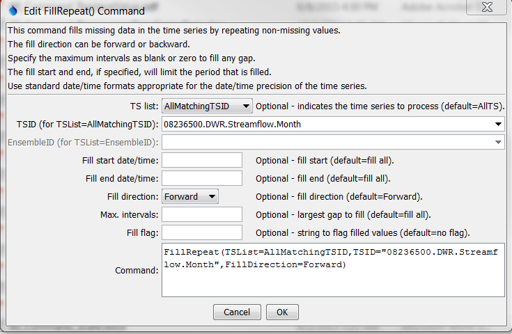

# TSTool / Command / FillRepeat #

*   [Overview](#overview)
*   [Command Editor](#command-editor)
*   [Command Syntax](#command-syntax)
*   [Examples](#examples)
*   [Troubleshooting](#troubleshooting)
*   [See Also](#see-also)

-------------------------

## Overview ##

The `FillRepeat` command fills missing data in time series by repeating
observations until another observation is found.
This fill technique is useful, for example,
where time series are likely to be step-wise or nearly constant,
such as some reservoir and diversion time series.

## Command Editor ##

The command is available in the following TSTool menu:

*   ***Commands / Fill Time Series Missing Data***

The following dialog is used to edit the command and illustrates the syntax of the command.

**<p style="text-align: center;">

</p>**

**<p style="text-align: center;">
`FillRepeat` Command Editor (<a href="../FillRepeat.png">see full-size image</a>)
</p>**

## Command Syntax ##

The command syntax is as follows:

```text
FillRepeat(Parameter="Value",...)
```
**<p style="text-align: center;">
Command Parameters
</p>**

|**Parameter**&nbsp;&nbsp;&nbsp;&nbsp;&nbsp;&nbsp;&nbsp;&nbsp;&nbsp;&nbsp;&nbsp;|**Description**|**Default**&nbsp;&nbsp;&nbsp;&nbsp;&nbsp;&nbsp;&nbsp;&nbsp;&nbsp;&nbsp;&nbsp;&nbsp;&nbsp;&nbsp;&nbsp;&nbsp;&nbsp;&nbsp;&nbsp;&nbsp;&nbsp;&nbsp;&nbsp;&nbsp;&nbsp;&nbsp;&nbsp;|
|--------------|-----------------|-----------------|
|`TSList`|Indicates the list of time series to be processed, one of:<br><ul><li>`AllMatchingTSID` – all time series that match the TSID (single TSID or TSID with wildcards) will be processed.</li><li>`AllTS` – all time series before the command.</li><li>`EnsembleID` – all time series in the ensemble will be processed (see the EnsembleID parameter).</li><li>`FirstMatchingTSID` – the first time series that matches the TSID (single TSID or TSID with wildcards) will be processed.</li><li>`LastMatchingTSID` – the last time series that matches the TSID (single TSID or TSID with wildcards) will be processed.</li><li>`SelectedTS` – the time series are those selected with the [`SelectTimeSeries`](../SelectTimeSeries/SelectTimeSeries.md) command.</li></ul> | `AllTS` |
|`TSID`|The time series identifier or alias for the time series to be processed, using the `*` wildcard character to match multiple time series.  Can be specified using `${Property}`.|Required if `TSList=*TSID`|
|`EnsembleID`|The ensemble to be processed, if processing an ensemble. Can be specified using `${Property}`.|Required if `TSList=*EnsembleID`|
|`FillStart`|The starting date/time for the fill.  Can be specified using processor `${Property}`.|Available period.|
|`FillEnd`|The ending date/time for the fill.  Can be specified using processor `${Property}`.|Available period.|
|`FillDirection`|Specify the direction of the fill as `Forward` or `Backward`.|`Forward`|
|`MaxIntervals`|The maximum number of intervals to fill in a data gap.|Fill all gaps.|
|`Flag`|String to flag filled values.  Prefix with `+` to append the string to existing flag values.  Can be specified using processor `${Property}`.|Do not flag filled values.|

## Examples ##

See the [automated tests](https://github.com/OpenCDSS/cdss-app-tstool-test/tree/master/test/commands/FillRepeat).

A sample command file to fill a time series from the [State of Colorado’s HydroBase database](../../datastore-ref/CO-HydroBase/CO-HydroBase.md)
is as follows:

```text
# 08236500 - ALAMOSA RIVER BELOW TERRACE RESERVOIR
08236500.DWR.Streamflow.Month~HydroBase
FillRepeat(TSList=AllMatchingTSID,TSID="08236500.DWR.Streamflow.Month",FillDirection=Forward)
```

## Troubleshooting ##

See the main [TSTool Troubleshooting](../../troubleshooting/troubleshooting.md) documentation.

## See Also ##

*   [`FillConstant`](../FillConstant/FillConstant.md) command
*   [`SelectTimeSeries`](../SelectTimeSeries/SelectTimeSeries.md) command
