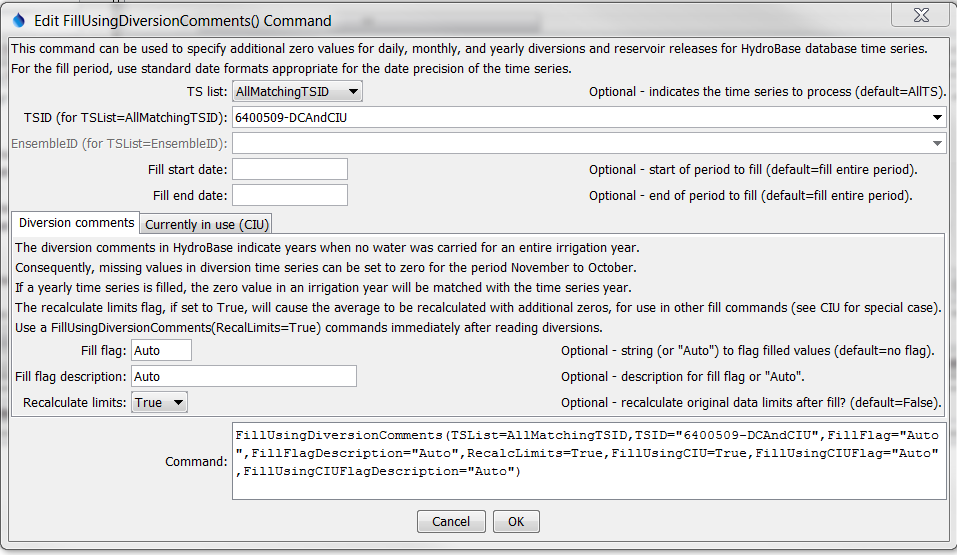
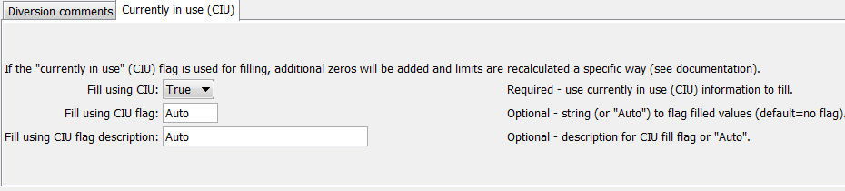
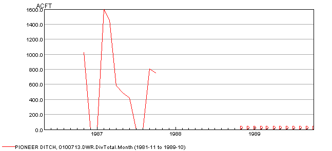
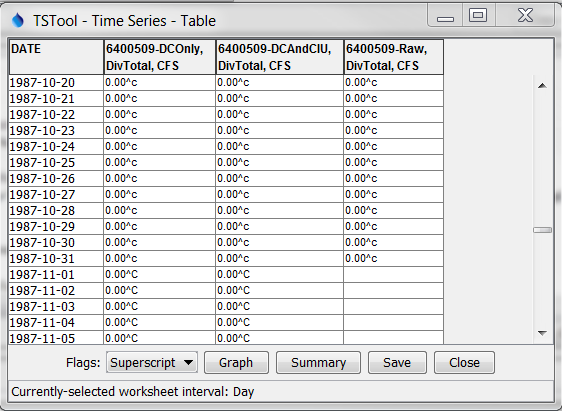

# TSTool / Command / FillUsingDiversionComments #

* [Overview](#overview)
* [Command Editor](#command-editor)
* [Command Syntax](#command-syntax)
* [Examples](#examples)
* [Troubleshooting](#troubleshooting)
* [See Also](#see-also)

-------------------------

## Overview ##

**The `FillUsingDiversionComments` command is only appropriate for use with diversion (e.g.,
`DivTotal`, `DivClass` data types) and reservoir release (e.g., `RelTotal`,
`RelClass` data types) time series for the
[State of Colorado's HydroBase database](../../datastore-ref/CO-HydroBase/CO-HydroBase.md).**

The `FillUsingDiversionComments` command fills missing data in time series by using
diversion comment and structure “currently in use” (CIU) information in HydroBase.
This information is used, for example, in cases where Water Commissioners have entered
annual data values rather than daily or monthly records.
Only time series with data type `DivTotal`, `RelTotal`, `DivClass*`, or `RelClass*` are processed.

### Diversion Comment `not-used` Flag ###

HydroBase contains diversion comment data with a `not_used` field.
If the `not_used` value matches one of the values shown in the following table for an
irrigation year (November of the previous year to October of the irrigation year),
the diversion (or reservoir release) data for the specified irrigation year
can be interpreted as zero (see the
[State of Colorado’s Diversion Records Standard](http://hermes.cde.state.co.us/drupal/islandora/object/co%3A20416) for more information).

**<p style="text-align: center;">
Diversion Comment `not_used` Flag Resulting in Additional Zero Values
</p>**

|**`not_used`**|**Meaning (reason why diversion is zero)**
|--|--|
|`A`|Structure is not usable|
|`B`|No water is available|
|`C`|Water available, but not taken|
|`D`|Water taken in another structure|

### Structure Currently in Use Flag ###

The HydroBase structure data contains a “currently in use” (CIU) field.
Unlike diversion comments, this is a single value that is consistent with the
current status of a structure (it is not a time series).  The following CIU values are used.

**<p style="text-align: center;">
Structure CIU Flag Values and Meaning
</p>**

|**CIU**|**Meaning**|
|--|--|
|`A`|Active structure with contemporary diversion records|
|`B`|Structure abandoned by the court|
|`C`|Conditional structure|
|`D`|Duplicate; ID no longer used|
|`F`|Structure used as FROM number; located in another water district|
|`H`|Historical structure only-no longer exists or has records, but has historical data|
|`I`|Inactive structure which physically exists but no diversion records are kept|
|`N`|Non-existent structure with no contemporary or historical records|
|`U`|Active structure but diversion records are not maintained|

If `UseCIU=True` is specified for this command,
the following logic will be used to fill missing time series values:

1. If the HydroBase CIU value is H or I for the structure associated with the time series:
	1. Fill using the diversion comments (see above for interpretation of comments).
	2. The limits of the time series are recomputed based on diversion data and comments.
	3. Missing data at the end of the period are filled with zeros,
	reflecting the fact that the structure is off-line.
	In this case, the limits are always recomputed,
	regardless of the value of the RecalcLimits command parameter.
	These values are not included in historical averages
	because they do not occur in the active life of the structure.
	4. Missing data within the data period remain missing,
	and can be filled with other commands such as
	[`FillHistMonthAverage`](../FillHistMonthAverage/FillHistMonthAverage.md).
	5. Missing data prior to the first diversion values or comments remain missing,
	and can be filled with other commands as appropriate, perhaps specific to each location.
2. If in HydroBase `CIU=N`:
	1. Fill using the diversion comments (see above for interpretation of comments).
	2. The limits of the time series are recomputed based on diversion data and comments.
	3. Missing data at the beginning of the period are filled with zeros.
	In this case, the limits are always recomputed,
	regardless of the value of the `RecalcLimits` command parameter.
	4. The remaining missing data in the active data period or
	at the end of the period remain missing and can be filled with other commands.

The output period for filled time series is handled as follows:

* If a global output period has been specified (e.g., with the
[`SetOutputPeriod`](../SetOutputPeriod/SetOutputPeriod.md) command) then the time series
will NOT be extended to include diversion comments and CIU codes beyond the output period.
* If NO output period has been specified,
the time series WILL be extended to include the longer period from diversion comments.
CIU information does not cause the time series to be extended.

After setting additional zero values using this command,
the limits of the time series can be recomputed, if appropriate,
for use with the [`FillHistMonthAverage`](../FillHistMonthAverage/FillHistMonthAverage.md) command
(see the `RecalcLimits=True` parameter).  If `FillUsingCIU=true` is specified,
it overrides the `RecalcLimits` parameter as per the logic described above.

See also the [`ReadHydroBase`](../ReadHydroBase/ReadHydroBase.md) command,
which allows filling with diversion comments after reading data.
Refer to the [HydroBase Input Type Appendix](../../datastore-ref/CO-HydroBase/CO-HydroBase.md)
for more information about diversion time series.

## Command Editor ##

The following dialog is used to edit the command and illustrates the syntax of the command for diversion comment parameters.

**<p style="text-align: center;">

</p>**

**<p style="text-align: center;">
`FillUsingDiversionComments` Command Editor for Diversion Comment Parameters (<a href="../FillUsingDiversionComments.png">see also the full-size image</a>)
</p>**

The following dialog is used to edit the command and illustrates the syntax of the command for CIU parameters.

**<p style="text-align: center;">

</p>**

**<p style="text-align: center;">
`FillUsingDiversionComments` Command Editor for CIU Parameters (<a href="../FillUsingDiversionComments_CIU.png">see also the full-size image</a>)
</p>**

## Command Syntax ##

The command syntax is as follows:

```text
FillUsingDiversionComments(Parameter="Value",...)
```
**<p style="text-align: center;">
Command Parameters
</p>**

|**Parameter**&nbsp;&nbsp;&nbsp;&nbsp;&nbsp;&nbsp;&nbsp;&nbsp;&nbsp;&nbsp;&nbsp;&nbsp;&nbsp;&nbsp;&nbsp;&nbsp;&nbsp;&nbsp;&nbsp;&nbsp;&nbsp;&nbsp;&nbsp;&nbsp;&nbsp;&nbsp;&nbsp;&nbsp;&nbsp;&nbsp;&nbsp;&nbsp;&nbsp;&nbsp;&nbsp;&nbsp;&nbsp;|**Description**|**Default**&nbsp;&nbsp;&nbsp;&nbsp;&nbsp;&nbsp;&nbsp;&nbsp;&nbsp;&nbsp;&nbsp;&nbsp;&nbsp;&nbsp;&nbsp;&nbsp;&nbsp;&nbsp;&nbsp;&nbsp;&nbsp;&nbsp;&nbsp;&nbsp;&nbsp;&nbsp;&nbsp;|
|--------------|-----------------|-----------------|
|`TSList`|Indicates the list of time series to be processed, one of:<br><ul><li>`AllMatchingTSID` – all time series that match the TSID (single TSID or TSID with wildcards) will be processed.</li><li>`AllTS` – all time series before the command.</li><li>`EnsembleID` – all time series in the ensemble will be processed (see the EnsembleID parameter).</li><li>`FirstMatchingTSID` – the first time series that matches the TSID (single TSID or TSID with wildcards) will be processed.</li><li>`LastMatchingTSID` – the last time series that matches the TSID (single TSID or TSID with wildcards) will be processed.</li><li>`SelectedTS` – the time series are those selected with the [`SelectTimeSeries`](../SelectTimeSeries/SelectTimeSeries.md) command.</li></ul> | `AllTS` |
|`TSID`|The time series identifier or alias for the time series to be processed, using the `*` wildcard character to match multiple time series.  Can be specified using `${Property}`.|Required if `TSList=*TSID`|
|`EnsembleID`|The ensemble to be processed, if processing an ensemble. Can be specified using `${Property}`.|Required if `TSList=*EnsembleID`|
|`FillStart`|The starting date/time for the fill.|Available period.|
|`FillEnd`|The ending date/time for the fill.|Available period.|
|`FillFlag`|For each value that is filled using the diversion comment `not_used` information, tag the filled value as follows:<br><ul><li>If `FillFlag` is specified, tag filled values with the specified character.</li><li>If `FillFlag=Auto` is specified, the diversion comment `not_used` value (`A`, `B`, `C`, or `D`) from HydroBase is used for the flag.</li></ul><br>The flag can then be used later to label graphs, etc.  The flag will be appended to existing flags if necessary.|No flag is assigned.|
|`FillFlagDescription`|Description to use for `FillFlag`, used in report legends, etc.  Specify a literal string or `Auto` to generate a description corresponding to the diversion comments.  No description is set.|
|`RecalcLimits`|Indicate whether the original data limits for the time series should be recalculated after the zero values are set.  Zero values are included in the monthly and annual averages (daily limits are not calculated).<br>See the discussion above related to CIU – time series that are impacted by CIU always have their limits recalculated.|`False` (additional zeros are not considered in the original data averages).|
|`FillUsingCIU`|Indicates whether the “currently in use” (CIU) information is used to fill missing data.  This will result in additional zeros at the beginning or end of the time series, depending on CIU value.   See the description of the logic above.  Note that this will cause the time series data limits to be automatically recomputed, regardless of the value of the `RecalcLimits` parameter.|`False` (CIU information is not used to fill missing data).
|`FillUsingCIUFlag`|For each missing data value that is filled using the CIU information, tag the filled value as follows:<br><ul><li>If `FillUsingCIUFlag=Auto` is specified, the CIU value (H, I, or N) from HydroBase is used for the flag.</li><li>else if `FillUsingCIUFlag` is specified, tag filled values with the specified string.</li></ul><br>The flag can then be used later to label graphs, etc.  The flag will be appended to existing flags if necessary.|No flag is assigned.|
|`FillUsingCIUFlagDescription`|Description to use for `FillFlagCIU`, used in report legends, etc.  Specify a literal string or Auto to generate a description corresponding to the CIU.|No description is set.|

## Examples ##

See the [automated tests](https://github.com/OpenCDSS/cdss-app-tstool-test/tree/master/test/regression/commands/general/FillUsingDiversionComments).

A sample command file to fill time series from the [State of Colorado’s HydroBase database](../../datastore-ref/CO-HydroBase/CO-HydroBase.md)
is as follows:

```text
# 0100506 - PUTNAM DITCH
0100506.DWR.DivTotal.Month~HydroBase
# 0100503 - RIVERSIDE CANAL
0100503.DWR.DivTotal.Month~HydroBase
# 0100501 - EMPIRE DITCH
0100501.DWR.DivTotal.Month~HydroBase
FillUsingDiversionComments(TSID="*",RecalcLimits=True)
```
The following example fills one time series and labels the values with the flag.

```text
# Set the date to cause comments NOT to automatically extend the period.
# setOutputPeriod(1950-01,1989-06)
# 0100713 - PIONEER DITCH
0100713.DWR.DivTotal.Month~HydroBase
FillUsingDiversionComments(TSID="*",FillFlag="Auto",RecalcLimits=False)
```

The corresponding graph created with data flags as labels is shown below (note the `D` symbols on the right).
It may be necessary to change the graph properties to display the
data labels above the point in order to see labels at the bottom of the graph.

**<p style="text-align: center;">

</p>**

**<p style="text-align: center;">
Example Graph Showing Fill Flag (D labels indicate additional zero values) (<a href="../FillUsingDiversionComments_Graph.png">see also the full-size image</a>)
</p>**

The following figure illustrates how data flags can be displayed in the table view.

**<p style="text-align: center;">

</p>**

**<p style="text-align: center;">
Example Table Showing Fill Flags (<a href="../FillUsingDiversionComments_Table.png">see also the full-size image</a>)
</p>**

## Troubleshooting ##

## See Also ##

* [`FillHistMonthAverage`](../FillHistMonthAverage/FillHistMonthAverage.md) command
* [`SelectTimeSeries`](../SelectTimeSeries/SelectTimeSeries.md) command
* [`SetOutputPeriod`](../SetOutputPeriod/SetOutputPeriod.md) command
