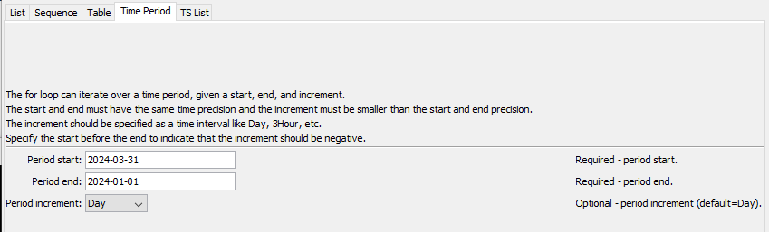
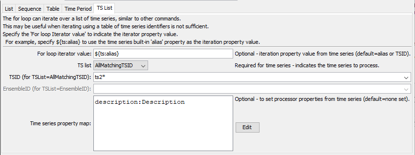

# TSTool / Command / For #

*   [Overview](#overview)
*   [Command Editor](#command-editor)
*   [Command Syntax](#command-syntax)
*   [Examples](#examples)
*   [Troubleshooting](#troubleshooting)
*   [See Also](#see-also)

-------------------------

## Overview ##

The `For` command iterates through a block of commands between `For` and matching
[`EndFor`](../EndFor/EndFor.md) commands.
Commands within a `For` block can be indented by selecting (highlighting) one or more commands,
right clicking, and using the ***> Indent Right*** menu choice.
A processor property is set to the value of the iteration property and can be used by other
commands that support properties, using the `${Property}` notation.
`For` commands can iterate over:

*   a list of supplied values (see the `List` parameter)
*   a sequence of integers or decimal numbers specified with start (`SequenceStart` parameter),
    end (`SequenceEnd` parameter), and increment (`SequenceIncrement` parameter)
*   values from a table column (see `TableID`, `TableColumn`, and `TablePropertyMap` parameters)
*   time period between a start (see `PeriodStart` parameter) and end (see `PeriodEnd` parameter) date/time,
    with an interval increment (see `PeriodIncrement` parameter),
    which can be used to iterate over individual time serie values with the
    [`SetPropertyFromTimeSeries`](../SetPropertyFromTimeSeries/SetPropertyFromTimeSeries.md) command
*   a list of time series and corresponding properties (see `TSList`, `TSID`, and `EnsembleID` parameters)

`For` commands can be nested.
Status messages for each run mode are accumulated in each command.

The editor for `For` a command that uses properties may show time series
identifiers and other command parameters as `${Property}` values,
rather than actual data, because the values get expanded at run-time.
This provides increased processing power but errors may not be evident until the `For` command is run.

See also the
[`Break`](../Break/Break.md) and
[`Continue`](../Continue/Continue.md) commands,
which can be used with
[`If`](../If/If.md) command to skip some commands in a `For` loop.

## Command Editor ##

The command is available in the following TSTool menu:

*   ***Commands / Running and Properties***

The following dialog is used to edit the command and illustrates the command syntax when iterating over a list.


**<p style="text-align: center;">
`For` Command Editor for a List for Iteration Values (<a href="../For_List.png">see full-size image</a>)
</p>**

The following dialog is used to edit the command and illustrates the command syntax when iterating over a sequence of numbers.


**<p style="text-align: center;">
`For` Command Editor for a Sequence of Integers for Iteration Values (<a href="../For_Sequence.png">see full-size image</a>)
</p>**

The following dialog is used to edit the command and illustrates the command syntax when iterating over table column values.


**<p style="text-align: center;">
`For` Command Editor for a Table for Iteration Values (<a href="../For_Table.png">see full-size image</a>)
</p>**

The following dialog is used to edit the command and illustrates the command syntax when iterating over a time period.



**<p style="text-align: center;">
`For` Command Editor for a Time Period for Iteration Values (<a href="../For_TimePeriod.png">see full-size image</a>)
</p>**

The following dialog is used to edit the command and illustrates the command syntax when iterating over a list of time series.



**<p style="text-align: center;">
`For` Command Editor for a List of Time Series (<a href="../For_TSList.png">see full-size image</a>)
</p>**

## Command Syntax ##

The command syntax is as follows.  One of the list, sequence, or table parameters must be specified.

```text
For(Parameter="Value",...)
```
**<p style="text-align: center;">
Command Parameters
</p>**

|**Iterator Method**|**Parameter**&nbsp;&nbsp;&nbsp;&nbsp;&nbsp;&nbsp;&nbsp;&nbsp;&nbsp;&nbsp;&nbsp;&nbsp;&nbsp;&nbsp;&nbsp;&nbsp;&nbsp;&nbsp;&nbsp;&nbsp;&nbsp;&nbsp;&nbsp;&nbsp;&nbsp;&nbsp;&nbsp; | **Description** | **Default**&nbsp;&nbsp;&nbsp;&nbsp;&nbsp;&nbsp;&nbsp;&nbsp;&nbsp;&nbsp;&nbsp;&nbsp;&nbsp;&nbsp;&nbsp;&nbsp;&nbsp; |
|--|--------------|-----------------|----------------- |
|**All**|`Name`<br>**required** | The name of the for loop, which will be matched with the name of an `EndFor` command to indicate the block of commands in the loop. | None - must be specified. |
||`IteratorProperty` | The processor property that will be set to the iterator property. The object type will depend on that used to provide the iteration property list. For example, if a sequence of integers is being iterated, the property will contain an integer. | Same as `Name`. |
||`IndexProperty` | The processor property that will be set to the iteration count (1+, regardless of the iteration direction) as an integer. This is useful when the command logic must be different depending on the loop index. | The property is not set. |
||`ShowProgress` | Whether the `For` loop should show progress in the TSTool command progress indicator, specified as as `False` or `True`. This is useful when the commands in the `For` block do not update the progress indicator and want to give the user feedback that progress is occurring.  If any commands are run in the loop that update the progress, the `For` loop progress will be quickly overruled.| `False`. |
|***List***|`List` | A list of comma-separated values to be used as variables for the iteration. Can use `${Property}` syntax. | No default if list is used – must specify a list of values. |
|***Sequence***|`SequenceStart` | Starting value when a sequence is specified for iteration, an integer or decimal number. | No default if sequence is used. |
||`SequenceEnd` | Ending value when a sequence is specified for iteration, an integer or decimal number. | No default if sequence is used. |
||`SequenceIncrement` | Increment for sequence iterator. | `1` or `1.0` depending on inferred type for `SequenceStart`. |
|***Table***|`TableID` | The table identifier, when specifying the iterator as a column from a table.  Can be specified with processor `${Property}`. | No default if table is used - required if table is used. |
||`TableColumn` | The table column name, when specifying the iterator as a column from a table. | No default if table is used - required if table is used. |
||`TablePropertyMap` | Specify the names of column names and corresponding processor property names to set.  This allows other commands to access the values of those properties using `${Property}` notation.  Specify using format:<br>`ColumnName1:PropertyName1,`<br>`ColumnName2:PropertyName2` | No default if table is used - required if table is used.  Only the iterator column value will be set as a property using `IteratorProperty`.|
|***Time Period***|`PeriodStart` | Starting date/time when a time period is specified for iteration, using format `YYYY-MM-DD hh:mm:ss` using a precision that is appropriate. Can use `${Property}` syntax. | No default if period is used. |
||`PeriodEnd` | Ending date/time when a time period is specified for iteration. Can use `${Property}` syntax. | No default if period is used. |
||`PeriodIncrement` | Increment for time period iterator, as a date/time interval (e.g., `Day`, `3Hour`). Can use `${Property}` syntax. | `Day`. |
| ***TS List*** | `TSList`|Indicates the list of time series to be processed, one of:<br><ul><li>`AllMatchingTSID` – all time series that match the TSID (single TSID or TSID with wildcards) will be processed.</li><li>`AllTS` – all time series before the command.</li><li>`EnsembleID` – all time series in the ensemble will be processed (see the EnsembleID parameter).</li><li>`FirstMatchingTSID` – the first time series that matches the TSID (single TSID or TSID with wildcards) will be processed.</li><li>`LastMatchingTSID` – the last time series that matches the TSID (single TSID or TSID with wildcards) will be processed.</li><li>`SelectedTS` – the time series are those selected with the [`SelectTimeSeries`](../SelectTimeSeries/SelectTimeSeries.md) command.</li></ul> | If iterating time series, must be specified. |
|| `TSID`|The time series identifier or alias for the time series to be processed, using the `*` wildcard character to match multiple time series.  Can be specified using `${Property}`.|Required if `TSList=*TSID`|
|| `EnsembleID`|The ensemble to be processed, if processing an ensemble. Can be specified using `${Property}`.|Required if `TSList=*EnsembleID`|
|| `TimeSeriesPropertyMap`| Map of time series property names to processor processor property names, which allows time series properties to be made visible for processing.| No additional time series properties other than iterator property are set as processor properties. |

## Examples ##

See the [automated tests](https://github.com/OpenCDSS/cdss-app-tstool-test/tree/master/test/commands/For).

### Example to process data for a list of counties ###

The following example illustrates a simple `For` and [`EndFor`](../EndFor/EndFor.md) usage.
In this example the `StationID` column in the input table is used to provide the list of values to iterate over.
The following input table is a delimited file but could come from another source:

```
# Test table data for For() command tests
"Count","Val","StationID","Basin"
1,1.0,Station1,Basin1
2,2.0,Station2,Basin2
3,3.0,Station3,Basin3
4,4.0,Station4,Basin4
```

The following command file reads the above input table, iterates over the `StationID` column, and creates a simple output file:

```
ReadTableFromDelimitedFile(TableID="Table1",InputFile="Data\testtable.csv")
RemoveFile(InputFile="Results/Test_For_TableString_out.txt",IfNotFound=Ignore)
For(Name="TestFor",TableID="Table1",TableColumn="StationID")
WritePropertiesToFile(OutputFile="Results/Test_For_TableString_out.txt",
    IncludeProperty="TestFor",WriteMode=Append,FileFormat=NameTypeValue)
EndFor(Name="TestFor")
```

The resulting output file is as follows:

```
TestFor="Station1"
TestFor="Station2"
TestFor="Station3"
TestFor="Station4"
```

### Example to process time series data values ###

The time period with a `For` command can be used to iterate over time series data values.
See the [`SetPropertyFromTimeSeries`](../SetPropertyFromTimeSeries/SetPropertyFromTimeSeries.md) command
to set a processor property to time series data value.
Then use the property in other commands as needed.

## Troubleshooting ##

See the main [TSTool Troubleshooting](../../troubleshooting/troubleshooting.md) documentation.

## See Also ##

*   [`Break`](../Break/Break.md) command
*   [`Continue`](../Continue/Continue.md) command
*   [`EndFor`](../EndFor/EndFor.md) command
*   [`ListFiles`](../ListFiles/ListFiles.md) command
*   [`Message`](../Message/Message.md) command
*   [`SetProperty`](../SetProperty/SetProperty.md) command (can be used to set list of strings for iteration)
*   [`SetPropertyFromTimeSeries`](../SetPropertyFromTimeSeries/SetPropertyFromTimeSeries.md) command
