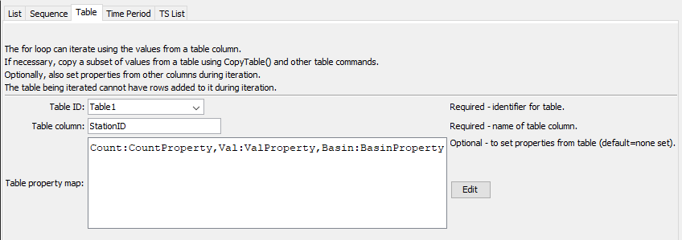

# TSTool / Command / For #

* [Overview](#overview)
* [Command Editor](#command-editor)
* [Command Syntax](#command-syntax)
* [Examples](#examples)
* [Troubleshooting](#troubleshooting)
* [See Also](#see-also)

-------------------------

## Overview ##

The `For` command iterates through a block of commands between `For` and matching
[`EndFor`](../EndFor/EndFor) commands.
A processor property is set to the value of the iteration property and can be used by other
commands that support properties, using the `${Property}` notation.
`For` commands can iterate over:

* a list of supplied values (see the `List` parameter)
* a sequence of integers or decimal numbers specified with start (`SequenceStart` parameter),
end (`SequenceEnd` parameter), and increment (`SequenceIncrement` parameter)
* values from a table column (see `TbleID`, `TableColumn`, and `TablePropertyMap` parameters)

`For` commands can be nested.
Status messages for run mode are accumulated in each command (this update is occurring over time –
status messages for some commands may be cleared out each iteration).
A limitation of using `For` with properties is that the command when edited may show time series
identifiers and other command parameters as `${Property}` values,
rather than actual data, because the values get expanded at run-time.
This provides increased processing power but errors may not be evident until commands run.

## Command Editor ##

The following dialog is used to edit the command and illustrates the command syntax when iterating over a list.
<a href="../For_List.png">See also the full-size image.</a>


**<p style="text-align: center;">
`For` Command Editor Illustrating Using a List for Iteration Values
</p>**

The following dialog is used to edit the command and illustrates the command syntax when iterating over a sequence of numbers.
<a href="../For_Sequence.png">See also the full-size image.</a>


**<p style="text-align: center;">
`For` Command Editor Illustrating Using a Sequence of Integers for Iteration Values
</p>**

The following dialog is used to edit the command and illustrates the command syntax when iterating over table column values.
<a href="../For_Table.png">See also the full-size image.</a>



**<p style="text-align: center;">
`For` Command Editor Illustrating Using a Table for Iteration Values
</p>**

## Command Syntax ##

The command syntax is as follows.  One of the list, sequence, or table parameters must be specified.

```text
For(Parameter="Value",...)
```
**<p style="text-align: center;">
Command Parameters
</p>**

|**Iterator Method**|**Parameter**&nbsp;&nbsp;&nbsp;&nbsp;&nbsp;&nbsp;&nbsp;&nbsp;&nbsp;&nbsp;&nbsp;&nbsp;&nbsp;&nbsp;&nbsp;&nbsp;&nbsp;&nbsp;&nbsp;&nbsp;&nbsp; | **Description** | **Default**&nbsp;&nbsp;&nbsp;&nbsp;&nbsp;&nbsp;&nbsp;&nbsp;&nbsp;&nbsp;&nbsp;&nbsp;&nbsp;&nbsp;&nbsp;&nbsp;&nbsp; |
|--|--------------|-----------------|----------------- |
|All|`Name`<br>**required** | The name of the for loop, which will be matched with the name of an `EndFor` command to indicate the block of commands in the loop. | None - must be specified. |
|All|`IteratorProperty` | The processor property that will be set to the iterator property. The object type will depend on that used to provide the iteration property list. For example, if a sequence of integers is being iterated, the property will contain an integer. | Same as `Name`.
|List|`List` | A list of comma-separated values to be used as variables for the iteration. | No default if list is used – must specify a list of values. |
|Sequence|`SequenceStart` | Starting value when a sequence is specified for iteration, an integer or decimal number. | No default if sequence is used. |
|Sequence|`SequenceEnd` | Ending value when a sequence is specified for iteration, an integer or decimal number. | No default if sequence is used. |
|Sequence|`SequenceIncrement` | Increment for sequence iterator. | `1` or `1.0` depending on inferred type for `SequenceStart`. |
|Table|`TableID` | The table identifier, when specifying the iterator as a column from a table.  Can be specified with processor `${Property}`. | No default if table is used - required if table is used. |
|Table|`TableColumn` | The table column name, when specifying the iterator as a column from a table. | No default if table is used - required if table is used. |
|Table|`TablePropertyMap` | Specify the names of column names and corresponding processor property names to set.  This allows other commands to access the values of those properties using `${Property}` notation.  Specify using format:<br>`ColumnName1:PropertyName1,`<br>`ColumnName2:PropertyName2` | No default if table is used - required if table is used.  Only the iterator column value will be set as a property using `IteratorProperty`.|

## Examples ##

See the [automated tests](https://github.com/OpenWaterFoundation/cdss-app-tstool-test/tree/master/test/regression/commands/general/For).

### Example to process data for a list of counties ###

The following example illustrates a simple `For` and [`EndFor`](../EndFor/EndFor) usage.
In this example the `StationID` column in the input table is used to provide the list of values to iterate over.
The following input table is a delimited file but could come from another source:

```
# Test table data for For() command tests
"Count","Val","StationID","Basin"
1,1.0,Station1,Basin1
2,2.0,Station2,Basin2
3,3.0,Station3,Basin3
4,4.0,Station4,Basin4
```

The following command file reads the above input table, iterates over the `StationID` column, and creates a simple output file:

```
ReadTableFromDelimitedFile(TableID="Table1",InputFile="Data\testtable.csv")
RemoveFile(InputFile="Results/Test_For_TableString_out.txt",IfNotFound=Ignore)
For(Name="TestFor",TableID="Table1",TableColumn="StationID")
WritePropertiesToFile(OutputFile="Results/Test_For_TableString_out.txt",
    IncludeProperty="TestFor",WriteMode=Append,FileFormat=NameTypeValue)
EndFor(Name="TestFor")
```

The resulting output file is as follows:

```
TestFor="Station1"
TestFor="Station2"
TestFor="Station3"
TestFor="Station4"
```

## Troubleshooting ##

## See Also ##

* [`EndFor`](../EndFor/EndFor) command
* [`ListFiles`](../ListFiles/ListFiles) command
* [`Message`](../Message/Message) command
* [`SetProperty`](../SetProperty/SetProperty) command (can be used to set list of strings for iteration)
