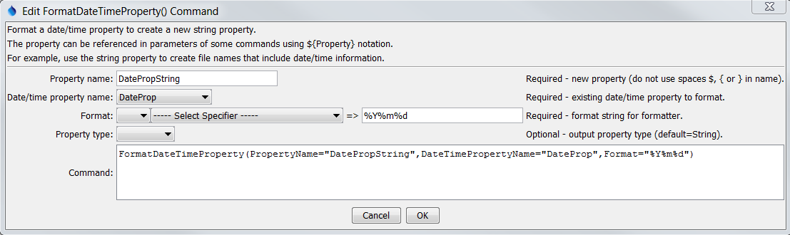

# TSTool / Command / FormatDateTimeProperty #

*   [Overview](#overview)
*   [Command Editor](#command-editor)
*   [Command Syntax](#command-syntax)
*   [Examples](#examples)
*   [Troubleshooting](#troubleshooting)
*   [See Also](#see-also)

-------------------------

## Overview ##

The `FormatDateTimeProperty` command creates a new processor property by
formatting an existing date/time property.
These properties are accessible to commands using `${Property}` notation.
A formatted date/time string is useful when specifying filenames more dynamically.
Date/time properties will by default be formatted using the ISO 8061 format (e.g., `YYYY-MM-DD hh:mm:ss`).
Support for properties varies by command and command documentation should be consulted.

## Command Editor ##

The command is available in the following TSTool menu:

*   ***Commands / General - Running and Properties***

The following dialog is used to edit the command and illustrates the command syntax.

**<p style="text-align: center;">

</p>**

**<p style="text-align: center;">
`FormatDateTimeProperty` Command Editor (<a href="../FormatDateTimeProperty.png">see also the full-size image</a>)
</p>**

## Command Syntax ##

The command syntax is as follows:

```text
FormatDateTimeProperty(Parameter="Value",...)
```
**<p style="text-align: center;">
Command Parameters
</p>**

| **Parameter**&nbsp;&nbsp;&nbsp;&nbsp;&nbsp;&nbsp;&nbsp;&nbsp;&nbsp;&nbsp;&nbsp;&nbsp;&nbsp;&nbsp;&nbsp;&nbsp;&nbsp;&nbsp;&nbsp;&nbsp;&nbsp;&nbsp;&nbsp;&nbsp;&nbsp;&nbsp; | **Description** | **Default**&nbsp;&nbsp;&nbsp;&nbsp;&nbsp;&nbsp;&nbsp;&nbsp;&nbsp;&nbsp; |
| --------------|-----------------|----------------- |
|`PropertyName`|The name of the string property to be created.|None – must be specified.|
|`DateTimePropertyName`|The name of the existing date/time property to be formatted.|None – must be specified.|
|`FormatterType`|The date/time formatter type, which defines the format specifiers, one of:<ul><li>`C` – the C programming language `strftime()` function, which has been widely copied (described below).</li><li>`MS` – Microsoft convention (currently not supported but may be added in the future).</li></ul>|`C`|
|`Format`|The format string for the formatter, which defines how date/time data parts are formatted into the new string property.  The string is interpreted by the formatter as follows:<ul><li>`FormatterType=C` – The string can contain literal characters and format specifiers that start with the `%` character.|None – must be specified.|
|`PropertyType`|Indicate the output property type, which allows the command to create properties other than strings.  The formatted string must have an appropriate value to allow the conversion:<ul><li>`Boolean` – string must be true or false (case-insensitive)</li><li>`DateTime` – string must be a standard date/time format such as supported by [`SetProperty`](../SetProperty/SetProperty.md)</li><li>`Double` – floating point number</li><li>`Integer` – integer number</li><li>`String` – any text</li></ul>`String`|

The following table lists the supported formatting strings for `FormatterType=C`:

**<p style="text-align: center;">
Supported C (strftime) Formatting Specifiers
</p>**

| **Format Specifier**&nbsp;&nbsp;&nbsp;&nbsp;&nbsp;&nbsp;&nbsp;&nbsp;&nbsp;&nbsp;&nbsp;&nbsp;&nbsp;&nbsp;&nbsp;&nbsp;&nbsp;&nbsp;&nbsp;&nbsp;&nbsp;&nbsp;&nbsp;&nbsp;&nbsp;&nbsp;&nbsp;&nbsp;&nbsp; | **Description** |
|-----------------------|-----------------|
|`%a`|Weekday abbreviation (e.g., `Sun`)|
|`%A`|Weekday (e.g., `Sunday`).|
|`%b`|Month abbreviation (e.g., `Jan`).|
|`%B`|Month (e.g., `January`).|
|`%d`|Day (`01`-`31`).|
|`%H`|Hour (`00`-`23`).|
|`%I`|Hour (`01`-`12`).|
|`%j`|Day of year (`001`-`366`).|
|`%m`|Month (`01`-`12`).|
|`%M`|Minute (`00`-`59`).|
|`%p`|AM, PM (noon=`PM`, midnight=`AM`).|
|`%S`|Second (`00`-`59`).|
|`%y`|Year (`00`-`99`).|
|`%Y`|Year (`0000`-`9999`).|
|`%Z`|Time zone (e.g., `MST`).|

## Examples ##

See the [automated tests](https://github.com/OpenCDSS/cdss-app-tstool-test/tree/master/test/commands/FormatDateTimeProperty).

A sample command file is as follows:

```
SetProperty(PropertyName="DateTimeProp",PropertyType=DateTime,PropertyValue="CurrentToSecond")
FormatDateTimeProperty(PropertyName="DateTimePropString",DateTimePropertyName="DateTimeProp",Format="%Y-%m-%dT%H:%M:%S")
```

## Troubleshooting ##

## See Also ##

*   [`FormatStringProperty`](../FormatStringProperty/FormatStringProperty.md) command
*   [`SetProperty`](../SetProperty/SetProperty.md) command
