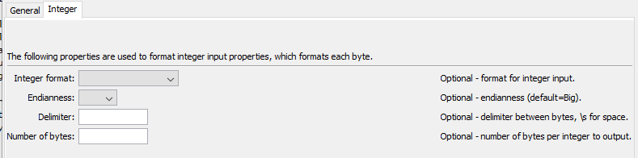

# TSTool / Command / FormatStringProperty #

*   [Overview](#overview)
*   [Command Editor](#command-editor)
*   [Command Syntax](#command-syntax)
    +   [Endianness](#endianness)
*   [Examples](#examples)
*   [Troubleshooting](#troubleshooting)
*   [See Also](#see-also)

-------------------------

## Overview ##

The `FormatStringProperty` command uses zero or more processor properties
as input and formats an output processor property.
Although the command was originally implemented to create a string property as output,
it can also set a property that is another type by converting the formatted string to a property of a different type.

Examples of use include:

*   concatenate values from several properties
    to create a string that can be used in a command
*   assign a literal string to a property,
    although [`SetProperty`](../SetProperty/SetProperty.md) is more suitable
*   manipulate strings to create a number and set as a number or `DateTime` property
*   format an integer's bytes as hex codes, for example for data representations that use hex format

Formatting occurs as follows:

*   The data types for input properties control the type of formatting that can be done.
    For example, properties that are floating-point numbers must use the format specifiers for floating-point numbers.
*   Format specifiers are consistent with the C programming language
    that have similarly been implemented by Java
*   A newline character can be inserted using `\n`, although properties with newlines may cause issues if output to a file.
*   Null input properties will result in blanks in output.

## Command Editor ##

The command is available in the following TSTool menu:

*   ***Commands / General - Running and Properties***

The following dialog is used to edit the command and illustrates the command syntax for general parameters.

**<p style="text-align: center;">

</p>**

**<p style="text-align: center;">
`FormatStringProperty` Command Editor for General Parameters (<a href="../FormatStringProperty.png">see also the full-size image</a>)
</p>**

The following is used to edit the command and illustrates the command syntax for integer parameters.

**<p style="text-align: center;">

</p>**

**<p style="text-align: center;">
`FormatStringProperty` Command Editor for Integer Parameters (<a href="../FormatStringProperty-Integer.png">see also the full-size image</a>)
</p>**

## Command Syntax ##

The command syntax is as follows:

```text
FormatStringProperty(Parameter="Value",...)
```
**<p style="text-align: center;">
Command Parameters
</p>**

| **Tab** | **Parameter**&nbsp;&nbsp;&nbsp;&nbsp;&nbsp;&nbsp;&nbsp;&nbsp;&nbsp;&nbsp;&nbsp;&nbsp;&nbsp;&nbsp;&nbsp;&nbsp;&nbsp;&nbsp;&nbsp;&nbsp;&nbsp;&nbsp;&nbsp;&nbsp;&nbsp;&nbsp; | **Description** | **Default**&nbsp;&nbsp;&nbsp;&nbsp;&nbsp;&nbsp;&nbsp;&nbsp;&nbsp;&nbsp; |
| ------|-------|-----------------|----------------- |
| ***All*** | `InputProperties`|The name(s) of one or more input processor properties.  Values corresponding to the properties will be formatted according to the `Format` or `IntegerFormat` parameters.  Input properties can be omitted if the format string is a literal value. The property names **should not** be surrounded by `${ }` because this results in an immediate expansion of the property values.  If detected, the surrounding `${ }` characters will automatically be removed. |Required if the `Format` parameter provides formatting specifiers or the `IntegerFormat` parameter is specified. |
|***General*** | `Format`|The format specifier string used to format the property values.  See the editor dialog for examples and refer to [`sprintf` documentation](https://en.wikipedia.org/wiki/Printf_format_string) for further explanation.  Specify as many format specifiers as there are input properties.  All other characters will be transferred literally to the output string.| Required if `IntegerFormat` is not specified. |
| ***Integer*** | `IntegerFormat` | Used if input properties are all integers and are output in byte representation:<ul><li>`HexBytes` - each byte is encoded as a 2-character hex code using lower case letters</li><li>`HexBytesUpperCase` - same as `HexBytes` but use upper case letters</li></ul> | |
| ***Integer*** | `Endianness` | The endianness for the order of bytes in an integer (see the [Endianness](#endianness) section below):<ul><li>`Big` - big endian</li><li>`Little` - little endian</li></ul> | `Big`, which results in an output order similar to normal numbers. |
| ***Integer*** | `Delimiter` | The delimiter used with `IntegerFormat`, to separate byte values. Use `\s` for space. | None, values are packed together. |
| ***Integer*** | `NumBytes` | Number of bytes to output, for example specify `2` to output only two bytes from a 4-byte integer (the size in Java).  The most significant 0-bytes in an integer can be discarded without changing the value of the integer. |  Determine automatically based on the input properties.  |
| ***All*** | `OutputProperty`<br>**required**|The name of the processor property to be set.|None – must be specified.|
| ***All*** | `PropertyType`|Indicate the output property type, which allows the command to create properties other than strings.  The formatted string must have an appropriate value to allow the conversion:<ul><li>`Boolean` – string must be true or false (case-insensitive)</li><li>`DateTime` – string must be a standard date/time format such as supported by [`SetProperty`](../SetProperty/SetProperty.md)</li><li>`Double` – floating point number</li><li>`Integer` – integer number</li><li>`String` – any text</li><ul>|`String`|

### Endianness ###

Endianness is important when formatting integers in byte representations, such as hexadecimal (`IntegerFormat=HexBytes`).
Endianness indicates the order of bytes.  See [Endianness on Wikipedia](https://en.wikipedia.org/wiki/Endianness).

*   Big endian format numbers are shown with the most significant bytes at the lowest (leftmost) address when written as text.
*   Little endian format numbers are shown with the least significant bytes at the lowest (leftmost) address when written as text.
*   The 8 bits within a byte are always represented with the most significant bit on the left, regardless of whether big or little endian
*   Normal numbers are written with most significant digits on the left, similar to big-endian format.

An unsigned one byte integer is able to store a maximum value of 255, as shown below.
A four byte signed integer can be treated as 3 unsigned byte and 1 signed byte.

```
1 1 1 1 1 1 1 1
| | | | | | | |
| | | | | | | +- =   1
| | | | | | +--- =   2
| | | | | +----- =   4
| | | | +------- =   8
| | | +--------- =  16
| | +----------- =  32
| +------------- =  64
+--------------- = 128
           Total = 255
```

The next significant byte will continue a similar pattern with larger numbers 256, 512, etc.
Rather than representing a byte in binary representation, a two-character hexadecimal value can be used.
For example `ff` is equivalent to 8-bits set to `1` or decimal `255`.

A four byte unsigned integer has a value range of `0` to `4,294,967,295`,
whereas a signed integer has a value range of `-2,147,483,648` to `2,147,483,647`.

A decimal value of `25000` has a big-endian hexidecimal value of `000061a8`,
meaning that the byte values from left to right are (`00`, `00`, `61`, `a8`).

The same number in little-endian format is the reverse order (`a8`, `61`, `00`, `00`).

The target computer system must ensure that the byte is consistent with the endian-ness
of the in-memory integer.

## Examples ##

See the [automated tests](https://github.com/OpenCDSS/cdss-app-tstool-test/tree/master/test/commands/FormatStringProperty).

## Troubleshooting ##

See the main [TSTool Troubleshooting](../../troubleshooting/troubleshooting.md) documentation.

## See Also ##

*   [`FormatDateTimeProperty`](../FormatDateTimeProperty/FormatDateTimeProperty.md) command
*   [`SetProperty`](../SetProperty/SetProperty.md) command
