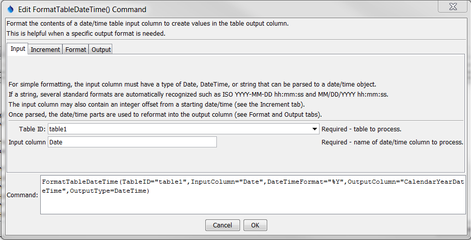
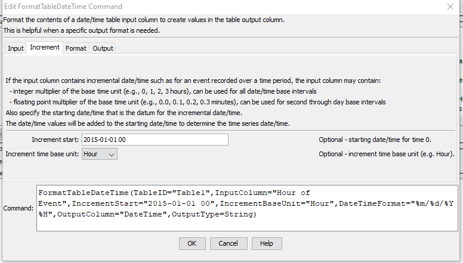
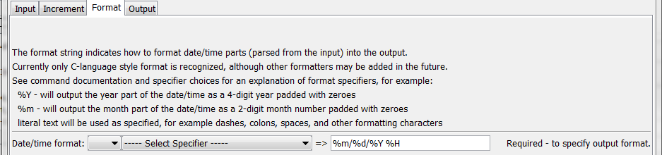
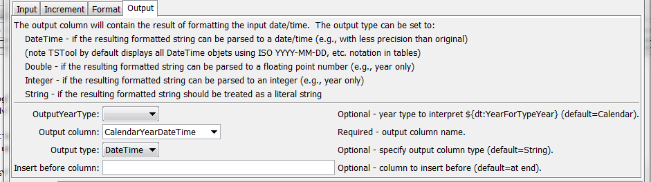
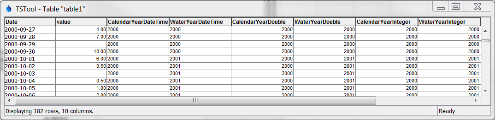
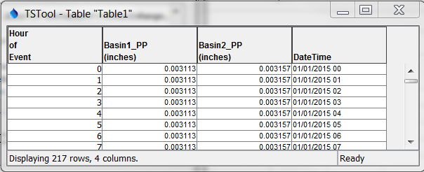

# TSTool / Command / FormatTableDateTime #

* [Overview](#overview)
* [Command Editor](#command-editor)
* [Command Syntax](#command-syntax)
* [Examples](#examples)
* [Troubleshooting](#troubleshooting)
* [See Also](#see-also)

-------------------------

## Overview ##

The `FormatTableDateTime` command formats a date/time input column from a table to create a table output column.
For example, it may be necessary to reformat a date/time column into
an object type that is more suitable for reporting,
further processing, or export to a spreadsheet.
See also the [`FormatTableString`](../FormatTableString/FormatTableString.md) command,
which manipulates strings.  Formatting occurs as follows:

1. The date/time input column value is parsed into internal date/time object.
Currently there is no command parameter to specify the format of the input
column and consequently standard formats are expected
(ISO `YYYY-MM-DD hh:mm:ss` or `MM/DD/YYYY hh:mm:ss` of varying precision):
	1. If the input column is not an increment (***Increment*** tab parameters are blank)
	then the input column is parsed directly to a date/time object.
	2. If the input column is an increment from a starting date/time
	(***Increment*** tab parameters are not blank),
	the date/time object is computed as the offset from the starting date/time,
	for example the number of hours since the start.
2. The date/time object from the previous step is formatted into a string using
the format specifier string specified by the `FormatterType` and `DateTimeFormat` parameters.
Missing values in input will result in blanks (nulls) in output.
3. The string is converted into the final output column type by specifying the `OutputType` parameter:
	1. DateTime output might be used to create date/time objects with less
	precision that the original input column (for example to truncate hh:mm:ss that is superfluous).
	2. Integer or double types can be created if the date/time output string from the
	previous step contains integer or floating-point number, for example `YYYY` or `YYYY.MM`
	3. String outputs the string from the previous step.

## Command Editor ##

The following dialog is used to edit the command and illustrates the syntax of the command, showing input parameters.



**<p style="text-align: center;">
`FormatTableDateTime` Command Editor Showing Input Parameters (<a href="../FormatTableDateTime.png">see also the full-size image</a>)
</p>**

The following dialog is used to edit the command and illustrates the syntax of the command, showing time increment parameters.



**<p style="text-align: center;">
`FormatTableDateTime` Command Editor Showing Increment Parameters (<a href="../FormatTableDateTime_Increment.png">see also the full-size image</a>)
</p>**

The following dialog is used to edit the command and illustrates the syntax of the command, showing format parameters.



**<p style="text-align: center;">
`FormatTableDateTime` Command Editor Showing Format Parameters (<a href="../FormatTableDateTime_Format.png">see also the full-size image</a>)
</p>**

The following dialog is used to edit the command and illustrates the syntax of the command, showing output parameters.



**<p style="text-align: center;">
`FormatTableDateTime` Command Editor Showing Output Parameters (<a href="../FormatTableDateTime_Output.png">see also the full-size image</a>)
</p>**

## Command Syntax ##

The command syntax is as follows:

```text
FormatTableDateTime(Parameter="Value",...)
```
**<p style="text-align: center;">
Command Parameters
</p>**

| **Parameter**&nbsp;&nbsp;&nbsp;&nbsp;&nbsp;&nbsp;&nbsp;&nbsp;&nbsp;&nbsp;&nbsp;&nbsp;&nbsp;&nbsp;&nbsp;&nbsp;&nbsp;&nbsp;&nbsp;&nbsp;&nbsp;&nbsp;&nbsp;&nbsp;&nbsp;&nbsp; | **Description** | **Default**&nbsp;&nbsp;&nbsp;&nbsp;&nbsp;&nbsp;&nbsp;&nbsp;&nbsp;&nbsp; |
| --------------|-----------------|----------------- |
|`TableID`|The identifier for the table to process.  Can be specified using processor `${Property}`.|None – must be specified.|
|`InputColumn`|The name of the input date/time column to process.  The column can contain date/time objects or strings that can be parsed into date/time objects.  If `IncrementStart` is specified, this column should contain integers that indicate the offset from the increment start.  Can be specified using processor `${Property}`.|None – must be specified.|
|`IncrementStart`|When input column is an increasing time increment, specify the starting date/time.  Can be specified using processor `${Property}`.|Do not use increment.|
|`IncrementBaseUnit`|When input column is an increasing time increment, specify the base unit for increment values: `Minute`, `Hour`, `Day`, `Year`.|Do not use increment.|
|`FormatterType`|The date/time formatter type that defines `DateTimeFormat`:<br><ul><li>`C` – the C programming language [strftime() function](http://man7.org/linux/man-pages/man3/strftime.3.html), which has been widely copied (described below).</li><li>`MS` – Microsoft convention (currently not supported but may be added in the future).</li></ul>|`C`|
|`DateTimeFormat`|The format specifier string used to format the date/time values.  Specify as many format specifiers as appropriate.  All other characters will be transferred to the output string.  See the table below for valid specifiers.  Can be specified using processor `${Property}`.|None – must be specified.|
|`OutputYearType`|Indicate the year type used to transform the date/time to an output.  For example, specify `OutputYearType=Water` and `DateTimeFormat=${dt:YearForYearType}` to output the water year corresponding to the input date/time.||
|`OutputColumn`|The name of the column to receive the output.  If the column does not exist in the table it will be created, considering `OutputType`.  Can be specified using processor `${Property}`.|None – must be specified.|
|`OutputType`|Specify if the output column should be other than a String.  Successful conversion to the output type requires that the format string result is consistent with the desired output type.|String|
|`InsertBeforeColumn`|The name of the column before which the output column should be inserted (if the output column needs to be created).  Can be specified using processor `${Property}`.|Insert at the end of the table.|

The following table lists the supported format strings for `FormatterType=C`:

**<p style="text-align: center;">
Supported C (Strftime) Format Specifiers
</p>**

| **Format Specifier**&nbsp;&nbsp;&nbsp;&nbsp;&nbsp;&nbsp;&nbsp;&nbsp;&nbsp;&nbsp;&nbsp;&nbsp;&nbsp;&nbsp;&nbsp;&nbsp;&nbsp;&nbsp;&nbsp;&nbsp;&nbsp;&nbsp;&nbsp;&nbsp;&nbsp;&nbsp; | **Description** |
| --------------|-----------------|
|`%a`|Weekday abbreviation (e.g., `Sun`)|
|`%A`|Weekday (e.g., `Sunday`).|
|`%b`|Month abbreviation (e.g., `Jan`).|
|`%B`|Month (e.g., `January`).|
|`%d`|Day (`01`-`31`).|
|`%H`|Hour (`00`-`23`).|
|`%I`|Hour (`01`-`12`).|
|`%j`|Day of year (`001`-`366`).|
|`%m`|Month (`01`-`12`).|
|`%M`|Minute (`00`-`59`).|
|`%p`|AM, PM (noon=`PM`, midnight=`AM`).|
|`%S`|Second (`00`-`59`).|
|`%s`|Number of seconds since Jan 1, 1970 00:00:00|
|`%y`|Year (`00`-`99`).|
|`%Y`|Year (`0000`-`9999`).|
|`%Z`|Time zone (e.g., `MST`).|
|`${dt:YearForYearType}`|4-digit year for the given `OutputYearType`.|

## Examples ##

See the [automated tests](https://github.com/OpenCDSS/cdss-app-tstool-test/tree/master/test/regression/commands/general/FormatTableDateTime).

The following example illustrates how to convert an input date/time column into
variations of the date/time, with the following input used to generate the
`WaterYearDateTime` column (surrounding quotes will be added automatically by command editor).
Note the change in value of the water year.

```
InputColumn=Date
DateTimeFormat=%Y
OutputYearType=Water
OutputColumn=WateryearDateTime
OuputType=DateTime
```

Output is as shown below.



**<p style="text-align: center;">
Formatted Date/time Output (<a href="../FormatTableDateTime_Data.png">see also the full-size image</a>)
</p>**

The following example illustrates how to convert increment data into a full date/time column string, with the following input (surrounding quotes will be added automatically by command editor):

```
InputColumn=Hour of Event
IncrementStart=2015-01-01 00
IncrementBaseUnit=Hour
DateTimeFormat=%m/%d/%Y %H
OutputColumn=DateTime
```

Output is as shown below.



**<p style="text-align: center;">
Formatted Date/time Output for Increment Data (<a href="../FormatTableDateTime_IncrementData.png">See also the full-size image</a>)
</p>**

## Troubleshooting ##

## See Also ##

* [`FormatTableString`](../FormatTableString/FormatTableString.md) command
* [`ManipulateTableString`](../ManipulateTableString/ManipulateTableString.md) command
