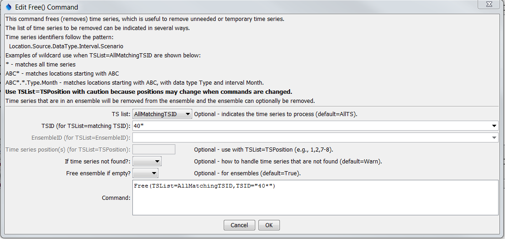

# Learn TSTool / Command / Free Time Series #

* [Overview](#overview)
* [Command Editor](#command-editor)
* [Command Syntax](#command-syntax)
* [Examples](#examples)
* [Troubleshooting](#troubleshooting)
* [See Also](#see-also)

-------------------------

## Overview ##

The `Free` command frees (removes) the selected time series from memory.
The time series will therefore not be available for use after that line in the command file.
This command is useful for discarding temporary time series needed for data manipulation
(e.g., so that they are not written in output and are not available for interactive plots).
Freed time series are also removed from any ensembles that reference the time series. 
	
Rather than freeing time series, it may be more appropriate to use the [`SelectTimeSeries`](../SelectTimeSeres/SelectTimeSeries) command,
which can be used in conjunction with some commands to select time series and then operate on the selected time series.
This approach allows selective use of time series and minimizes the need for `Free` commands.
Many commands also use a `TSList` parameter to indicate which time series should be operated on by a command.
The `Free` command is useful if a block of commands is used with [`For`](../For/For) because many time series may be created.
  
## Command Editor ##

The following dialog is used to edit the command and illustrates the command syntax.
<a href="../Free.png">See also the full-size image.</a>



**<p style="text-align: center;">
`Free` Command Editor
</p>**


## Command Syntax ##

The command syntax is as follows:

```text
Free(Parameter="Value",...)
```
**<p style="text-align: center;">
Command Parameters
</p>**

|**Parameter**&nbsp;&nbsp;&nbsp;&nbsp;&nbsp;&nbsp;&nbsp;&nbsp;&nbsp;&nbsp;&nbsp;&nbsp;&nbsp;&nbsp;&nbsp;&nbsp;&nbsp;&nbsp;&nbsp;&nbsp;&nbsp;&nbsp;| **Description** | **Default**&nbsp;&nbsp;&nbsp;&nbsp;&nbsp;&nbsp;&nbsp;&nbsp;&nbsp;&nbsp;&nbsp;&nbsp;&nbsp;&nbsp;&nbsp;&nbsp;&nbsp;&nbsp;&nbsp;&nbsp;&nbsp;&nbsp;&nbsp;&nbsp;&nbsp;&nbsp; |
| --------------|-----------------|----------------- |
| `TSList`|Indicates the list of time series to be processed, one of:<br><br><ul><li>`AllMatchingTSID` – all time series that match the TSID (single TSID or TSID with wildcards) will be processed.</li><li>`AllTS` – all time series before the command.</li><li>`EnsembleID` – all time series in the ensemble will be processed (see the EnsembleID parameter).</li><li>`LastMatchingTSID` – the last time series that matches the TSID (single TSID or TSID with wildcards) will be processed.</li><li>`TSPosition` – time series specified by position in the results list (see TSPosition parameter below).</li></ul>
| `TSID`|The time series identifier or alias for the time series to be processed, using the `*` wildcard character to match multiple time series.  Can be specified using `${Property}`.|Required if `TSList=*TSID`|
| `EnsembleID`|The ensemble to be modified, if processing an ensemble. Can be specified using `${Property}`.|Required if `TSList=*EnsembleID`|
| `TSPosition`|A list of time series positions (1+) in output, separated by commas.  Ranges can be specified as `Start-End`.|Required if `TSList=TSPosition`|
| `IfNotFound`|If a time series is not found to free, indicate the action to take:<br><br><ul><li>`Ignore` – ignore</li><li>`Fail` – generate a failure status</li><li>`Warn` – generate a warning status</li></ul>|`Warn`|
| `FreeEnsembleIfEmpty`|Indicate whether to free the ensemble from which time series were removed, if the ensemble is empty (has no time series remaining after the `Free` command).| `True`|

## Examples ##

See the [automated tests](https://github.com/OpenWaterFoundation/cdss-app-tstool-test/tree/master/test/regression/commands/general/Free).

## Troubleshooting ##

## See Also ##

* [`FreeTable`](../FreeTable/FreeTable) command
