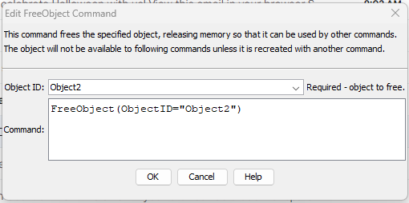

# TSTool / Command / FreeObject #

*   [Overview](#overview)
*   [Command Editor](#command-editor)
*   [Command Syntax](#command-syntax)
*   [Examples](#examples)
*   [Troubleshooting](#troubleshooting)
*   [See Also](#see-also)

-------------------------

## Overview ##

The `FreeObject` command frees an object.
The object will not be available for subsequent commands,
although a new object with the same name can be created and used with subsequent commands.
This command is useful, for example, when looping through blocks of commands where logic is repeated and the object contents are recreated.

## Command Editor ##

The command is available in the following TSTool menu:

*   ***Commands / Object Processing***

The following dialog is used to edit the command and illustrates the command syntax.

**<p style="text-align: center;">

</p>**

**<p style="text-align: center;">
`FreeObject` Command Editor (<a href="../FreeObject.png">see also the full-size image</a>)
</p>**

## Command Syntax ##

The command syntax is as follows:

```text
FreeObject(Parameter="Value",...)
```
**<p style="text-align: center;">
Command Parameters
</p>**

| **Parameter**&nbsp;&nbsp;&nbsp;&nbsp;&nbsp;&nbsp;&nbsp;&nbsp;&nbsp;&nbsp;&nbsp;&nbsp; | **Description** | **Default**&nbsp;&nbsp;&nbsp;&nbsp;&nbsp;&nbsp;&nbsp;&nbsp;&nbsp;&nbsp; |
| --------------|-----------------|----------------- |
|`ObjectID`<br>**required**|The identifier for the object.  Can be specified using ${Property} syntax.|None – must be specified.|

## Examples ##

See the [automated tests](https://github.com/OpenCDSS/cdss-app-tstool-test/tree/master/test/commands/FreeObject).

## Troubleshooting ##

See the main [TSTool Troubleshooting](../../troubleshooting/troubleshooting.md) documentation.

## See Also ##

*   [`NewObject`](../NewObject/NewObject.md) command
