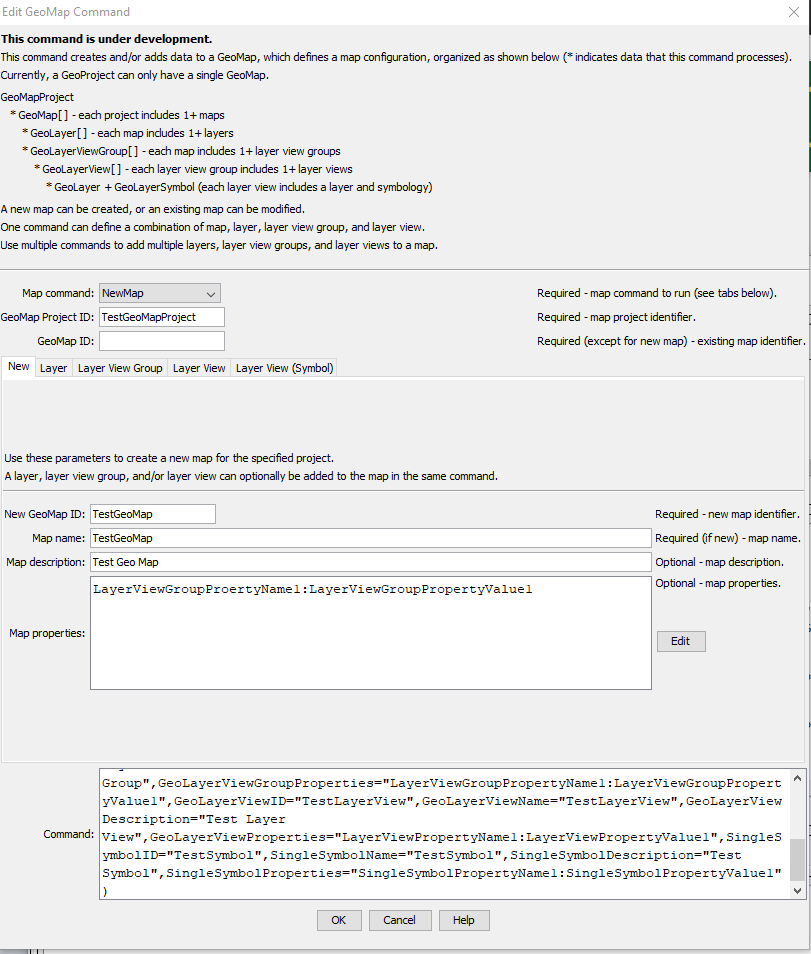
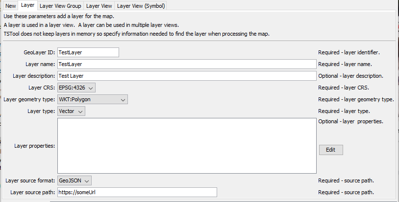
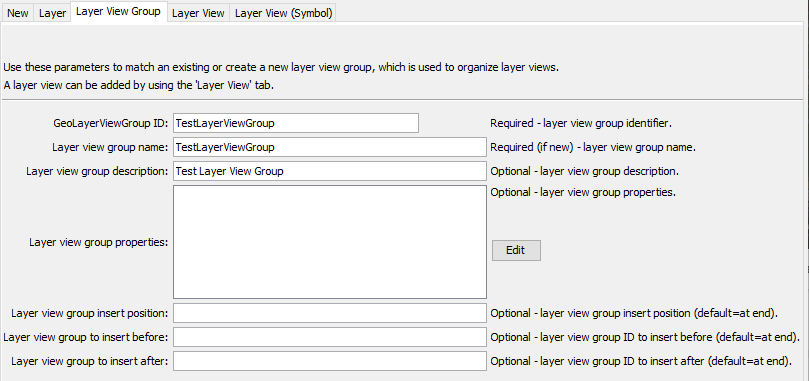
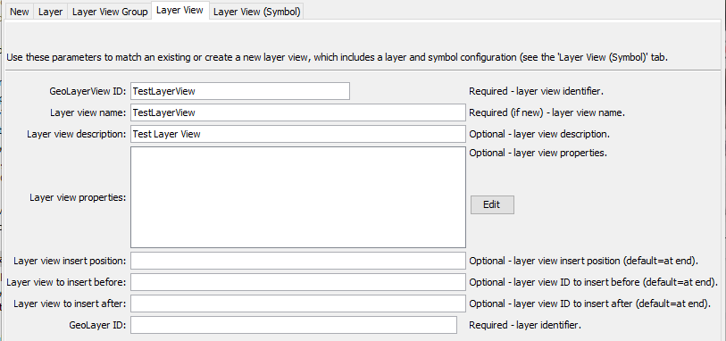
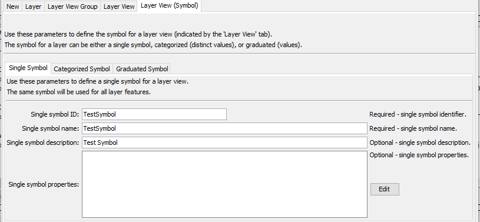
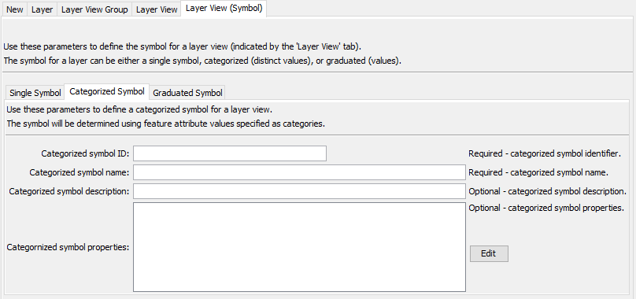
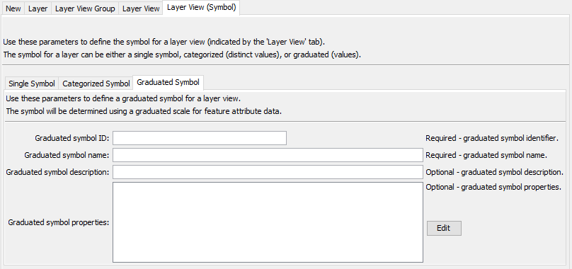

# TSTool / Command / GeoMap #

*   [Overview](#overview)
*   [Command Editor](#command-editor)
*   [Command Syntax](#command-syntax)
*   [Examples](#examples)
*   [Troubleshooting](#troubleshooting)
*   [See Also](#see-also)

-------------------------

## Overview ##

**This command is under development.**

The `GeoMap` command processes a single "GeoMap" within a GeoMap project, which describes a spatial map.
This command is used to develop and test Java map processing code and integrate time series data visualizations with maps.

See the [`GeoMapProject`](../GeoMapProject/GeoMapProject.md) command documentation for background on a map project.

See the Open Water Foundation [GeoProcessor](https://software.openwaterfoundation.org/geoprocessor/latest/doc-user/appendix-geomapproject/geomapproject/)
documentation for details about the JSON map project file.

One or more processing actions can be executed by this command, independently or combined:

*   create a new map:
    +   specify data using the ***New*** and other tabs
    +   copy an existing map (future feature)
*   add a layer using the ***Layer*** tab (provides spatial data, and can be used by one or more layer views)
*   add a layer view group using the ***Layer View Group*** tab (associates a layer with a layer view)
*   add a layer view to a layer view group using the ***LayerView*** and ***Layer View (Symbol)*** tab (defines how a layer is visualized)
*   write the project to an output JSON file

## Command Editor ##

The command is available in the following TSTool menu:

*   ***Commands / Spatial Data Processing***

The following dialog is used to edit the command and illustrates the command syntax.

The `GeoMap` command uses sub-commands as specified by the `MapCommand` parameter to perform tasks,
with tabs provided to organize parameters for each sub-command.
Parameters in one or more tabs are specified as needed.

**<p style="text-align: center;">

</p>**

**<p style="text-align: center;">
`GeoMap` Command Editor for New Parameters (<a href="../GeoMap-New.png">see full-size image</a>)
</p>**

**<p style="text-align: center;">

</p>**

**<p style="text-align: center;">
`GeoMap` Command Editor for Layer Parameters (<a href="../GeoMap-Layer.png">see full-size image</a>)
</p>**

**<p style="text-align: center;">

</p>**

**<p style="text-align: center;">
`GeoMap` Command Editor for Layer View Group Parameters (<a href="../GeoMap-LayerViewGrouppng">see full-size image</a>)
</p>**

**<p style="text-align: center;">

</p>**

**<p style="text-align: center;">
`GeoMap` Command Editor for Layer View Parameters (<a href="../GeoMap-LayerView.png">see full-size image</a>)
</p>**

**<p style="text-align: center;">

</p>**

**<p style="text-align: center;">
`GeoMap` Command Editor for Single Symbol Parameters (<a href="../GeoMap-SingleSymbol.png">see full-size image</a>)
</p>**

**<p style="text-align: center;">

</p>**

**<p style="text-align: center;">
`GeoMap` Command Editor for Categorized Symbol Parameters (<a href="../GeoMap-CategorizedSymbol.png">see full-size image</a>)
</p>**

**<p style="text-align: center;">

</p>**

**<p style="text-align: center;">
`GeoMap` Command Editor for Graduated Symbol Parameters (<a href="../GeoMap-GraduatedSymbol.png">see full-size image</a>)
</p>**

## Command Syntax ##

The command syntax is as follows:

```text
GeoMap(Parameter="Value",...)
```
**<p style="text-align: center;">
Command Parameters
</p>**

| **Tab** | **Parameter**&nbsp;&nbsp;&nbsp;&nbsp;&nbsp;&nbsp;&nbsp;&nbsp;&nbsp;&nbsp;&nbsp;&nbsp;&nbsp;&nbsp;&nbsp;&nbsp;&nbsp;&nbsp;&nbsp;&nbsp;&nbsp;&nbsp;&nbsp;&nbsp;&nbsp;&nbsp;&nbsp;&nbsp;&nbsp;&nbsp;&nbsp;&nbsp;&nbsp;&nbsp;&nbsp;&nbsp;&nbsp;&nbsp;&nbsp;&nbsp;&nbsp;&nbsp;&nbsp;&nbsp;&nbsp;&nbsp; | **Description** | **Default**&nbsp;&nbsp;&nbsp;&nbsp;&nbsp;&nbsp;&nbsp;&nbsp;&nbsp;&nbsp; |
| --|--------------|-----------------|----------------- |
|***All***|`MapCommand` | GeoMap command to run:<ul><li>`NewMap` - create a new map</li><li>`Layer` - add/edit a layer</li><li>`LayerViewGroup` - add/edit a layer view group</li><li>`LayerView` - add/edit a layer view</li><li>`Layer View (Symbol)` - add/edit a layer view symbol </li></ul> See separate tabs for the related command parameters.| None - must be specified.|
||`GeoMapProjectID` |Identifier for the GeoMap project, to identify the existing project associated with the GeoMap.  Can be specified using processor `${Property}`.| None - must be specified.|
||`GeoMapID` |Identifier for the GeoMap within a project, to identify the existing map associated with the GeoMap.  Can be specified using processor `${Property}`.| Must be specified if processing an existing map.|
|***New*** | `NewGeoMapID`| New GeoMap identifier, used when creating a new map. Can be specified using processor `${Property}`. | |
| | `GeoMapName` | Name for the map. Can be specified using processor `${Property}`.| |
| | `GeoMapDescription` | Description for the map. Can be specified using processor `${Property}`.| |
| | `GeoMapProperties` | Map properties using the format `Property1:Value1,Property2:Value2,...`.  Can be specified using processor `${Property}`. |
|***Layer*** | `GeoLayerID`| Layer identifier. Can be specified using processor `${Property}`. | |
| | `GeoLayerName` | Name for the layer. Can be specified using processor `${Property}`.| |
| | `GeoLayerDescription` | Description for the layer. Can be specified using processor `${Property}`.| |
| | `GeoLayerProperties` | Layer properties using the format `Property1:Value1,Property2:Value2,...`.  Can be specified using processor `${Property}`. |
| | `GeoLayerCrs` | Layer coordinate reference system (CRS) using syntax `EPSG:xxxx`, where `xxxx` is the CRS number.  See [Spatial reference system on Wikipedia](https://en.wikipedia.org/wiki/Spatial_reference_system). Can be specified using processor `${Property}`. |
| | `GeoLayerGeometryType` | Layer geometry type as:<ul><li>`Raster`</li><li>`WKT:GeometryType`, where `GeometryType` matches a [Well Known Text geometry type](https://en.wikipedia.org/wiki/Well-known_text_representation_of_geometry)</li></ul> | None - must be specified. |
| | `GeoLayerType` | Type type of the layer:<ul><li>`Raster`</li><li>`Vector`</li></ul> | None - must be specified. |
| | `GeoLayerSourceFormat` | The format of the layer:<ul><li>`GeoJSON` - for vector data</li><li>`WMTS` - for web mapping tile service for a background layer</li></ul> | None - must be specified. |
| | `GeoLayerSourcePath` | The path to the layer's data:<ul><li>file path</li><li>URL</li></ul> | None - must be specified. |
|***Layer View Group*** | `GeoLayerViewGroupID`| Layer view group identifier. Can be specified using processor `${Property}`. | |
| | `GeoLayerViewGroupName` | Name for the layer view group. Can be specified using processor `${Property}`.| |
| | `GeoLayerViewGroupDescription` | Description for the layer view group. Can be specified using processor `${Property}`.| |
| | `GeoLayerViewGroupProperties` | Layer view group properties using the format `Property1:Value1,Property2:Value2,...`.  Can be specified using processor `${Property}`. |
| | `GeoLayerViewGroupInsertPosition` | Position (1+) to insert the layer view group. Can be specified using processor `${Property}`. | |
| | `GeoLayerViewGroupInsertBefore` | Layer view group identifier to insert before. Can be specified using processor `${Property}`. | |
| | `GeoLayerViewGroupInsertAfter` | Layer view group identifier to insert after. Can be specified using processor `${Property}`. | |
|***Layer View*** | `GeoLayerViewID`| Layer view identifier. Can be specified using processor `${Property}`. | |
| | `GeoLayerViewName` | Name for the layer view. Can be specified using processor `${Property}`.| |
| | `GeoLayerViewDescription` | Description for the layer view. Can be specified using processor `${Property}`.| |
| | `GeoLayerViewProperties` | Layer view properties using the format `Property1:Value1,Property2:Value2,...`.  Can be specified using processor `${Property}`. |
| | `GeoLayerViewInsertPosition` | Position (1+) to insert the layer group. Can be specified using processor `${Property}`. | |
| | `GeoLayerViewInsertBefore` | Layer view identifier to insert before. Can be specified using processor `${Property}`. | |
| | `GeoLayerViewInsertAfter` | Layer view identifier to insert after. Can be specified using processor `${Property}`. | |
| | `GeoLayerViewGeoLayerID` | Layer identifier to use for the view.  Can be specified using processor `${Property}`. | |

The ***Layver View (Symbol)*** tab includes tabs for the symbol to use for the layer view, as described in the following table,
for the following symbol types:

*   `SingleSymbol` - a single symbol is used for every feature in the layer, regardless of attribute value
*   `CategorizedSymbol` - distinct or ranges for a feature attribute are used to determine the symbol
*   `GraduatedSymbol` - a graduated symbol (e.g., color ramp) based on feature attribute value is used to determine the symbol

**<p style="text-align: center;">
***Layer View (Symbol)*** Command Parameters
</p>**

| **Tab** | **Parameter**&nbsp;&nbsp;&nbsp;&nbsp;&nbsp;&nbsp;&nbsp;&nbsp;&nbsp;&nbsp;&nbsp;&nbsp;&nbsp;&nbsp;&nbsp;&nbsp;&nbsp;&nbsp;&nbsp;&nbsp;&nbsp;&nbsp;&nbsp;&nbsp;&nbsp;&nbsp;&nbsp;&nbsp;&nbsp;&nbsp;&nbsp;&nbsp;&nbsp;&nbsp;&nbsp;&nbsp;&nbsp;&nbsp;&nbsp;&nbsp; | **Description** | **Default**&nbsp;&nbsp;&nbsp;&nbsp;&nbsp;&nbsp;&nbsp;&nbsp;&nbsp;&nbsp; |
| --|--------------|-----------------|----------------- |
|***Single Symbol***|`SingleSymbolID` | Identifier for the symbol. | None - must be specified. |
| | `SingleSymbolName` | Name for the symbol. Can be specified using processor `${Property}`.| |
| | `SingleSymbolDescription` | Description for the symbol. Can be specified using processor `${Property}`.| |
| | `SingleSymbolProperties` | Symbol properties using the format `Property1:Value1,Property2:Value2,...`.  Can be specified using processor `${Property}`. |
|***Categorized Symbol***|`CategorizedSymbolID` | Identifier for the symbol. | None - must be specified. |
| | `CategorizedSymbolName` | Name for the symbol. Can be specified using processor `${Property}`.| |
| | `CategorizedSymbolDescription` | Description for the symbol. Can be specified using processor `${Property}`.| |
| | `CategorizedSymbolProperties` | Symbol properties using the format `Property1:Value1,Property2:Value2,...`.  Can be specified using processor `${Property}`. |
|***Graduated Symbol***|`GraduatedSymbolID` | Identifier for the symbol. | None - must be specified. |
| | `GraduatedSymbolName` | Name for the symbol. Can be specified using processor `${Property}`.| |
| | `GraduatedSymbolDescription` | Description for the symbol. Can be specified using processor `${Property}`.| |
| | `GraduatedSymbolProperties` | Symbol properties using the format `Property1:Value1,Property2:Value2,...`.  Can be specified using processor `${Property}`. |

## Examples ##

See the [automated tests](https://github.com/OpenCDSS/cdss-app-tstool-test/tree/master/test/commands/GeoMapProject).

## Troubleshooting ##

See the main [TSTool Troubleshooting](../../troubleshooting/troubleshooting.md) documentation.

## See Also ##

*   [`GeoMap`](../GeoMap/GeoMap.md) command
