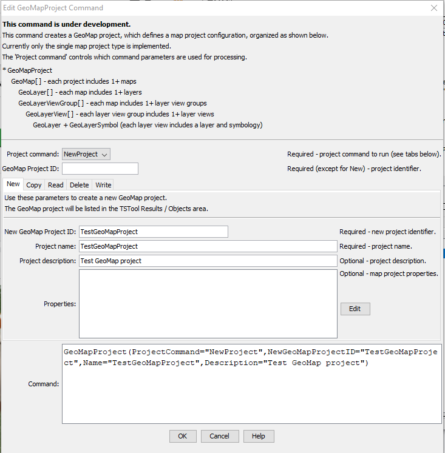
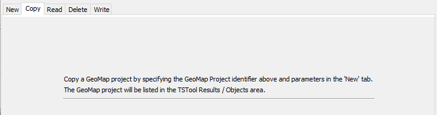
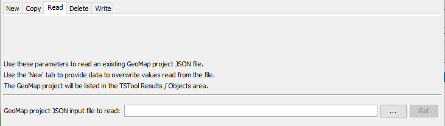
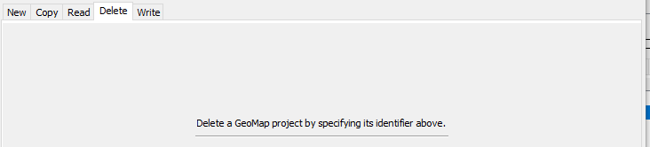
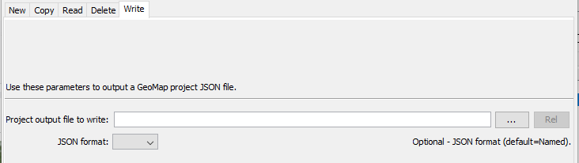

# TSTool / Command / GeoMapProject #

*   [Overview](#overview)
*   [Command Editor](#command-editor)
*   [Command Syntax](#command-syntax)
*   [Examples](#examples)
*   [Troubleshooting](#troubleshooting)
*   [See Also](#see-also)

-------------------------

## Overview ##

**This command is under development.**

The `GeoMapProject` command processes a "GeoMap" project,
which describes one or more spatial maps.
A GeoMap project organizes spatial data layers and configuration data.
This command is used to develop and test Java map processing code and integrate time series data visualizations with maps.

See the Open Water Foundation
[GeoProcessor](https://software.openwaterfoundation.org/geoprocessor/latest/doc-user/appendix-geomapproject/geomapproject/) documentation.
The GeoProcessor provides extensive spatial data processing,
whereas this TSTool command is mainly used to assemble and manipulate GeoMap project files that use existing spatial data files and web services.
A GeoMap project file can be saved as JSON and used with web applications to describe maps for visualizations.

Time series data are accessed either by using the data as an attribute for map symbol
and providing links to other pages that display time series data.

## Command Editor ##

The command is available in the following TSTool menu:

*   ***Commands / Spatial Data Processing***

The following dialog is used to edit the command and illustrates the command syntax.
The `GeoMapProject` command uses sub-commands as specified by the `ProjectCommand` parameter to perform tasks,
with tabs provided to organize parameters for each sub-command.
One or more processing actions can be executed independently or combined:

*   create a new project:
    +   specify project data (see the ***New*** tab)
    +   copy an existing project (see the ***Copy*** tab)
    +   read a project from a JSON file (see the ***Read*** tab)
*   write the project to an output JSON file (see the ***Write*** tab)

Use more than one command as needed to add and modify project content.
Use the [`GeoMap`](../GeoMap/GeoMap.md) command to configure maps within a project

**<p style="text-align: center;">

</p>**

**<p style="text-align: center;">
`GeoMapProject` Command Editor for New Parameters (<a href="../GeoMapProject-New.png">see full-size image</a>)
</p>**

**<p style="text-align: center;">

</p>**

**<p style="text-align: center;">
`GeoMapProject` Command Editor for Copy Parameters (<a href="../GeoMapProject-Copy.png">see full-size image</a>)
</p>**

**<p style="text-align: center;">

</p>**

**<p style="text-align: center;">
`GeoMapProject` Command Editor for Read Parameters (<a href="../GeoMapProject-Read.png">see full-size image</a>)
</p>**

**<p style="text-align: center;">

</p>**

**<p style="text-align: center;">
`GeoMapProject` Command Editor for Delete Parameters (<a href="../GeoMapProject-Delete.png">see full-size image</a>)
</p>**

**<p style="text-align: center;">

</p>**

**<p style="text-align: center;">
`GeoMapProject` Command Editor for Write Parameters (<a href="../GeoMapProject-Write.png">see full-size image</a>)
</p>**

## Command Syntax ##

The command syntax is as follows:

```text
GeoMapProject(Parameter="Value",...)
```
**<p style="text-align: center;">
Command Parameters
</p>**

| **Tab** | **Parameter**&nbsp;&nbsp;&nbsp;&nbsp;&nbsp;&nbsp;&nbsp;&nbsp;&nbsp;&nbsp;&nbsp;&nbsp;&nbsp;&nbsp;&nbsp;&nbsp;&nbsp;&nbsp;&nbsp;&nbsp; | **Description** | **Default**&nbsp;&nbsp;&nbsp;&nbsp;&nbsp;&nbsp;&nbsp;&nbsp;&nbsp;&nbsp; |
| --|--------------|-----------------|----------------- |
|***All***|`ProjectCommand` | GeoMap project command to run:<ul><li>`NewProject` - create a new project</li><li>`Copy` - copy an existing project</li><li>`Read` - read a project from a JSON file</li><li>`Delete` - delete a project</li><li>`Write` - write a project to a JSON file</li></ul> See separate tabs for the related command parameters.| None - must be specified.|
||`GeoMapProjectID` |Identifier for the GeoMap project, needed when processing an existing project.  Can be specified using processor `${Property}`.| Must be specified except when creating a new project.|
|***New*** | `NewGeoMapProjectID`| New GeoMap project identifier, used when creating a new project. Can be specified using processor `${Property}`. | Required for a new project. |
| | `Project` | Name for the project. Can be specified using processor `${Property}`.| Required for a new project. |
| | `Description` | Description for the project. Can be specified using processor `${Property}`.| |
| | `Properties` | GeoMap project properties using format `Property1:Value1,Property2:Value2,...`.  Can be specified using processor `${Property}`. |
|***Copy*** | | Use the `GeoMapProjectID` and ***New*** tab parameters to copy an existing project to a new project. | |
|***Read*** | `InputFile` | GeoMap project JSON input file to read. Can be specified using processor `${Property}`.| |
|***Delete*** | | Use the `GeoMapProjectID` parameter to delete an existing project. | |
|***Write*** | `OutputFile` | GeoMap project JSON output file to write. Can be specified using processor `${Property}`.| |
| | `JsonFormat` | Specify the format of the JSON output file:<ul><li>`Bare` - no top-level `geoMapProject` element, project data elements are at the top level</li><li>`Named` - top-level `geoMapProject` element encloses project data</li></ul> | `Named` |

## Examples ##

See the [automated tests](https://github.com/OpenCDSS/cdss-app-tstool-test/tree/master/test/commands/GeoMapProject).

## Troubleshooting ##

See the main [TSTool Troubleshooting](../../troubleshooting/troubleshooting.md) documentation.

## See Also ##

*   [`GeoMap`](../GeoMap/GeoMap.md) command
