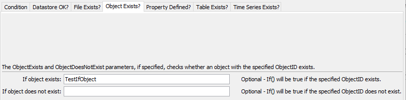
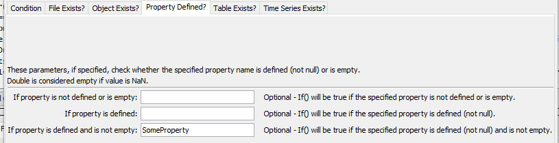
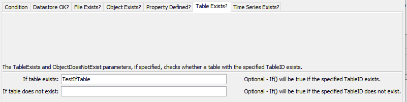
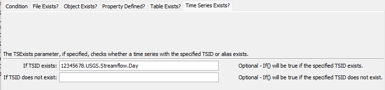

# TSTool / Command / If #

*   [Overview](#overview)
    +   [Conditional Syntax](#conditional-syntax)
*   [Command Editor](#command-editor)
*   [Command Syntax](#command-syntax)
*   [Examples](#examples)
*   [Troubleshooting](#troubleshooting)
*   [See Also](#see-also)

-------------------------

## Overview ##

The `If` command evaluates a conditional and if true will result in the commands between
`If` and matching [`EndIf`](../EndIf/EndIf.md) commands being executed.
A matching `Name` parameter for the `If` and [`EndIf`](../EndIf/EndIf.md)
commands defines a block of commands. Currently, there is no “else if” or “else” syntax and nested
`If` commands must be used to evaluate complex conditions.

The `If` command can evaluate the following:

*   simple conditional statement, as described in the next section
*   file exists or does not exist
*   object exists or does not exist (by checking for the object ID)
*   table exists or does not exist (by checking for the table ID)
*   time series exists or does not exist (by checking for the alias and TSID)

All nested `If` commands must evaluate to true to execute the commands within the deepest level of nesting.
Some commands, including [`SelectTimeSeries`](../SelectTimeSeries/SelectTimeSeries.md) and
[`CopyTable`](../CopyTable/CopyTable.md) set a property that
can be used for checks, for example to see if the number of rows in a table or time series in a list is non-zero.
It is helpful to use the [`Message`](../Message/Message.md) command to print a message to the log file and help control whether
a warning or failure status should occur as the result of the `If`.
The [`SetProperty`](../SetProperty/SetProperty.md) command can also be used to set a property to indicate
the result of evaluating an `If` block.

Future enhancements to the `If` command may include:

*   Test whether a time series value is non-missing.
*   Compare time series properties with other properties and values.

See also the [`Break`](../Break/Break.md) and
[`Continue`](../Continue/Continue.md) commands,
which can be used within an `If` block to control logic in a [`For`](../For/For.md) loop.

### Conditional Syntax ###

The syntax for a conditional statement is restricted to a simple comparison:

```
Value1 operator Value2
```

The values can be integers, floating point numbers, boolean values (true/false), strings, or processor properties
specified with `${Property}` that
evaluate to primitive types. The operator is one of the following (more functionality will be added in the
future). For Booleans, False is less than True. For strings, A is less than Z, etc.

*   `<`
*   `<=`
*   `>`
*   `>=`
*   `==` (use this to test equality – do not use a single equal sign)
*   `!=`
*   `contains` (only for string comparison)
*   `!contains` (only for string comparison)

## Command Editor ##

The command is available in the following TSTool menu:

*   ***Commands / General - Running and Properties***

The following dialog is used to edit the command and illustrates the command syntax for a condition check.


**<p style="text-align: center;">
`If` Command Editor for Conditions Test (<a href="../If.png">see also the full-size image</a>)
</p>**

The following illustrates checking for file existence.

**<p style="text-align: center;">

</p>**

**<p style="text-align: center;">
`If` Command Editor for Check for File Existence (<a href="../If_FileExists.png">see also the full-size image</a>)
</p>**

The following illustrates checking for object existence.

**<p style="text-align: center;">

</p>**

**<p style="text-align: center;">
`If` Command Editor for Check for Object Existence (<a href="../If_ObjectExists.png">see also the full-size image</a>)
</p>**

The following illustrates checking for a property to make sure it is defined and not empty.
This is useful for detecting logic and data problems.

**<p style="text-align: center;">

</p>**

**<p style="text-align: center;">
`If` Command Editor for Check for Whether a Property is Not Defined or is Empty (<a href="../If_PropDefined.png">see also the full-size image</a>)
</p>**

The following illustrates checking for table existence.

**<p style="text-align: center;">

</p>**

**<p style="text-align: center;">
`If` Command Editor for Check for Table Existence (<a href="../If_TableExists.png">see also the full-size image</a>)
</p>**

The following illustrates how to detect if a time series exists.
This is useful for executing only blocks of commands that operate on the time series
(and avoiding those steps and related warning/failure messages when the time series does not exist).

**<p style="text-align: center;">

</p>**

**<p style="text-align: center;">
`If` Command Editor for Check for Time Series Existance (<a href="../If_TSExists.png">see also the full-size image</a>)
</p>**

## Command Syntax ##

The command syntax is as follows:

```text
If(Parameter="Value",...)
```
**<p style="text-align: center;">
Command Parameters
</p>**

| **Parameter**&nbsp;&nbsp;&nbsp;&nbsp;&nbsp;&nbsp;&nbsp;&nbsp;&nbsp;&nbsp;&nbsp;&nbsp;&nbsp;&nbsp;&nbsp;&nbsp;&nbsp;&nbsp;&nbsp;&nbsp;&nbsp; | **Description** | **Default**&nbsp;&nbsp;&nbsp;&nbsp;&nbsp;&nbsp;&nbsp;&nbsp;&nbsp;&nbsp;&nbsp;&nbsp;&nbsp;&nbsp;&nbsp;&nbsp;&nbsp; |
| --------------|-----------------|----------------- |
| `Name`<br>**required** | The name of the `If` command, which will be matched with the name of an [`EndIf`](../EndIf/EndIf.md) command to indicate the block of commands in the if condition. | None - must be specified. |
| `Condition`<br>**required** | The conditional statement to evaluate. | `Condition` and/or `TSExists` and/or `PropertyIsNotDefinedOrIsEmpty` must be specified. |
| `CompareAsStrings` | If `True`, the comparison will be done as strings even if the values could be treated as numbers or Booleans. | `False` |
| `FileExists` | Causes the command to evaluate to `True` if the specified file exists.  Can specify using `${Property}`. | `Condition` and/or one or more other checks must be specified. |
| `FileDoesNotExist` | Causes the command to evaluate to `True` if the specified file does not exist.  Can specify using `${Property}`. | `Condition` and/or one or more other checks must be specified. |
| `ObjectExists` | Causes the command to evaluate to `True` if the specified object exists, based on checking the object IDs.  Can specify using `${Property}`. | `Condition` and/or one or more other checks must be specified. |
| `ObjectDoesNotExist` | Causes the command to evaluate to `True` if the specified object does not exist, based on checking the object IDs.  Can specify using `${Property}`. | `Condition` and/or one or more other checks must be specified. |
| `PropertyIsNotDefinedOrIsEmpty` | Causes the command to evaluate to `True` if the specified parameter (a property name) is not defined or has a value of null, `NaN` (floating point numbers), or is an empty string. | `Condition` and/or one or more other checks must be specified. |
| `TableExists` | Causes the command to evaluate to `True` if the specified table exists, based on checking the table IDs.  Can specify using `${Property}`. | `Condition` and/or one or more other checks must be specified. |
| `TableDoesNotExist` | Causes the command to evaluate to `True` if the specified table does not exist, based on checking the table IDs.  Can specify using `${Property}`. | `Condition` and/or one or more other checks must be specified. |
| `TSExists` | Causes the command to evaluate to `True` if the specified time series exists.  Specify a TSID or alias to match.  Can specify using `${Property}`. | `Condition` and/or one or more other checks must be specified. |
| `TSDoesNotExist` | Causes the command to evaluate to `True` if the specified time series does exist.  Specify a TSID or alias to match.  Can specify using `${Property}`. | `Condition` and/or one or more other checks must be specified. |

## Examples ##

See the [automated tests](https://github.com/OpenCDSS/cdss-app-tstool-test/tree/master/test/commands/If).

### Example to Check Number Against Property ###

```text
# Some previous command will have set an error count
If(Name="ExampleIf",Condition="${ErrorCount} > 1")
  Message(Message="Have ${ErrorCount} errors.  Stopping.")
  Exit()
EndIf(Name="ExampleIf")
```

### Example to Check that a Sample Size is Sufficient ###

The following example illustrates combinations of `If` and [`Message`](../Message/Message.md) commands (indentation indicates line continuation).
In these examples processor properties are used to provide condition values.

```
# Test evaluating an integer condition where integer is supplied by property
StartLog(LogFile="Results/Test_If_IntegerProperty_LT_IntegerProperty.TSTool.log")
SetProperty(PropertyName="SampleSizeRequired",PropertyType=Integer,PropertyValue="10")
SetProperty(PropertyName="SampleSize",PropertyType=Integer,PropertyValue="5")
If(Name="SampleSizeCheck",Condition="${SampleSize} < ${SampleSizeRequired}")
Message(Message="Sample size (${SampleSize}) is less than required ${SampleSizeRequired}",CommandStatus=WARNING)
EndIf(Name="SampleSizeCheck")
If(Name="SampleSizeCheck2",Condition="${SampleSize} > ${SampleSizeRequired}")
Message(Message="Sample size (${SampleSize}) is >= than required ${SampleSizeRequired}",CommandStatus=WARNING)
EndIf(Name="SampleSizeCheck2")
If(Name="SampleSizeCheck3Outer",Condition="${SampleSize} < ${SampleSizeRequired}")
If(Name="SampleSizeCheck3InnerTrue",Condition="${SampleSize} == 5")
Message(Message="Sample size (${SampleSize}) is == 5",CommandStatus=WARNING)
EndIf(Name="SampleSizeCheck3InnerTrue")
If(Name="SampleSizeCheck3InnerFalse",Condition="${SampleSize} != 6")
Message(Message="Sample size (${SampleSize}) is not == 6",CommandStatus=WARNING)
EndIf(Name="SampleSizeCheck3InnerFalse")
EndIf(Name="SampleSizeCheck3Outer")
```

## Troubleshooting ##

See the main [TSTool Troubleshooting](../../troubleshooting/troubleshooting.md) documentation.

## See Also ##

*   [`Break`](../Break/Break.md) command
*   [`Continue`](../Continue/Continue.md) command
*   [`EndIf`](../EndIf/EndIf.md) command
*   [`Message`](../Message/Message.md) command
*   [`SetProperty`](../SetProperty/SetProperty.md) command
