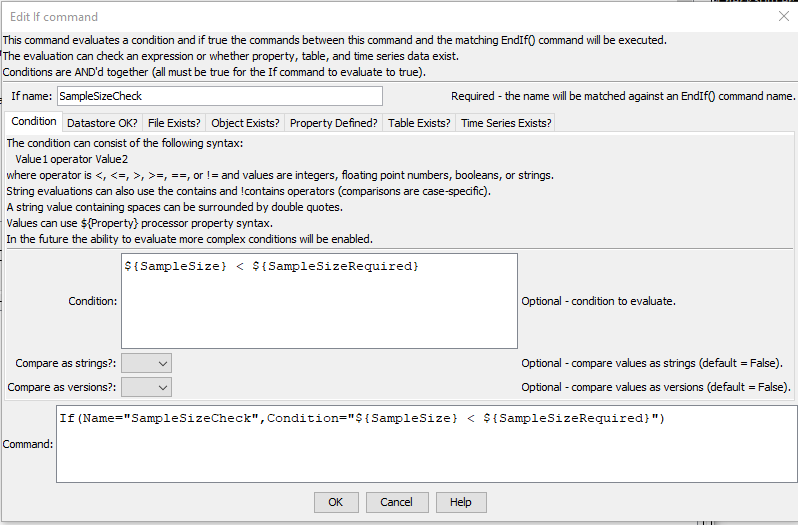
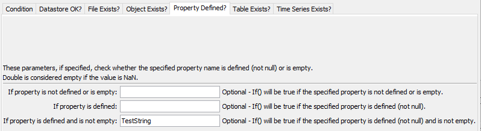
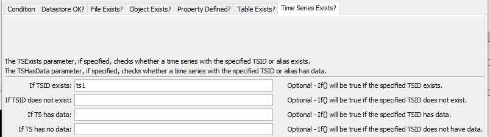

# TSTool / Command / If #

*   [Overview](#overview)
    +   [Conditional Syntax](#conditional-syntax)
*   [Command Editor](#command-editor)
*   [Command Syntax](#command-syntax)
*   [Examples](#examples)
*   [Troubleshooting](#troubleshooting)
*   [See Also](#see-also)

-------------------------

## Overview ##

The `If` command evaluates a conditional and if true will result in the commands between
`If` and matching [`EndIf`](../EndIf/EndIf.md) commands being executed.
A matching `Name` parameter for the `If` and [`EndIf`](../EndIf/EndIf.md)
commands defines a block of commands. Currently, there is no “else if” or “else” syntax and nested
`If` commands must be used to evaluate complex conditions.
Select (highlight) one or more commands and use the ***> Indent Right*** menu to indent commands to
improve the readability of the workflow.

The `If` command can evaluate the following:

*   simple conditional statement for strings, integers, boolean, and floating point (double precision) values, as described in the [Conditional Syntax](#conditional-syntax) section
*   comparison of Semantic versions (see [semantic versions](https://semver.org/))
*   file exists or does not exist
*   object exists or does not exist (by checking for the object ID)
*   property exists, is set, or is not set
*   table exists or does not exist (by checking for the table ID)
*   time series exists or does not exist (by checking for the alias and TSID) and does or does not have data

`If` blocks can be nested and each level can be indented (right-click on commands in TSTool to indent)
All nested `If` commands must evaluate to true to execute the commands within the deepest level of nesting.
Some commands, including [`SelectTimeSeries`](../SelectTimeSeries/SelectTimeSeries.md) and
[`CopyTable`](../CopyTable/CopyTable.md) set a property that
can be used for checks, for example to see if the number of rows in a table or time series in a list is non-zero.
It is helpful to use the [`Message`](../Message/Message.md) command to print a message to the log file and help control whether
a warning or failure status should occur as the result of the `If`.
The [`SetProperty`](../SetProperty/SetProperty.md) command can also be used to set a property to indicate
the result of evaluating an `If` block.

Granular checks can be made by using the [`For`](../For/For.md) command with inner `If` statements,
for example to iterate over values (including values in time series) and checking the values.

See also the [`Break`](../Break/Break.md) and
[`Continue`](../Continue/Continue.md) commands,
which can be used within an `If` block to control logic in a [`For`](../For/For.md) loop.

### Conditional Syntax ###

The syntax for a conditional statement is restricted to a simple comparison:

```
Value1 operator Value2
```

The values can be integers, floating point numbers, boolean values (true/false), strings, or processor properties
specified with `${Property}` that
evaluate to primitive types. The operator is one of the following (more functionality will be added in the
future). For Booleans, False is less than True. For strings, A is less than Z, etc.

*   `<`
*   `<=`
*   `>`
*   `>=`
*   `==` (use this to test equality – do not use a single equal sign)
*   `!=`
*   `contains` (only for string comparison)
*   `!contains` (only for string comparison)

If a value types are not consistent, then a string comparison will occur.
Because an integer can also be a floating point number,
comparisons of integers and floating point numbers occurs using numbers.

String values that contain spaces can be surrounded by double quotes,
which will be removed before the comparison.

## Command Editor ##

The command is available in the following TSTool menu:

*   ***Commands / General - Running and Properties***

The following dialog is used to edit the command and illustrates the command syntax for a condition check.



**<p style="text-align: center;">
`If` Command Editor for Conditions Test (<a href="../If.png">see full-size image</a>)
</p>**

The following illustrates checking for file existence.

**<p style="text-align: center;">

</p>**

**<p style="text-align: center;">
`If` Command Editor for Check for File Existence (<a href="../If_FileExists.png">see full-size image</a>)
</p>**

The following illustrates checking for object existence.

**<p style="text-align: center;">

</p>**

**<p style="text-align: center;">
`If` Command Editor for Check for Object Existence (<a href="../If_ObjectExists.png">see full-size image</a>)
</p>**

The following illustrates checking for a property to make sure it is defined and not empty.
This is useful for detecting logic and data problems.

**<p style="text-align: center;">

</p>**

**<p style="text-align: center;">
`If` Command Editor for Check for Whether a Property is Defined and is has a Value (<a href="../If_PropDefined.png">see full-size image</a>)
</p>**

The following illustrates checking for table existence.

**<p style="text-align: center;">

</p>**

**<p style="text-align: center;">
`If` Command Editor for Check for Table Existence (<a href="../If_TableExists.png">see full-size image</a>)
</p>**

The following illustrates how to detect if a time series exists.
This is useful for executing only blocks of commands that operate on the time series
(and avoiding those steps and related warning/failure messages when the time series does not exist).

**<p style="text-align: center;">

</p>**

**<p style="text-align: center;">
`If` Command Editor for Check for Time Series Existance (<a href="../If_TSExists.png">see full-size image</a>)
</p>**

## Command Syntax ##

The command syntax is as follows:

```text
If(Parameter="Value",...)
```
**<p style="text-align: center;">
Command Parameters
</p>**

| **Tab** | **Parameter**&nbsp;&nbsp;&nbsp;&nbsp;&nbsp;&nbsp;&nbsp;&nbsp;&nbsp;&nbsp;&nbsp;&nbsp;&nbsp;&nbsp;&nbsp;&nbsp;&nbsp;&nbsp;&nbsp;&nbsp;&nbsp; | **Description** | **Default**&nbsp;&nbsp;&nbsp;&nbsp;&nbsp;&nbsp;&nbsp;&nbsp;&nbsp;&nbsp;&nbsp;&nbsp;&nbsp;&nbsp;&nbsp;&nbsp;&nbsp; |
| --|--|--|--|
|**All**| `Name`<br>**required** | The name of the `If` command, which will be matched with the name of an [`EndIf`](../EndIf/EndIf.md) command to indicate the block of commands in the if condition. | None - must be specified. |
|**Condition**| `Condition`<br>**required** | The conditional statement to evaluate. | `Condition` and/or `TSExists` and/or `PropertyIsNotDefinedOrIsEmpty` must be specified. |
|| `CompareAsStrings` | If `True`, the comparison will be done as strings even if the values could be treated as numbers or Booleans. | `False` |
|| `CompareAsVersions` | If `True`, the comparison will be done by treating the strings as [semantic versions](https://semver.org/). This can be used to check the TSTool, plugin, or API version to ensure that enabled command features are used. Version parts are formatted with leading spaces if necessary for comparison (a space character has a value less than alphanumeric characters). | `False` |
|**File Exists?**| `FileExists` | Causes the command to evaluate to `True` if the specified file exists.  Can specify using `${Property}`. | `Condition` and/or one or more other checks must be specified. |
|| `FileDoesNotExist` | Causes the command to evaluate to `True` if the specified file does not exist.  Can specify using `${Property}`. | `Condition` and/or one or more other checks must be specified. |
|**Object Exists?** | `ObjectExists` | Causes the command to evaluate to `True` if the specified object exists, based on checking the object IDs.  Can specify using `${Property}`. | `Condition` and/or one or more other checks must be specified. |
|| `ObjectDoesNotExist` | Causes the command to evaluate to `True` if the specified object does not exist, based on checking the object IDs.  Can specify using `${Property}`. | `Condition` and/or one or more other checks must be specified. |
|**Property Defined?**| `PropertyIsNotDefinedOrIsEmpty` | Causes the command to evaluate to `True` if the property matching the specified name is not defined, because one of the following is true:<ul><li>has a value of null</li><li>has a value of `NaN` for floating point numbers</li><li>is an empty string</li></ul> | `Condition` and/or one or more other checks must be specified. |
|| `PropertyIsDefined` | Causes the command to evaluate to `True` if the property matching the specified name is defined, meaning that it has a value that is:<ul><li>not null</li><li>not `NaN` (for floating point numbers)</li><li>if a string, may be empty string</li></ul> | `Condition` and/or one or more other checks must be specified. |
|| `PropertyIsDefined`<br>`AndIsNotEmpty` | Causes the command to evaluate to `True` if the property matching the specified name is defined and not empty, meaning that it has a value that is:<ul><li>not null</li><li>not `NaN` (for floating point number)</li><li>not an empty string</li></ul> | `Condition` and/or one or more other checks must be specified. |
|**Table Exists?**| `TableExists` | Causes the command to evaluate to `True` if the specified table exists, based on checking the table IDs.  Can specify using `${Property}`. | `Condition` and/or one or more other checks must be specified. |
|| `TableDoesNotExist` | Causes the command to evaluate to `True` if the specified table does not exist, based on checking the table IDs.  Can specify using `${Property}`. | `Condition` and/or one or more other checks must be specified. |
|**Time Series Exists?**| `TsExists` | Causes the command to evaluate to `True` if the specified time series exists.  Specify a TSID or alias to match.  Can specify using `${Property}`. | `Condition` and/or one or more other checks must be specified. |
|| `TsDoesNotExist` | Causes the command to evaluate to `True` if the specified time series does exist.  Specify a TSID or alias to match.  Can specify using `${Property}`. | `Condition` and/or one or more other checks must be specified. |
|| `TsHasData` | Causes the command to evaluate to `True` if the specified time series has data.  Specify a TSID or alias to match.  Can specify using `${Property}`. | `Condition` and/or one or more other checks must be specified. |
|| `TsHasNoData` | Causes the command to evaluate to `True` if the specified time series has no data, typically because no data records were found in the data source.  Specify a TSID or alias to match.  Can specify using `${Property}`. | `Condition` and/or one or more other checks must be specified. |

## Examples ##

See the [automated tests](https://github.com/OpenCDSS/cdss-app-tstool-test/tree/master/test/commands/If).

### Example to Check Number Against Property ###

```text
# Some previous command will have set an error count
If(Name="ExampleIf",Condition="${ErrorCount} > 1")
  Message(Message="Have ${ErrorCount} errors.  Stopping.")
  Exit()
EndIf(Name="ExampleIf")
```

### Example to Check that a Sample Size is Sufficient ###

The following example illustrates combinations of `If` and [`Message`](../Message/Message.md) commands (indentation indicates line continuation).
In these examples processor properties are used to provide condition values.

```
# Test evaluating an integer condition where integer is supplied by property
StartLog(LogFile="Results/Test_If_IntegerProperty_LT_IntegerProperty.TSTool.log")
SetProperty(PropertyName="SampleSizeRequired",PropertyType=Integer,PropertyValue="10")
SetProperty(PropertyName="SampleSize",PropertyType=Integer,PropertyValue="5")
If(Name="SampleSizeCheck",Condition="${SampleSize} < ${SampleSizeRequired}")
Message(Message="Sample size (${SampleSize}) is less than required ${SampleSizeRequired}",CommandStatus=WARNING)
EndIf(Name="SampleSizeCheck")
If(Name="SampleSizeCheck2",Condition="${SampleSize} > ${SampleSizeRequired}")
Message(Message="Sample size (${SampleSize}) is >= than required ${SampleSizeRequired}",CommandStatus=WARNING)
EndIf(Name="SampleSizeCheck2")
If(Name="SampleSizeCheck3Outer",Condition="${SampleSize} < ${SampleSizeRequired}")
If(Name="SampleSizeCheck3InnerTrue",Condition="${SampleSize} == 5")
Message(Message="Sample size (${SampleSize}) is == 5",CommandStatus=WARNING)
EndIf(Name="SampleSizeCheck3InnerTrue")
If(Name="SampleSizeCheck3InnerFalse",Condition="${SampleSize} != 6")
Message(Message="Sample size (${SampleSize}) is not == 6",CommandStatus=WARNING)
EndIf(Name="SampleSizeCheck3InnerFalse")
EndIf(Name="SampleSizeCheck3Outer")
```

## Troubleshooting ##

See the main [TSTool Troubleshooting](../../troubleshooting/troubleshooting.md) documentation.

## See Also ##

*   [`Break`](../Break/Break.md) command
*   [`Continue`](../Continue/Continue.md) command
*   [`EndIf`](../EndIf/EndIf.md) command
*   [`Message`](../Message/Message.md) command
*   [`SetProperty`](../SetProperty/SetProperty.md) command
