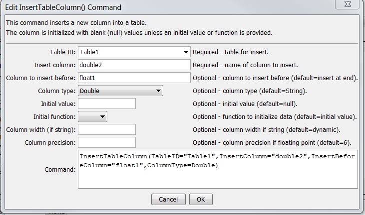

# TSTool / Command / InsertTableColumn #

* [Overview](#overview)
* [Command Editor](#command-editor)
* [Command Syntax](#command-syntax)
* [Examples](#examples)
* [Troubleshooting](#troubleshooting)
* [See Also](#see-also)

-------------------------

## Overview ##

The `InsertTableColumn` command inserts a column into a table.  An initial value can be set or use the
[`SetTableValues`](../SetTableValues/SetTableValues.md) command to set values after inserting the column.

## Command Editor ##

The following dialog is used to edit the command and illustrates the syntax of the command.

**<p style="text-align: center;">

</p>**

**<p style="text-align: center;">
`InsertTableColumn` Command Editor (<a href="../InsertTableColumn.png">see also the full-size image</a>)
</p>**

## Command Syntax ##

The command syntax is as follows:

```text
InsertTableColumn(Parameter="Value",...)
```
**<p style="text-align: center;">
Command Parameters
</p>**

| **Parameter**&nbsp;&nbsp;&nbsp;&nbsp;&nbsp;&nbsp;&nbsp;&nbsp;&nbsp;&nbsp;&nbsp;&nbsp;&nbsp;&nbsp;&nbsp;&nbsp;&nbsp;&nbsp;&nbsp;&nbsp;&nbsp;&nbsp;&nbsp;&nbsp;&nbsp;&nbsp; | **Description** | **Default**&nbsp;&nbsp;&nbsp;&nbsp;&nbsp;&nbsp;&nbsp;&nbsp;&nbsp;&nbsp;&nbsp;&nbsp;&nbsp;&nbsp;&nbsp;&nbsp; |
| --------------|-----------------|----------------- |
|`TableID`<br>**required**|The identifier for the table being modified.  Can be specified using processor `${Property}`.|None – must be specified.|
|`InsertColumn`|The column name to insert.  Can be specified using processor `${Property}`.|Required|
|`InsertBeforeColumn`<br>**required**|The name of the column to insert before.  Can be specified using processor `${Property}`.|Insert at the end of the table|
|`ColumnType`|The data type for the column, one of:<br><ul><li>`DateTime` – date/time object</li><li>`Double` – double precision number</li><li>`Float` – single precision number</li><li>`Integer` – integer</li><li>`Long` – long integer</li><li>`Short` – short integer</li><li>`String` – string|String|
|`InitialValue`|The initial data value to set for the cells in the column.  For a date/time column use the format `YYYY-MM-DD hh:mm` or `MM/DD/YYYY hh:mm`.  Can be specified using processor `${Property}`.|null|
|`InitialFunction`|The initial value to set for the cells in the column, evaluated as a function.  The following functions are supported:<br><ul><li>`Row` – assign the cell value to an integer row number (1=first data row).</li><li>`Row0` – assign the cell value to an integer row number (0=first data row).|Defaults to `InitialValue`|
|`ColumnWidth`|The column width in characters, if a `String` column type.|Dynamic sizing|
|`ColumnPrecision`|The number of digits of precision to show, if a `Double` or `Float` column type.|`6`|

## Examples ##

See the [automated tests](https://github.com/OpenCDSS/cdss-app-tstool-test/tree/master/test/commands/InsertTableColumn).

## Troubleshooting ##

## See Also ##

* [InsertTableRow](../InsertTableRow/InsertTableRow.md) command
