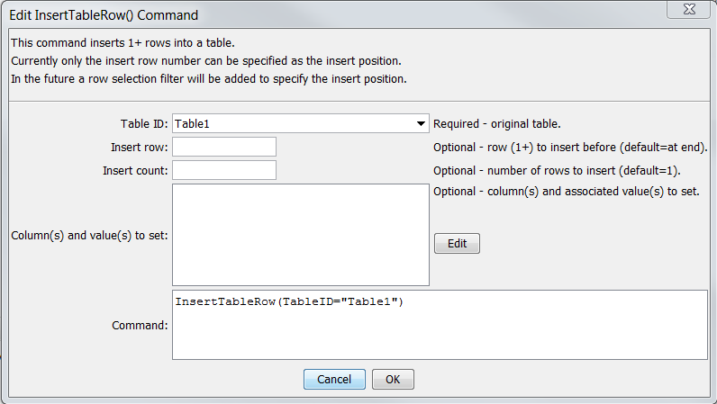

# TSTool / Command / InsertTableRow #

*   [Overview](#overview)
*   [Command Editor](#command-editor)
*   [Command Syntax](#command-syntax)
*   [Examples](#examples)
*   [Troubleshooting](#troubleshooting)
*   [See Also](#see-also)

-------------------------

## Overview ##

The `InsertTableRow` inserts 1+ rows in a table.
This command has been created to assign blank values for use with the
[`WriteTableCellsToExcel`](../WriteTableCellsToExcel/WriteTableCellsToExcel.md) command,
for example to clear out named cells in an Excel workbook.

## Command Editor ##

The command is available in the following TSTool menu:

*   ***Commandsi(Table) / Manipulate Table Values***

The following dialog is used to edit the command and illustrates the syntax of the command.

**<p style="text-align: center;">

</p>**

**<p style="text-align: center;">
`InsertTableRow` Command Editor (<a href="../InsertTableRow.png">see full-size image</a>)
</p>**

## Command Syntax ##

The command syntax is as follows:

```text
InsertTableRow(Parameter="Value",...)
```
**<p style="text-align: center;">
Command Parameters
</p>**

| **Parameter**&nbsp;&nbsp;&nbsp;&nbsp;&nbsp;&nbsp;&nbsp;&nbsp;&nbsp;&nbsp;&nbsp;&nbsp;&nbsp;&nbsp;&nbsp;&nbsp;&nbsp;&nbsp;&nbsp;&nbsp;&nbsp;&nbsp;&nbsp;&nbsp;&nbsp;&nbsp; | **Description** | **Default**&nbsp;&nbsp;&nbsp;&nbsp;&nbsp;&nbsp;&nbsp;&nbsp;&nbsp;&nbsp;&nbsp;&nbsp;&nbsp;&nbsp;&nbsp;&nbsp; |
| --------------|-----------------|----------------- |
|`TableID`|The identifier for the table being modified.|None – must be specified.|
|`InsertRow`|The row number (1+) to insert before.|The row will be appended to the end of the table.|
|`InsertCount`|The number of times the insert should be repeated.|`1`|
|`ColumnValues`|The column names and corresponding values to set using syntax:<br>`ColumnName1:Value1, ColumnName2:Value2`<br>The column name and value parts can be specified using `${Property}` notation.|No values will be assigned (will be null values).|

## Examples ##

See the [automated tests](https://github.com/OpenCDSS/cdss-app-tstool-test/tree/master/test/commands/InsertTableRow).

## Troubleshooting ##

See the main [TSTool Troubleshooting](../../troubleshooting/troubleshooting.md) documentation.

## See Also ##

* [`InsertTableColumn`](../InsertTableColumn/InsertTableColumn.md) command
* [`WriteTableCellsToExcel`](../WriteTableCellsToExcel/WriteTableCellsToExcel.md) command
