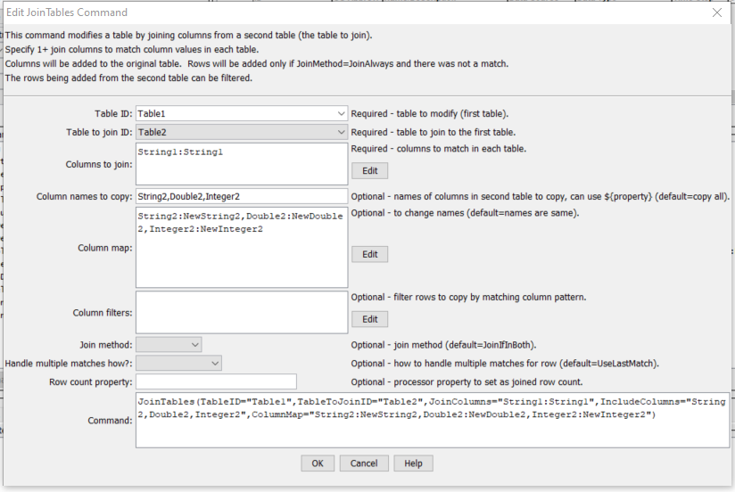

# TSTool / Command / JoinTables #

* [Overview](#overview)
* [Command Editor](#command-editor)
* [Command Syntax](#command-syntax)
* [Examples](#examples)
* [Troubleshooting](#troubleshooting)
* [See Also](#see-also)

-------------------------

## Overview ##

The `JoinTables` command joins two tables that have matching column values,
resulting in the first table being modified to contain additional columns from the second table.
Rows from the first table are always retained.  Depending on the join method,
additional rows may be added in cases where one of the tables does not match the other.
All or a subset of the columns and rows from the second table can be included in the result.
The functionality of the command is similar to database SQL join statements using left, right, center, etc. join syntax.  

## Command Editor ##

The following dialog is used to edit the command and illustrates the syntax of the command
(in this case illustrating how values in a column named `LocationID` are copied to a new table).  

**<p style="text-align: center;">

</p>**

**<p style="text-align: center;">
`JoinTables` Command Editor (<a href="../JoinTables.png">see also the full-size image</a>)
</p>**

## Command Syntax ##

The command syntax is as follows:

```text
JoinTables(Parameter="Value",...)
```
**<p style="text-align: center;">
Command Parameters
</p>**

| **Parameter**&inbsp;&nbsp;&nbsp;&nbsp;&nbsp;&nbsp;&nbsp;&nbsp;&nbsp;&nbsp;&nbsp;&nbsp;&nbsp;&nbsp;&nbsp;&nbsp;&nbsp;&nbsp;&nbsp;&nbsp;&nbsp;&nbsp;&nbsp;&nbsp;&nbsp;&nbsp;&nbsp;&nbsp;&nbsp;&nbsp;&nbsp;&nbsp;&nbsp;&nbsp; | **Description** | **Default**&nbsp;&nbsp;&nbsp;&nbsp;&nbsp;&nbsp;&nbsp;&nbsp;&nbsp;&nbsp;&nbsp;&nbsp;&nbsp;&nbsp;&nbsp;&nbsp; |
| --------------|-----------------|----------------- |
|`TableID`<br>**required**|The identifier for the original table.  This table will be modified.  Can be specified using `${Property}.`|None – must be specified.|
|`TableToJoinID`<br>**required**|The identifier for the table to join.  Can be specified using `${Property}`.|None – must be specified.|
|`JoinColumns`<br>**required**|The names of columns to be compared in the join, using syntax, and can use `${Property}` syntax:<br>`Table1ColumnName1:Table2ColumnName1`,<br>`Table1ColumnName2:Table2ColumnName2`|Required – must specify at least one column to compare|
|`IncludeColumns`|Specify the names of columns to copy from the second table into the first table, separated by commas.  The columns indicated by `JoinColumns` will not be added because they should already be in the table.  Can be specified using `${Property}`.|Copy all of the columns from the `TableToJoinID` table.|
|`ColumnMap`|Specify new names for the output columns being included, using syntax, and can use `${Property}` syntax:<br>`OriginalTable2ColumnName1:NewColumnName1, OriginalTable2ColumnName2:NewColumnName2`|Column names in the result will be the same as in the original `TableToJoinID` table.|
|`ColumnFilters`|Filters that limit the number of rows being processed, using the syntax, and can use `${Property}` syntax:<br>`Table2Column1:FilterPattern1, Table2Column2:FilterPattern2`<br>Patterns can use `*` to indicate wildcards for matches.  Only string values can be checked (other data types are converted to strings for comparison).  Comparisons are case-independent.  All patterns must be matched in order to copy the row.  In the future a command may be added to perform queries on tables, similar to SQL for databases.|No filtering.|
|`JoinMethod`|Indicate how the tables should be joined:<br><ul><li>`JoinIfInBoth` – only add column values from the second table that have matching values in columns specified by `JoinColumns`</li><li>`JoinAlways` – behave as if `JoinIfInBoth` is used and also add rows even if join column values do not match.  Rows in the second table that don’t match will result in new rows at the bottom of the table, with null/missing values for columns in the first table.</li></ul>|`JoinIfInBoth`|
|`HandleMultipleJoinMatchesHow`|Indicate how to handle multiple matches resulting from the join:<ul><li>`NumberColumns` – the first match will result in the requested join columns being added to the first table; subsequent matches will result in new columns with `_2`, `_3`, etc. appended to the column names.</li><li>`UseLastMatch` – the join will occur once and subsequent matches will result in the new column values being overwritten with the last match.  In other words, new rows are not added for multiple matches – the same row is overwritten.</li></ul>|`UseLastMatch`|
|`RowCountProperty`|The number of rows that were joined.  This can be used with [`If`](../If/If.md) and [`Message`](../Message/Message.md) commands to check that joining two tables resulted in an expected number of matches. |

## Examples ##

See the [automated tests](https://github.com/OpenCDSS/cdss-app-tstool-test/tree/master/test/regression/commands/general/JoinTables).

## Troubleshooting ##

## See Also ##

* [`AppendTable`](../AppendTable/AppendTable.md) command
* [`CopyTable`](../CopyTable/CopyTable.md) command
* [`FreeTable`](../FreeTable/FreeTable.md) command
* [`NewTable`](../NewTable/NewTable.md) command
* [`ReadTimeSeriesList`](../ReadTimeSeriesList/ReadTimeSeriesList.md) command
