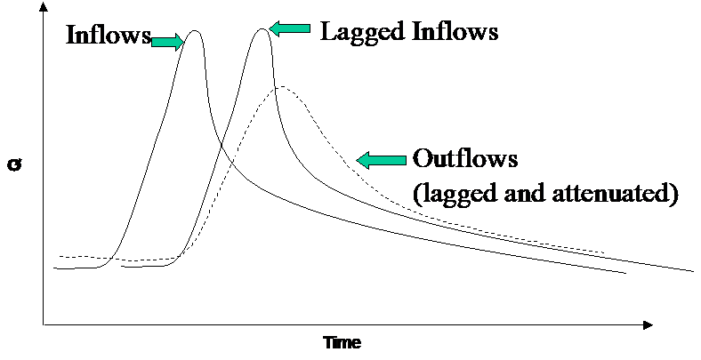
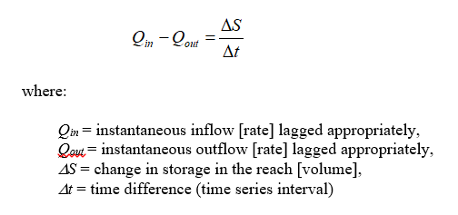
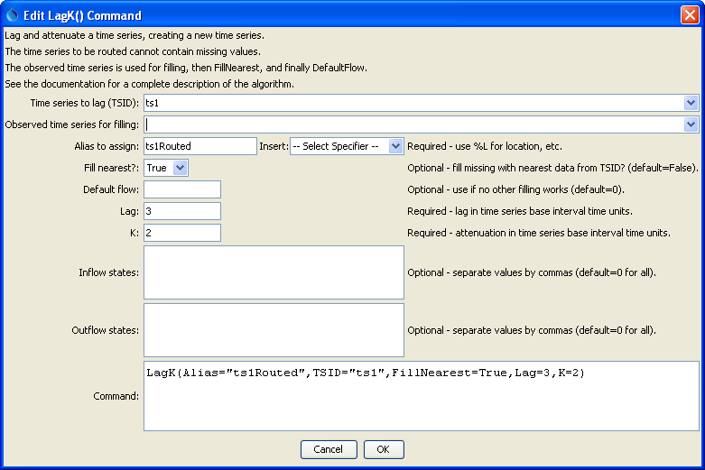

# TSTool / Command / LagK #

* [Overview](#overview)
* [Command Editor](#command-editor)
* [Command Syntax](#command-syntax)
* [Examples](#examples)
* [Troubleshooting](#troubleshooting)
* [See Also](#see-also)

-------------------------

## Overview ##

The `LagK` command can be used to lag and attenuate an input time series,
resulting in a new time series.
The time series identifier for the new time series is the same as the
original time series with “routed” appended to the scenario.
The command is commonly used to route an instantaneous flow time series through a stretch of river (reach).
Lag and K routing is a common routing method that combines the concepts of:

1. Lagging the inflow to simulate travel time in a reach and,
2. Attenuating the wave to simulate the storage-outflow relationship for the reach (see figure below).



**<p style="text-align: center;">
Lag and K Routing (<a href="../LagK.png">see also the full-size image</a>)
</p>**

At its fundamental level, the method solves the continuity equation using an approach similar
to Muskingum routing (assuming that the Muskingum parameter representing wave storage is negligible).
The governing equation for this routing method is given as:



The relationship assumes an outflow-storage relationship of the form:


To ensure accurate results, *k* should be larger or equal to *&Delta;t/2*.
For discrete time steps these relationships translate into:


In the case that either *I_1* , *I_2* or *O_1* are missing, these values will be set in the following order:

1. Use data from an observed time series (see `ObsTSID` parameter below).
2. Use the nearest value in the input time series (see `FillNearest` parameter below).
3. Use the nearest value in the observed time series (see `FillNearest` parameter and the `ObsTSID` parameter below).
4. Use a defined default flow value (see `DefaultFlow` parameter below). 

By default, the identifier of the resulting time series is the same as the original input time series,
with the data subtype set to “routed” (e.g., `Streamflow` becomes `Streamflow-routed`).

Values for `Lag` and `K` parameters can usually be established by comparing routed flows to downstream observations.
Alternatively, the `Lag` can be estimated using the reach length and wave speed in the reach.
Without any other information, `K` can be set to `Lag`/2.

## Command Editor ##

The following dialog is used to edit the command and illustrates the syntax of the command.



**<p style="text-align: center;">
`LagK` Command Editor (<a href="../LagK.png">see also the full-size image</a>)
</p>**

## Command Syntax ##

The command syntax is as follows:

```text
LagK(Parameter="Value",...)
```

The following older command syntax is updated to the above syntax when a command file is read:

```
TS Alias = LagK(Parameter="Value",...)
```

**<p style="text-align: center;">
Command Parameters
</p>**

|**Parameter**&nbsp;&nbsp;&nbsp;&nbsp;&nbsp;&nbsp;&nbsp;&nbsp;&nbsp;&nbsp;&nbsp;&nbsp;&nbsp;&nbsp;&nbsp;&nbsp;&nbsp;&nbsp;&nbsp;&nbsp;&nbsp;&nbsp;&nbsp;|**Description**|**Default**&nbsp;&nbsp;&nbsp;&nbsp;&nbsp;&nbsp;&nbsp;&nbsp;&nbsp;&nbsp;&nbsp;&nbsp;&nbsp;&nbsp;&nbsp;&nbsp;&nbsp;&nbsp;&nbsp;&nbsp;&nbsp;&nbsp;&nbsp;&nbsp;&nbsp;&nbsp;&nbsp;|
|--------------|-----------------|-----------------|
|`TSID`|Identifier or alias for the time series to be routed.  It is assumed that this series describes an instantaneous flow.  Due to the lagging, the first data values required for the computation of *O_2* are not available within this time series and are therefore set to values set in the `InflowStates` parameter.  See also the `ObsTSID` time series, and the `FillNearest` and `DefaultFlow` parameters.|None – must be specified.|
|`ObsTSID`|Identifier or alias for an observed time series.  If specified, the missing values in the `TSID` time series will be taken from the observed time series if non-missing.  `ObsTSID` can be used in conjunction with `FillNearest` to substitute a missing value in the `TSID` time series with the nearest non-missing value in `ObsTSID`.|None|
|`Alias`|The alias to assign to the time series, as a literal string or using the special formatting characters listed by the command editor.  The alias is a short identifier used by other commands to locate time series for processing, as an alternative to the time series identifier (TSID).|None – must be specified.|
|`FillNearest`|If set to `True`, then when a missing data value is found anywhere in the lagged period, a replacement value will be determined by searching forward and back in time in the input time series to find the nearest non-missing value.  The maximum search window depends on the interval of the `TSID` time series:<br><ul><li><= Seconds: 1000 intervals</li><li>Minute, Hour: 1 day</li><li>Day: 1 Week</li><li>> Day: 1 interval only</li></ul><br>The assumption is that a flow value close in time will be representative of the missing value and will not result in significant errors.  This option has lower precedence than specifying the `ObsTSID` data.  It can also find non-missing data in the `ObsTSID` if `ObsTSID` is defined (lower precedence).  Both options have a higher precedence than `DefaultFlow.`|`False`|
|`DefaultFlow`|A flow value in the units of the input time series that is substituted for missing values in the input time series.  This has the lowest precedence of all missing data substitutions.  It will be applied at any time in the lagged period.|`0`|
|`Lag`|Lag time for the modeled reach in the units of the `TSID` time series base interval.  For example, if the input time series is 10 minutes, the units of `Lag` are assumed to be minutes. The `Lag` value is not required to be evenly divisible by the time step interval; values in the time series between time steps will be linearly interpolated.|Required|
|`K`|Attenuation factor to be applied to the wave. The units of `K` are time, and like the `Lag` value, it is assumed to have the same units as the input time series.|Required|
|`InflowStates`|Comma-delimited list of default inflow values prior to the start of the time series.  The order of the values is earliest to latest.  The array must specify (`Lag`/multiplier) + 1 values; i.e., a 10 minute interval with a `Lag` of 30 must be provided with 30/10 + 1 = 4 inflow carryover values.  Note: Specifying values that are not consistent with the `Lag` and `K` parameters will result in oscillation!|`0` for each value.|
|`OutflowStates`|Comma-delimited list of default outflow values prior to the start of the time series.  See `InflowStates` for details.|`0` for each value.|

## Examples ##

See the [automated tests](https://github.com/OpenCDSS/cdss-app-tstool-test/tree/master/test/regression/commands/general/LagK).

A sample command file is as follows (commands to read time series are omitted):

```text
LagK(Alias=”LKPN6routed”,TSID=LKPN6.USGS.QIN.1HOUR,Lag=3,K=2,FillNearest=true)
```

## Troubleshooting ##

## See Also ##

* [`VariableLagK`](../VariableLagK/VariableLagK.md) command
