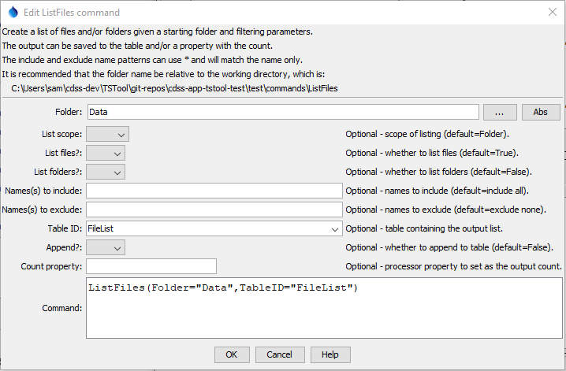

# TSTool / Command / ListFiles #

*   [Overview](#overview)
*   [Command Editor](#command-editor)
*   [Command Syntax](#command-syntax)
*   [Examples](#examples)
*   [Troubleshooting](#troubleshooting)
*   [See Also](#see-also)

-------------------------

## Overview ##

The `ListFiles` command lists files and folders in a starting folder and saves the list to a table.
The table can then be used to drive processes, such as looping with [`For`](../For/For.md) command
and working with a template.

Parameters are available to control the listing:

*   List files and/or folders.
*   Process a single folder or also process sub-folders.
*   Provide names to include and exclude.

The resulting table will include the following columns:

**<p style="text-align: center;">
`ListFiles` Output Table
</p>**

| **Column** | **Description** |
| -- | -- |
| `Name` | Name of the file without leading path (prior to TSTool 14.8.0 this column is called `FileName`). |
| `RelativePath` | File or folder path relative to the command file working directory. |
| `AbsolutePath` | File or folder absolute path. |
| `ParentFolder` | Parent folder absolute path path. |
| `Type` | <ul><li>`File` - for files</li><li>`Folder` - for folders</li></ul> |
| `Size` | File size in bytes, blank for folders. |
| `Owner` | The file or folder owner. |
| `LastModified` | The last modification time for the file or folder in local time. |

## Command Editor ##

The command is available in the following TSTool menu:

*   ***Commands / General - File Handling***

The following dialog is used to edit the command and illustrates the command syntax.

**<p style="text-align: center;">

</p>**

**<p style="text-align: center;">
`ListFiles` Command Editor Showing Conditions Test (<a href="../ListFiles.png">see full-size image</a>)
</p>**

## Command Syntax ##

The command syntax is as follows:

```text
ListFiles(Parameter="Value",...)
```
**<p style="text-align: center;">
Command Parameters
</p>**

|**Parameter**&nbsp;&nbsp;&nbsp;&nbsp;&nbsp;&nbsp;&nbsp;&nbsp;&nbsp;&nbsp;&nbsp;&nbsp;&nbsp;&nbsp;&nbsp;&nbsp;| **Description** | **Default**&nbsp;&nbsp;&nbsp;&nbsp;&nbsp;&nbsp;&nbsp;&nbsp;&nbsp;&nbsp;&nbsp;&nbsp;&nbsp;&nbsp;&nbsp;&nbsp; |
| --------------|-----------------|----------------- |
|`Folder`<br>**required**|The starting folder. | None - must be specified. |
|`ListScope` | The scope for the listing:<ul><li>`All` - `Folder` and its sub-folders</li><li>`Folder` - only list the contents immediately in `Folder`</li></ul> | `Folder` |
|`ListFiles` | Whether files should be listed (`True`) or not (`False`). | `True` |
|`ListFolders` | Whether folders should be listed (`True`) or not (`False`). | `False` |
|`IncludeNames`|A pattern indicating names to include. The pattern is only checked for the name, not the leading path. Use `*` in the name for a wildcard.| All names will be included.|
|`ExcludeNames`|A pattern indicating names to exclude. The pattern is only checked for the name, not the leading path. Use `*` in the name for a wildcard.| No names will be excluded.|
|`TableID`<br>**required**|The identifier for the output table.  If the table does not exist, it will be created.  See also `Append`.|None - must be specified.|
|`Append`|Indicate whether list output should be appended to the table (`True`).  This allows multiple `ListFiles` commands to be used to create a larger list.|`False` - the table will contain only the current output list.|

## Examples ##

See the [automated tests](https://github.com/OpenCDSS/cdss-app-tstool-test/tree/master/test/commands/ListFiles).

## Troubleshooting ##

See the main [TSTool Troubleshooting](../../troubleshooting/troubleshooting.md) documentation.

## See Also ##

*   [`For`](../For/For.md) command
