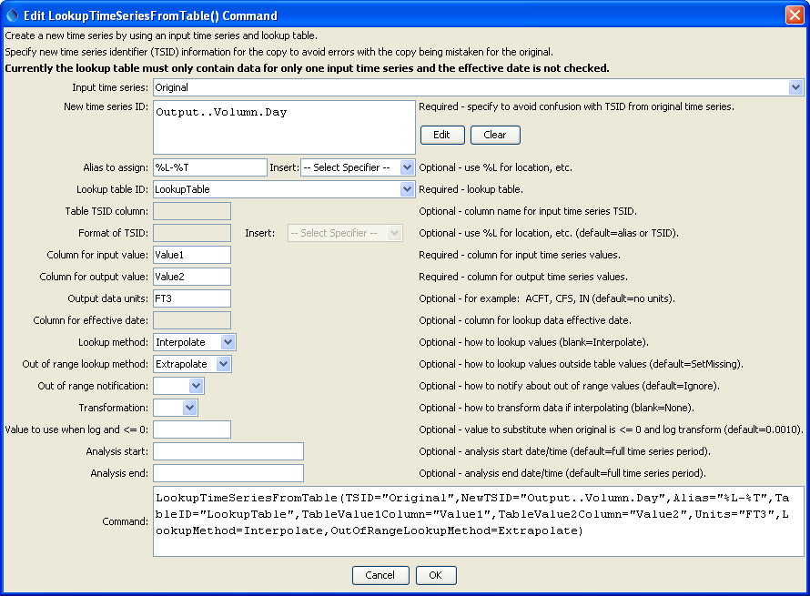

# TSTool / Command / LookupTimeSeriesFromTable #

* [Overview](#overview)
* [Command Editor](#command-editor)
* [Command Syntax](#command-syntax)
* [Examples](#examples)
* [Troubleshooting](#troubleshooting)
* [See Also](#see-also)

-------------------------

## Overview ##

The `LookupTimeSeriesFromTable` command uses an input time series and
lookup table to create the output time series.  Examples of using this command include:

* Converting reservoir elevation to storage, surface area, seepage, or other values
* Converting river stage to discharge
* Converting a time series to category values

In many cases the lookup table will apply throughout the analysis period.
However, it is possible that the table will change over time (e.g., as a
stream channel changes or a reservoir fills with silt).
In these cases, the command allows for an effective date to be specified – the
table then is applicable on and after the specified date/time,
until another effective date is encountered.
The values in the table should be sorted in ascending order prior to lookup.
This command currently does not handle rating table shifts; however,
this capability may be added in the future.  

## Command Editor ##

The following dialog is used to edit the command and illustrates the syntax of the command.

**<p style="text-align: center;">

</p>**

**<p style="text-align: center;">
`LookupTimeSeriesFromTable` Command Editor (<a href="../LookupTimeSeriesFromTable.png">see also the full-size image</a>)
</p>**

## Command Syntax ##

The command syntax is as follows:

```text
LookupTimeSeriesFromTable(Parameter="Value",...)
```
**<p style="text-align: center;">
Command Parameters
</p>**

|**Parameter**&nbsp;&nbsp;&nbsp;&nbsp;&nbsp;&nbsp;&nbsp;&nbsp;&nbsp;&nbsp;&nbsp;&nbsp;&nbsp;&nbsp;&nbsp;&nbsp;&nbsp;&nbsp;&nbsp;&nbsp;&nbsp;&nbsp;&nbsp;&nbsp;&nbsp;&nbsp;&nbsp;&nbsp;&nbsp;|**Description**|**Default**&nbsp;&nbsp;&nbsp;&nbsp;&nbsp;&nbsp;&nbsp;&nbsp;&nbsp;&nbsp;&nbsp;&nbsp;&nbsp;&nbsp;&nbsp;&nbsp;&nbsp;&nbsp;&nbsp;&nbsp;&nbsp;&nbsp;&nbsp;&nbsp;&nbsp;&nbsp;&nbsp;|
|--------------|-----------------|-----------------|
|`TSID`<br>**required**|The time series identifier or alias for the time series used as input.|None – must be specified.|
|`NewTSID`|The time series identifier for the time series being created.  Use the ***Edit*** button to edit the time series identifier parts.|None – must be specified.|
|`Alias`<br>**required**|The alias to assign to the time series, as a literal string or using the special formatting characters listed by the command editor.  The alias is a short identifier used by other commands to locate time series for processing, as an alternative to the time series identifier (`TSID`).|No alias.|
|`TableID`<br>**required**|The lookup table identifier.|None – must be specified.|
|`TableTSIDColumn`|Table column name that is used to match the time series identifier for processing.  This parameter currently is not supported but will be enabled in the future.|If not specified, it is assumed that the entire lookup table applies.|
|`TableTSIDFormat`|The specification to format the time series identifier to match the `TableTSIDColumn` column.  **This parameter currently is not supported but will be enabled in the future**.|Time series alias if available, or otherwise the time series identifier.|
|`TableValue1Column`<br>**required**|Table column name for data values that correspond to the input time series (`TSID`)|None – must be specified.|
|`TableValue2Column`<br>**required**|Table column name for data values that correspond to the output (new) time series identifier (`NewTSID`).|None – must be specified.|
|`Units`|The data units to assign to the new time series.|No data units will be assigned.|
|`EffectiveDateColumn`|Table column name for the effective date.  **This parameter currently is not supported but will be enabled in the future**.|The lookup data apply to the entire period.|
|`LookupMethod`|Indicate how to select the value to use for output:<ul><li>`Interpolate` – interpolate between points if input values do not exactly align with table values; if Transformation=Log, then interpolation will use the transformed values</li><li>`PreviousValue` – pick the previous (lower) value in the table (exact matches use the lookup table value)</li><li>`NextValue` – pick the next (higher) value in the table (exact matches use the lookup table value)</li></ul>|`Interpolate`|
|`OutOfRangeLookupMethod`|Indicate the value to use when estimating values that are outside the range of the rating table:<ul><li>`Extrapolate` – use the two known values at the end of the table to extrapolate; if Transformation=Log, then extrapolation will use the transformed values</li><li>`SetMissing` – set output to missing</li><li>`UseEndValue` – use the data value on the end</li></ul>|`SetMissing`|
|`OutOfRangeNotification`|Indicate the notification to generate when a value is outside the range of the lookup table:<ul><li>`Ignore` – do not generate warning or failure message</li><li>`Warn` – generate a warning message</li><li>`Fail` – generate a failure message</li></ul>|`Ignore`|
|`Transformation`|Indicates how to transform the data before interpolation, used when `LookupMethod=Interpolate` and `OutOfRangeMethod=Extrapolate`.  Specify as `None` to compare raw values or `Log` (for log10) to transform values before interpolation and extrapolation.  If the `Log` option is used, zero and negative values are replaced with the value specified by the `LEZeroLogValue` parameter value for analysis (missing data values are ignored in the analysis).|None (no transformation).|
|`LEZeroLogValue`|Value to use for data values less than or equal to zero when using a log transformation.|`.0010`|
|`AnalysisStart`|The date/time to start the analysis.|Analyze the full period.|
|`AnalysisEnd`|The date/time to end the analysis.|Analyze the full period.|

## Examples ##

See the [automated tests](https://github.com/OpenCDSS/cdss-app-tstool-test/tree/master/test/commands/LookupTimeSeriesFromTable).

## Troubleshooting ##

## See Also ##

* [`SetTimeSeriesValuesFromLookupTable`](../SetTimeSeriesValuesFromLookupTable/SetTimeSeriesValuesFromLookupTable.md) command
