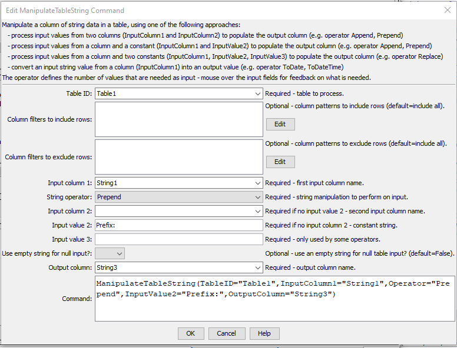

# Learn TSTool / Command / ManipulateTableString #

* [Overview](#overview)
* [Command Editor](#command-editor)
* [Command Syntax](#command-syntax)
* [Examples](#examples)
* [Troubleshooting](#troubleshooting)
* [See Also](#see-also)

-------------------------

## Overview ##

The `ManipulateTableString` command manipulates a string column in a table.
For example, it may be necessary to manipulate strings in a table in order to
match time series identifier parts, so that lookups can occur.  The input is specified by:
	
* a table column name (`InputColumn1`)
* optionally, either a second input column name (`InputColumn2`) or a constant string value (`InputValue2`), depending on operator
* optionally, some operators require an additional input value (`InputValue3`)

The result is placed in the output column (`OutputColumn`).
Missing/blank input will be considered as empty strings when formatting the output.
The output column can be the same as an existing table column.

## Command Editor ##

The following dialog is used to edit the command and illustrates the syntax of the command.
<a href="../ManipulateTableString.png">See also the full-size image.</a>



**<p style="text-align: center;">
`ManipulateTableString` Command Editor
</p>**

## Command Syntax ##

The command syntax is as follows:

```text
ManipulateTableString(Parameter="Value",...)
```
**<p style="text-align: center;">
Command Parameters
</p>**

| **Parameter**&nbsp;&nbsp;&nbsp;&nbsp;&nbsp;&nbsp;&nbsp;&nbsp;&nbsp;&nbsp;&nbsp;&nbsp;&nbsp;&nbsp;&nbsp;&nbsp;&nbsp;&nbsp;&nbsp;&nbsp;&nbsp;&nbsp;&nbsp;&nbsp;&nbsp;&nbsp; | **Description** | **Default**&nbsp;&nbsp;&nbsp;&nbsp;&nbsp;&nbsp;&nbsp;&nbsp;&nbsp;&nbsp; |
| --------------|-----------------|----------------- |
|`TableID`|The identifier for the table to process.  Can be specified with `${Property}` notation.|None – must be specified.|
|`ColumnIncludeFilters`|Specify values to match to include rows using syntax: `Column1:Value1,Column2,Value2`, where values can use `*` for wildcard.  All values must be matched to include a row.  Can be specified with `${Property}` notation.|Include all rows.|
|`ColumnExcludeFilters`|Specify values to match exclude rows using syntax: `Column1:Value1,Column2,Value2`, where values can use `*` for wildcard.  All values must be matched to exclude a row.  Can be specified with `${Property}` notation.|Include all rows.|
|`InputColumn1`|The name of a column containing strings, as the first input.  Can be specified with `${Property}` notation.|None – must be specified.|
|`Operator`|The operation to perform on the input strings:<br><ul><li>`Append` – append the second input to the first input (requires 2 inputs)</li><li>`Prepend` – prepend the second input before the first input (requires 2 inputs)</li><li>`Replace` – start with the first input, replace the substring indicated by the second input with that of the third input (requires 3 inputs)</li><li>`Remove` – start with the first input, remove the substring indicated by the second input (requires 2 inputs)</li><li>`Split` – split string by delimiter and output part</li><li>`Substring` – split out a substring from the first input, where the second input is the starting character position (1+) and the optional third input is the ending character position (1+) (requires 2 or 3 inputs)</li><li>`ToDate` – convert the first input to a DateTime object with date precision</li><li>`ToDateTime` – convert the first input to a DateTime object</li><li>`ToDouble` – convert the first input to a double precision object</li><li>`ToInteger` – convert the first input to an integer object</li></ul>|None – must be specified.|
|`InputColumn2`|The name of a column containing strings, as the second input.  Can be specified with `${Property}` notation.|Required if a 2nd input value is needed no `InputValue2`.|
|InputValue2`|A string constant, as the second input.  Can be specified with `${Property}` notation.  For `Replace` operator, use `^` to indicate start of line, `$` to indicate end of line and `\s` to indicate space.|Required if a 2nd input value is needed and no `InputColumn2`.|
|`InputValue3`|A string constant, as the third input.  Can be specified with `${Property}` notation.  See note for `InputValue2` for `Replace` operator.|Required if a 3rd input value is needed.|
|`OutputColumn`|The name of a column to receive the output.  Can be specified with `${Property}` notation.|None – must be specified.|

The following table describes the parameters that are needed for each operator.  This table will be completed for other operators in the future.

**<p style="text-align: center;">
Operators and Parameter Requirements
</p>**

|**Operator**|**Parameters Required and Description**|
| --------------|-----------------|
|`Split`|<ul><li>`InputValue2` is the delimiter character</li><li>`InputValue3` is the part to output (1+)</li><ul>|

## Examples ##

See the [automated tests](https://github.com/OpenWaterFoundation/cdss-app-tstool-test/tree/master/test/regression/commands/general/ManipulateTableString).

## Troubleshooting ##

## See Also ##

* [`FormatTableDateTime`](../FormatTableDateTime/FormatTableDateTime) command
* [`FormatTableString`](../FormatTableString/FormatTableString) command
