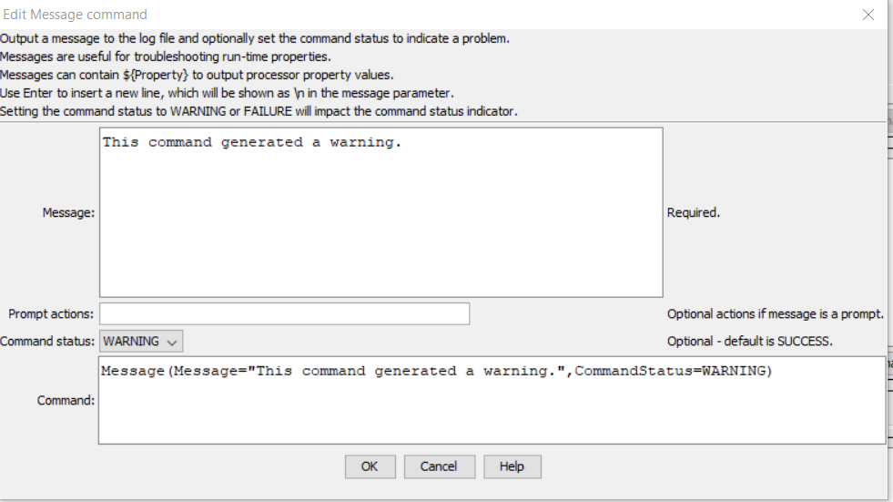

# TSTool / Command / Message #

*   [Overview](#overview)
*   [Command Editor](#command-editor)
*   [Command Syntax](#command-syntax)
*   [Examples](#examples)
*   [Troubleshooting](#troubleshooting)
*   [See Also](#see-also)

-------------------------

## Overview ##

The `Message` command prints a status message to the log file (status level 2).
Optionally, the `CommandStatus` parameter can be used to control the status level for the command.
Examples of use include:

*   this command is useful for troubleshooting by printing out properties
*   generate a warning or failure status if a condition is not met
    (see also the [`If`](../If/If.md) command, which can be used to check for a condition
    and print a message to warn the user using `Message` command)
*   use the optional `PromptActions` parameter to show a dialog with
    buttons that allow the command workflow to be canceled,
    for example if a condition exists that is a severe error

## Command Editor ##

The command is available in the following TSTool menu:

*   ***Commands / General - Logging and Messaging***

The following dialog is used to edit the command and illustrates the command syntax.

**<p style="text-align: center;">

</p>**

**<p style="text-align: center;">
`Message` Command Editor Showing Conditions Test (<a href="../Message.png">see also the full-size image</a>)
</p>**

## Command Syntax ##

The command syntax is as follows:

```text
Message(Parameter="Value",...)
```
**<p style="text-align: center;">
Command Parameters
</p>**

| **Parameter**&nbsp;&nbsp;&nbsp;&nbsp;&nbsp;&nbsp;&nbsp;&nbsp;&nbsp;&nbsp;&nbsp;&nbsp;&nbsp;&nbsp;&nbsp;&nbsp;&nbsp;&nbsp;&nbsp;&nbsp;&nbsp;&nbsp;&nbsp;&nbsp;&nbsp;&nbsp; | **Description** | **Default**&nbsp;&nbsp;&nbsp;&nbsp;&nbsp;&nbsp;&nbsp;&nbsp;&nbsp;&nbsp; |
| --------------|-----------------|----------------- |
| `Message`<br>**required** | The message to print.  Can be specified using `${Property}`. | None - must be specified. |
| `PromptActions` | If specified, a prompt dialog will be shown with buttons that match the requested actions.  This is useful for providing information in cases where additional actions need to be taken outside of TSTool before continuing. Specify actions as one or more of the following separated by spaces: <ul><li>`Cancel` - if pressed, processing will be cancelled</li><li>`Continue` - if pressed, processing will continue</li></ul> | No prompt dialog is shown. |
| `CommandStatus` | Indicate the status that should result from running the command:  `SUCCESS`, `WARNING`, `FAILURE` | `SUCCESS` |

## Examples ##

See the [automated tests](https://github.com/OpenCDSS/cdss-app-tstool-test/tree/master/test/commands/Message).

## Troubleshooting ##

## See Also ##

*   [`StartLog`](../StartLog/StartLog.md) command - controls log file where messages are written
