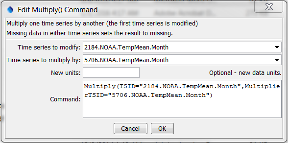

# TSTool / Command / Multiply #

*   [Overview](#overview)
*   [Command Editor](#command-editor)
*   [Command Syntax](#command-syntax)
*   [Examples](#examples)
*   [Troubleshooting](#troubleshooting)
*   [See Also](#see-also)

-------------------------

## Overview ##

The `Multiply` command multiplies one time series by another.
Missing data in either time series causes the result to be missing.
See also the [`Scale`](../Scale/Scale.md) command, which multiplies time series by a numerical value.  

## Command Editor ##

The command is available in the following TSTool menu:

*   ***Commands / Manipulate Time Series***

The following dialog is used to edit the command and illustrates the syntax of the command.

**<p style="text-align: center;">

</p>**

**<p style="text-align: center;">
`Multiply` Command Editor (<a href="../Multiply.png">see also the full-size image</a>)
</p>**

## Command Syntax ##

The command syntax is as follows:

```text
Multiply(Parameter="Value",...)
```
**<p style="text-align: center;">
Command Parameters
</p>**

|**Parameter**&nbsp;&nbsp;&nbsp;&nbsp;&nbsp;&nbsp;&nbsp;&nbsp;&nbsp;&nbsp;&nbsp;&nbsp;&nbsp;|**Description**|**Default**&nbsp;&nbsp;&nbsp;&nbsp;&nbsp;&nbsp;&nbsp;&nbsp;&nbsp;&nbsp;&nbsp;&nbsp;&nbsp;&nbsp;&nbsp;&nbsp;&nbsp;&nbsp;&nbsp;&nbsp;&nbsp;&nbsp;&nbsp;&nbsp;&nbsp;&nbsp;&nbsp;|
|--------------|-----------------|-----------------|
|`TSID`|The time series identifier or alias for the time series to be modified.  Can specify using `${Property}`.|None – must be specified.|
|`MultiplierTSID`|The time series identifier or alias for the time series that is the multiplier.  Can specify using `${Property}`.|None – must be specified.|
|`NewUnits`|Specify the new units to assign.  Can specify using `${Property}`.|Original units remain.|

## Examples ##

See the [automated tests](https://github.com/OpenCDSS/cdss-app-tstool-test/tree/master/test/commands/Multiply).

A sample command file to process time series from the [State of Colorado’s HydroBase database](../../datastore-ref/CO-HydroBase/CO-HydroBase.md)
is as follows (not an actual case but for illustration):

```text
# 2184 - DEL NORTE 2 E
2184.NOAA.TempMean.Month~HydroBase
# 5706 - MONTE VISTA 2 W
5706.NOAA.TempMean.Month~HydroBase
Multiply(TSID="2184.NOAA.TempMean.Month",MultiplierTSID="5706.NOAA.TempMean.Month")
```
## Troubleshooting ##

## See Also ##

*   [`Divide`](../Divide/Divide.md) command
*   [`Scale`](../Scale/Scale.md) command
*   [`SelectTimeSeries`](../SelectTimeSeries/SelectTimeSeries.md) command
