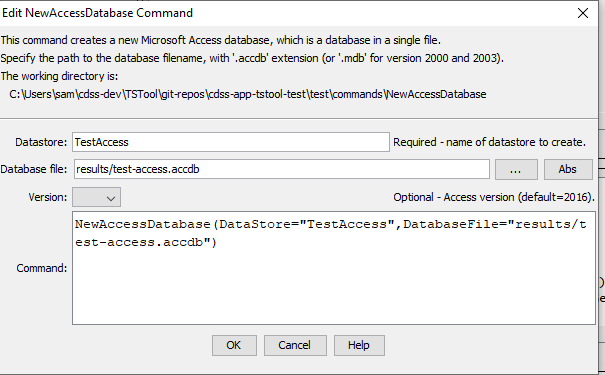

# TSTool / Command / NewAccessDatabase #

*   [Overview](#overview)
*   [Command Editor](#command-editor)
*   [Command Syntax](#command-syntax)
*   [Examples](#examples)
*   [Troubleshooting](#troubleshooting)
*   [See Also](#see-also)

-------------------------

## Overview ##

The `NewAccessDatabase` command creates a new, empty, Microsoft Access database.
Access databases are single file databases that are useful for creating,
manipulating, and publishing datasets.
TSTool tables can be read from a database using
[`ReadTableFromDataStore`](../ReadTableFromDataStore/ReadTableFromDataStore.md) command
and written to a database using
[`WriteTableToDataStore`](../WriteTableToDataStore/WriteTableToDataStore.md) command.
The [`RunSql`](../RunSql/RunSql.md) command can be used to perform other operations.
The following are technical considerations:

*   the datastore is dynamically created as a
    [`GenericDatabase`](../../datastore-ref/GenericDatabase/GenericDatabase.md) using a JDBC connection
*   database names should have `.accdb` extension for versions 2007 and later,
    and `.mdb` for older versions
*   if appropriate for a workflow, use the [`RemoveFile`](../RemoveFile/RemoveFile.md) or [`CopyFile`](../CopyFile/CopyFile.md)
    commands to handle an existing database file before creating a new database with the same name
*   for databases that are dynamically created, a database file that is in use cannot be overwritten
*   use a [`CloseDataStore`](../CloseDataStore/CloseDataStore.md) command to close a previously created (and opened) datastore,
    for example if rerunning a command file

A file database may perform slowly on database inserts due to the need to write to disk and 
the relatively slow speed of disk seek and write (compared to in-memory operations).
It is generally much faster to read data than write data.

## Command Editor ##

The command is available in the following TSTool menu:

*   ***Commands / Datastore Processing***

The following dialog is used to edit the command and illustrates the command syntax.

**<p style="text-align: center;">

</p>**

**<p style="text-align: center;">
`NewAccessDatabase` Command Editor (<a href="../NewAccessDatabase.png">see also the full-size image</a>)
</p>**

## Command Syntax ##

The command syntax is as follows:

```text
NewAccessDatabase(Parameter="Value",...)
```
**<p style="text-align: center;">
Command Parameters
</p>**

| **Parameter**&nbsp;&nbsp;&nbsp;&nbsp;&nbsp;&nbsp;&nbsp;&nbsp;&nbsp;&nbsp;&nbsp;&nbsp; | **Description** | **Default**&nbsp;&nbsp;&nbsp;&nbsp;&nbsp;&nbsp;&nbsp;&nbsp;&nbsp;&nbsp; |
| --------------|-----------------|----------------- |
|`DataStore`<br>**required**|DataStore name for the database that will be created.  Can be specified using processor `${Property}`.|None – must be specified.|
|`DatabaseFile`|The name of the database file as full path or path relative to the command file.  A file extension of `.accdb` should be used, or `.mdb` for Access versions 2000 and 2003.  **Rerunning a command file will recreate the database.  Use a datastore configuration file rather than this command if the database should be available throughout multiple TSTool sessions.**|None - must be specified.|
| `Version` | The Access version for the file, one of: `2000`, `2003`, `2007`, `2010`, `2016`. | `2016` |

## Examples ##

See the [automated tests](https://github.com/OpenCDSS/cdss-app-tstool-test/tree/master/test/commands/NewAccessDatabase).

## Troubleshooting ##

## See Also ##

*   [`CloseDataStore`](../CloseDataStore/CloseDataStore.md) command
*   [`CopyFile`](../CopyFile/CopyFile.md) command
*   [`ReadTableFromDataStore`](../ReadTableFromDataStore/ReadTableFromDataStore.md) command
*   [`RemoveFile`](../RemoveFile/RemoveFile.md) command
*   [`WriteTableToDataStore`](../WriteTableToDataStore/WriteTableToDataStore.md) command.
