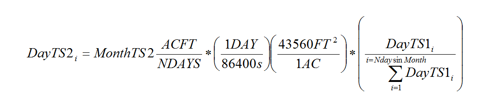
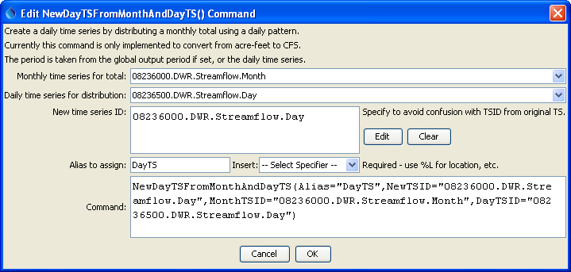
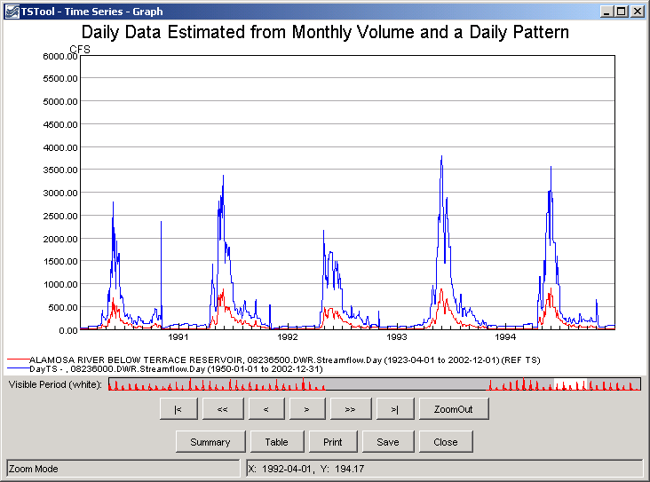

# TSTool / Command / NewDayTSFromMonthAndDayTS #

*   [Overview](#overview)
*   [Command Editor](#command-editor)
*   [Command Syntax](#command-syntax)
*   [Examples](#examples)
*   [Troubleshooting](#troubleshooting)
*   [See Also](#see-also)

-------------------------

## Overview ##

The `NewDayTSFromMonthAndDayTS` command creates a new daily time series by
distributing a monthly time series “volume” according to the
pattern of the independent daily time series.
This command currently only handles processing monthly ACFT and daily CFS time series.
This command is useful where a monthly flow time series is known at a location,
and a daily pattern is known at a related gage.
The new time series is assigned the given identifier and alias.
The following calculations are performed:

**<p style="text-align: center;">

</p>**

where, for days in a month:

*   *DayTS2_i* = the daily value being estimated in daily time series 2
*   *MonthTS2* = the monthly value being used for volumes for time series 2, shown in units of ACFT/NDAYS (equivalent to ACFT/Month)
*   *NDAYS*  = the number of days in the month
*   *DayTS1_i* = the daily value for indicator daily time series 1
*   *sum(DayTS1_i)* = the sum of the daily values for indicator time series for a month

In summary, the monthly volume in ACFT/NDAYS is first converted to an average monthly CFS
rate by multiplying by 43560/86400 (or 1/1.9835),
and finally the average CFS value is prorated by the ratio of the indicator
daily time series daily value divided by the total daily flows for the month,
to give a daily CFS value for each day of the month.
In this case, the last term is simply a ratio (converting daily average CFS to daily
ACFT and calculating the ratio would result in the same value).

Days with missing data are excluded from the summation and the estimated values.
The output period is the global output period from
[`SetOutputPeriod`](../SetOutputPeriod/SetOutputPeriod.md),
or if not set the period from the daily time series is used.

For example, consider a monthly total MonthTS2 = 1001.7 ACFT and daily values (CFS) as follows:

```text
 Day 1 = 14
14
13
13
14
14
15
15
15
16
17
17
16
18
18
17
18
18
18
18
17
17
17
17
16
16
17
18
18
17
 Day 31 = 17
```

The total is 505 CFS.  The estimated value for day 1 of the second daily time series would then be:

1001.7 * (1/1.9835) * (14/505) = 14 CFS

In this case, the indicator time series was the same as the time series being
estimated and therefore the estimated value should be the same as the indicator. 

## Command Editor ##

The command is available in the following TSTool menu:

*   ***Commands / Create Time Series***

The following dialog is used to edit the command and illustrates the syntax of the command.

**<p style="text-align: center;">

</p>**

**<p style="text-align: center;">
`NewDayTSFromMonthAndDayTS` Command Editor (<a href="../NewDayTSFromMonthAndDayTS.png">see full-size image</a>)
</p>**

## Command Syntax ##

The command syntax is as follows:

```text
NewDayTSFromMonthAndDayTS(Parameter="Value",...)
```
The following older command syntax is updated to the above syntax when a command file is read:

```
TS Alias = NewDayTSFromMonthAndDayTS(Parameter=Value,...)
```

**<p style="text-align: center;">
Command Parameters
</p>**

|**Parameter**&nbsp;&nbsp;&nbsp;&nbsp;&nbsp;&nbsp;&nbsp;&nbsp;&nbsp;&nbsp;&nbsp;|**Description**|**Default**&nbsp;&nbsp;&nbsp;&nbsp;&nbsp;&nbsp;&nbsp;&nbsp;&nbsp;&nbsp;&nbsp;&nbsp;&nbsp;&nbsp;&nbsp;&nbsp;&nbsp;&nbsp;&nbsp;&nbsp;&nbsp;&nbsp;&nbsp;&nbsp;&nbsp;&nbsp;&nbsp;|
|--------------|-----------------|-----------------|
|`MonthTSID`<br>**required**|The time series identifier or alias for a monthly time series supplying monthly ACFT values.|None – must be specified.|
|`DayTSID`<br>**required**|The time series identifier or alias for a daily time series supplying daily flow values (only the pattern is used).|None – must be specified.|
|`NewTSID`<br>**required**|The time series identifier of the new time series.  The interval must be `Day`.|None – must be specified.|
|`Alias`<br>**required**|The alias to assign to the time series, as a literal string or using the special formatting characters listed by the command editor.  The alias is a short identifier used by other commands to locate time series for processing, as an alternative to the time series identifier (TSID).|None – must be specified.|

## Examples ##

See the [automated tests](https://github.com/OpenCDSS/cdss-app-tstool-test/tree/master/test/commands/NewDayTSFromMonthAndDayTS).

A sample command file to process time series from the [State of Colorado’s HydroBase database](../../datastore-ref/CO-HydroBase/CO-HydroBase.md)
is as follows:

```text
SetOutputPeriod(OutputStart="1950-01",OutputEnd="2002-12")
# 08236500 - ALAMOSA RIVER BELOW TERRACE RESERVOIR
08236500.DWR.Streamflow.Day~HydroBase
# 08236000 - ALAMOSA RIVER ABOVE TERRACE RESERVOIR
08236000.DWR.Streamflow.Month~HydroBase
NewDayTSFromMonthAndDayTS(NewTSID="08236000.DWR.Streamflow.Day",MonthTSID="08236000.DWR.Streamflow.Month",DayTSID="08236500.DWR.Streamflow.Day",Alias=”DayTS”)
```
A graph of data resulting from this command will look similar to the following.
Note that the each time series has a similar pattern, but at different levels.

**<p style="text-align: center;">

</p>**

**<p style="text-align: center;">
Result of `NewDayTSFromMonthAndDayTS` Command (<a href="../NewDayTSFromMonthAndDayTS_Graph.png">see full-size image</a>)
</p>**

## Troubleshooting ##

See the main [TSTool Troubleshooting](../../troubleshooting/troubleshooting.md) documentation.

## See Also ##

*   [`SelectTimeSeries`](../SelectTimeSeries/SelectTimeSeries.md) command
*   [`SetOutputPeriod`](../SetOutputPeriod/SetOutputPeriod.md) command
