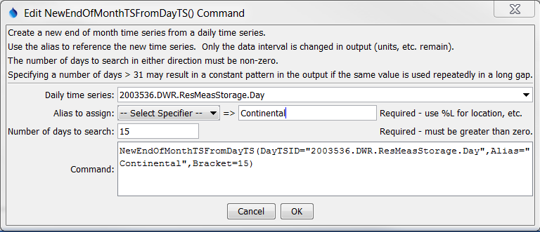
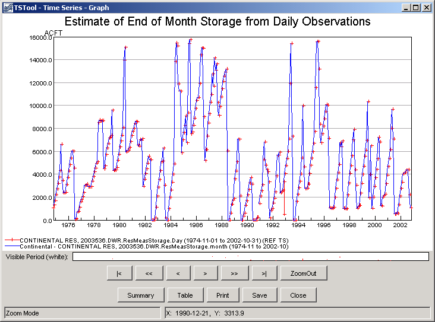

# TSTool / Command / NewEndOfMonthTSFromDayTS #

*   [Overview](#overview)
*   [Command Editor](#command-editor)
*   [Command Syntax](#command-syntax)
*   [Examples](#examples)
*   [Troubleshooting](#troubleshooting)
*   [See Also](#see-also)

-------------------------

## Overview ##

The `NewEndOfMonthTSFromDayTS` command is typically used to convert a daily
reservoir storage time series to an end of month reservoir storage time series.
The command can also be applied to other data types (e.g., measured well levels).

Changing from a daily to an end of month monthly time series is accomplished
by starting on the month ending day and searching in both directions
(backward then forward by expanding until the bracket is reached) for a daily measurement.
The number of days to search in each direction (the bracket)
should not be so large as to produce unrealistic results.
It is possible that no value will be found for a particular month, with the given restraints.
In this case, other fill commands (e.g.,
[`FillInterpolate`](../FillInterpolate/FillInterpolate.md)) can be applied to estimate the remaining missing data.

## Command Editor ##

The command is available in the following TSTool menu:

*   ***Commands / Create Time Series***

The following dialog is used to edit the command and illustrates the syntax of the command.

**<p style="text-align: center;">

</p>**

**<p style="text-align: center;">
`NewEndOfMonthTSFromDayTS` Command Editor (<a href="../NewEndOfMonthTSFromDayTS.png">see full-size image</a>)
</p>**

## Command Syntax ##

The command syntax is as follows:

```text
NewEndOfMonthTSFromDayTS(Parameter="Value",...)
```
The following older command syntax is updated to the above syntax when a command file is read:

```
TS Alias = NewEndOfMonthTSFromDayTS (Parameter=Value,…)
```

**<p style="text-align: center;">
Command Parameters
</p>**

|**Parameter**&nbsp;&nbsp;&nbsp;&nbsp;&nbsp;&nbsp;&nbsp;&nbsp;&nbsp;&nbsp;&nbsp;|**Description**|**Default**&nbsp;&nbsp;&nbsp;&nbsp;&nbsp;&nbsp;&nbsp;&nbsp;&nbsp;&nbsp;&nbsp;&nbsp;&nbsp;&nbsp;&nbsp;&nbsp;&nbsp;&nbsp;&nbsp;&nbsp;&nbsp;&nbsp;&nbsp;&nbsp;&nbsp;&nbsp;&nbsp;|
|--------------|-----------------|-----------------|
|`DayTSID`<br>**required**|The time series identifier or alias of the daily time series to be searched for data.  `${Property}` notation can be used to substitute a processor property value.|None – must be specified.|
|`Alias`<br>**required**|The alias to assign to the time series, as a literal string or using the special formatting characters listed by the command editor.  The alias is a short identifier used by other commands to locate time series for processing, as an alternative to the time series identifier (`TSID`).|None – must be specified.|
|`Bracket`<br>**required**|The number of days to search from the end of the month, in order to find a daily value to transfer to the end of the month.|None – must be specified.|

## Examples ##

See the [automated tests](https://github.com/OpenCDSS/cdss-app-tstool-test/tree/master/test/commands/NewEndOfMonthTSFromDayTS).

A sample command file for estimating reservoir contents, using a time series from the [State of Colorado’s HydroBase database](../../datastore-ref/CO-HydroBase/CO-HydroBase.md)
is as follows:

```text
# 2003536 - CONTINENTAL RES
2003536.DWR.ResMeasStorage.Day~HydroBase
NewEndOfMonthTSFromDayTS(Alias=”Continental”,DayTSID="2003536.DWR.ResMeasStorage.Day",Bracket=15)

```

A sample command file for estimating well levels is:

```
# 384549104445101 - SCO1506611ABC
384549104445101.USGS.WellLevel.Day~HydroBase
NewEndOfMonthTSFromDayTS(Alias=”WellMonth”,DayTSID="384549104445101.USGS.WellLevel.Day",Bracket=30)
FillInterpolate(TSList=AllMatchingTSID,TSID="WellMonth",MaxIntervals=0,Transformation=None)
```
To evaluate the results of this command, it is useful to graph both the input and results,
changing the graph properties to add symbols to see the individual measurements, as shown in the following figure.

**<p style="text-align: center;">

</p>**

**<p style="text-align: center;">
Results of `NewEndOfMonthTSFromDayTS` Command (<a href="../NewEndOfMonthTSFromDayTS_Graph.png">see full-size image</a>)
</p>**

## Troubleshooting ##

See the main [TSTool Troubleshooting](../../troubleshooting/troubleshooting.md) documentation.

## See Also ##

*   [`FillInterpolate`](../FillInterpolate/FillInterpolate.md) command
