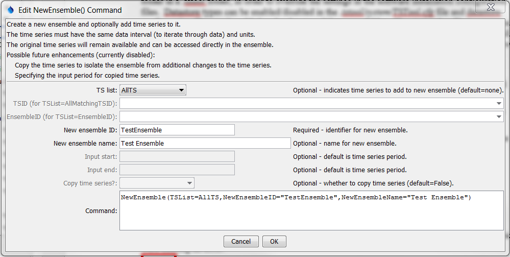

# TSTool / Command / NewEnsemble #

* [Overview](#overview)
* [Command Editor](#command-editor)
* [Command Syntax](#command-syntax)
* [Examples](#examples)
* [Troubleshooting](#troubleshooting)
* [See Also](#see-also)

-------------------------

## Overview ##

The `NewEnsemble` command creates a new ensemble and optionally inserts 1+ existing time series.
For example, use the command to create an ensemble that includes multiple scenarios.
Although it is typical that an ensemble contains time series at the same location,
it is also possible to use ensembles to group time series at different locations
(e.g., to group all time series for stations in a county).

It is envisioned that time series added to the ensemble can optionally be copied and the period changed,
in order to isolate the data from the original time series.
However, currently the time series from the main processor list are simply associated with the ensemble.
Consequently, if other commands change the time series (for example free the time series),
the ensemble will reflect the changes.  Overcoming this issue will require design changes that need to be evaluated.

## Command Editor ##

The following dialog is used to edit the command and illustrates the syntax of the command.



**<p style="text-align: center;">
`NewEnsemble` Command Editor (<a href="../NewEnsemble.png">see also the full-size image</a>)
</p>**

## Command Syntax ##

The command syntax is as follows:

```text
NewEnsemble(Parameter="Value",...)
```
**<p style="text-align: center;">
Command Parameters
</p>**

|**Parameter**&nbsp;&nbsp;&nbsp;&nbsp;&nbsp;&nbsp;&nbsp;&nbsp;&nbsp;&nbsp;&nbsp;&nbsp;&nbsp;&nbsp;&nbsp;|**Description**|**Default**&nbsp;&nbsp;&nbsp;&nbsp;&nbsp;&nbsp;&nbsp;&nbsp;&nbsp;&nbsp;&nbsp;&nbsp;&nbsp;&nbsp;&nbsp;&nbsp;&nbsp;&nbsp;&nbsp;&nbsp;&nbsp;&nbsp;&nbsp;&nbsp;&nbsp;&nbsp;&nbsp;|
|--------------|-----------------|-----------------|
|`TSList`|Indicates the list of time series to be processed, one of:<br><ul><li>`AllMatchingTSID` – all time series that match the TSID (single TSID or TSID with wildcards) will be processed.</li><li>`AllTS` – all time series before the command.</li><li>`EnsembleID` – all time series in the ensemble will be processed (see the EnsembleID parameter).</li><li>`FirstMatchingTSID` – the first time series that matches the TSID (single TSID or TSID with wildcards) will be processed.</li><li>`LastMatchingTSID` – the last time series that matches the TSID (single TSID or TSID with wildcards) will be processed.</li><li>`SelectedTS` – the time series are those selected with the [`SelectTimeSeries`](../SelectTimeSeries/SelectTimeSeries.md) command.</li></ul> | `AllTS` |
|`TSID`|The time series identifier or alias for the time series to be processed, using the `*` wildcard character to match multiple time series.  Can be specified using `${Property}`.|Required if `TSList=*TSID`|
|`EnsembleID`|The ensemble to be processed, if processing an ensemble. Can be specified using `${Property}`.|Required if `TSList=*EnsembleID`|
|`NewEnsembleID`<br>**required**|The new ensemble identifier.  Can be specified using `${Property}`.|None – must be specified.|
|`NewEnsembleName`|The name for the new ensemble.  Can be specified using `${Property}`.|Blank.|
|`InputStart`|The date/time to start transferring data from the time series.  Envisioned as future enhancement.  Can be specified using `${Property}`.|Use all data.|
|`InputEnd`|The date/time to end transferring data from the time series.  Envisioned as future enhancement.  Can be specified using `${Property}`.|Use all data.|
|`CopyTimeSeries`|Copy the time series to the ensemble rather than using time series in the main time series list.  This protects the data in the ensemble from general processing commands.  **Envisioned as future enhancement**.|Associate time series in the main time series list with the new ensemble.|

## Examples ##

See the [automated tests](https://github.com/OpenCDSS/cdss-app-tstool-test/tree/master/test/regression/commands/general/NewEnsemble).

A sample command file to create an ensemble from user-defined time series is as follows:

```text
# Test creating an ensemble from year interval time series
NewPatternTimeSeries(Alias=”ts1”,NewTSID="ts1..Flow.Year",SetStart="1960",SetEnd="2000",Units="ACFT",PatternValues="1,2,5,8,,20")
NewPatternTimeSeries(Alias=”ts2”,NewTSID="ts2..Flow.Year",SetStart="1950",SetEnd="2005",Units="ACFT",PatternValues="2,4,10,16,,40")
NewEnsemble(TSList=AllTS,NewEnsembleID="TestEnsemble",NewEnsembleName="Test Ensemble")
```

## Troubleshooting ##

## See Also ##

* [`Free`](../Free/Free.md) command
* [`SelectTimeSeries`](../SelectTimeSeries/SelectTimeSeries.md) command
