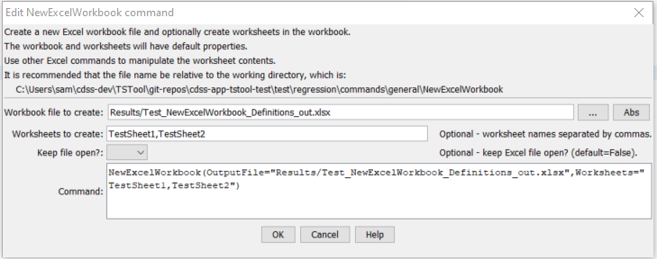

# TSTool / Command / NewExcelWorkbook #

* [Overview](#overview)
* [Command Editor](#command-editor)
* [Command Syntax](#command-syntax)
* [Examples](#examples)
* [Troubleshooting](#troubleshooting)
* [See Also](#see-also)

-------------------------

## Overview ##

The `NewExcelWorkbook` command creates a Microsoft Excel workbook file and
optionally also creates worksheets in the new workbook.
See also other Excel processing commands that can be used to further manipulate the Excel file.
	
TSTool uses the [Apache POI software](http://poi.apache.org) to write the Excel file
and consequently functionality is constrained by the features of that software package.

## Command Editor ##

The following dialog is used to edit the command and illustrates the syntax of the command.



**<p style="text-align: center;">
`NewExcelWorkbook` Command Editor (<a href="../NewExcelWorkbook.png">see also the full-size image</a>)
</p>**

## Command Syntax ##

The command syntax is as follows:

```text
NewExcelWorkbook(Parameter="Value",...)
```
**<p style="text-align: center;">
Command Parameters
</p>**

|**Parameter**&nbsp;&nbsp;&nbsp;&nbsp;&nbsp;&nbsp;&nbsp;&nbsp;&nbsp;&nbsp;&nbsp;|**Description**|**Default**&nbsp;&nbsp;&nbsp;&nbsp;&nbsp;&nbsp;&nbsp;&nbsp;&nbsp;&nbsp;&nbsp;&nbsp;&nbsp;&nbsp;&nbsp;&nbsp;&nbsp;&nbsp;&nbsp;&nbsp;&nbsp;&nbsp;&nbsp;&nbsp;&nbsp;&nbsp;&nbsp;|
|--------------|-----------------|-----------------|
|`OutputFile`<br>**required**|The name of the Excel workbook file (`*.xls` or `*.xlsx`) to create, as an absolute path or relative to the command file location.  Can specify using processor `${Property}`.|None – must be specified.|
|`Worksheets`|The name(s) of the worksheets to create in the workbook.  Can specify using processor `${Property}`.|Don’t create any named sheets.|
|`KeepOpen`|Indicate whether to keep the Excel file open (True) or close after creating (`False`).  Keeping the file open will increase performance because later commands will not need to reread the workbook.  Make sure to close the file in the last Excel command.|`False`|

## Examples ##

See the [automated tests](https://github.com/OpenCDSS/cdss-app-tstool-test/tree/master/test/regression/commands/general/NewExcelWorkbook).

## Troubleshooting ##

## See Also ##

* [`ReadTableFromExcel`](../ReadTableFromExcel/ReadTableFromExcel.md) command
