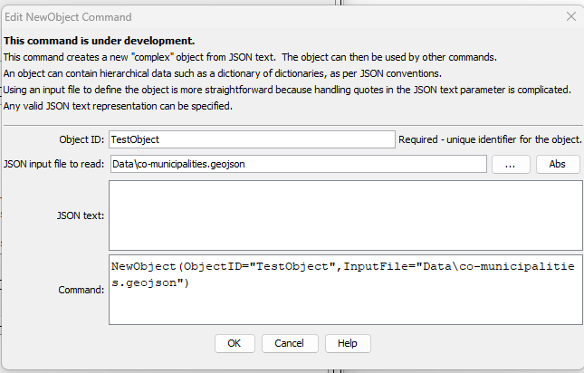

# TSTool / Command / NewObject #

*   [Overview](#overview)
*   [Command Editor](#command-editor)
*   [Command Syntax](#command-syntax)
*   [Examples](#examples)
*   [Troubleshooting](#troubleshooting)
*   [See Also](#see-also)

-------------------------

## Overview ##

The `NewObject` command creates a new complex object from
[JavaScript Object Notation (JSON)](https://en.wikipedia.org/wiki/JSON) text.
An object typically has a root level that is one of:

*   A dictionary of objects surrounded by `{  }`.
*   An array of objects surrounded by `[  ]`.

The object can be thought of as a dictionary of dictionaries,
where each object has a text name,
and a value that is text, a number, a dictionary, a list (array),
or other JSON types.
This representation works well for most data and is commonly used with software.
It is envisioned that in the future other object formats may be read and written,
such as [XML](https://en.wikipedia.org/wiki/XML) and
[YAML](https://en.wikipedia.org/wiki/YAML).
Internally, the open source [Jackson library](https://github.com/FasterXML/jackson)
is used to serialize and deserialize content.

Note that objects are not equivalent to TSTool properties,
which are simple objects used by TSTool to manage workflow execution.
The TSTool ***Results*** area has the ***Properties*** tabs for property objects and
the ***Objects*** tab for complex objects.

Common uses for objects are:

*   hold GeoJSON spatial data layer, which can be manipulated using commands like
    [`SetObjectPropertiesFromTable`](../SetObjectPropertiesFromTable/SetObjectPropertiesFromTable.md)
*   hold data that are used to control a process or describe a dataset or product,
    such as configuration files for web content
*   hold ad-hoc data that are not suitable for a database but are more complex than
    simple formats such as comma-separated-value
*   as content for "no SQL" databases or relational databases that support JSON content

Characteristics of each object are as follows:

*   has an identifier, which is used by TSTool to manage the objects
*   has a JSON object that holds the data and is used for input and output

## Command Editor ##

The command is available in the following TSTool menu:

*   ***Commands / Object Processing***

The following dialog is used to edit the command and illustrates the command syntax.

**<p style="text-align: center;">

</p>**

**<p style="text-align: center;">
`NewObject` Command Editor (<a href="../NewObject.png">see also the full-size image</a>)
</p>**

## Command Syntax ##

The command syntax is as follows:

```text
NewObject(Parameter="Value",...)
```
**<p style="text-align: center;">
Command Parameters
</p>**

| **Parameter**&nbsp;&nbsp;&nbsp;&nbsp;&nbsp;&nbsp;&nbsp;&nbsp;&nbsp;&nbsp;&nbsp;&nbsp; | **Description** | **Default**&nbsp;&nbsp;&nbsp;&nbsp;&nbsp;&nbsp;&nbsp;&nbsp;&nbsp;&nbsp; |
| --------------|-----------------|----------------- |
|`ObjectID`<br>**required**|Identifier for the object – should be unique among objects that are defined.  Can be specified using processor `${Property}`.|None – must be specified.|
|`InputFile`|JSON input file to read.| |
|`JSONText`|JSON text to use for object. **This is currently not implemented until quotes and other characters are properly handled (TSTool wraps command parameters in double quotes)**. | |

## Examples ##

See the [automated tests](https://github.com/OpenCDSS/cdss-app-tstool-test/tree/master/test/commands/NewObject).

## Troubleshooting ##

## See Also ##

*   [`FreeObject`](../FreeObject/FreeObject.md) command
*   [`SetObjectPropertiesFromTable`](../SetObjectPropertiesFromTable/SetObjectPropertiesFromTable.md) command
*   [`SetObjectProperty`](../SetObjectProperty/SetObjectProperty.md) command
*   [`WriteObjectToJSON`](../WriteObjectToJSON/WriteObjectToJSON.md) command
