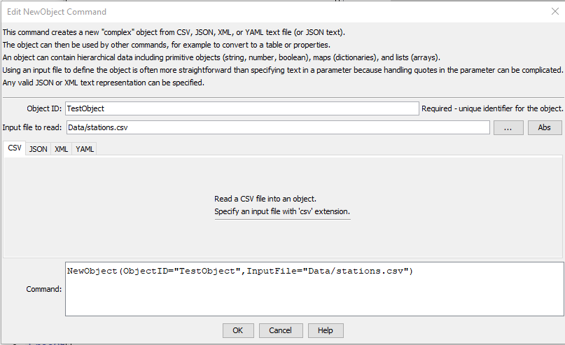
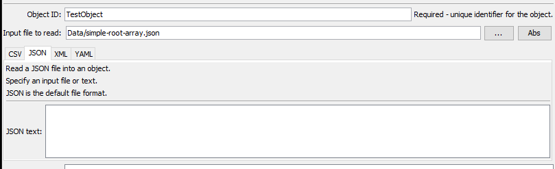
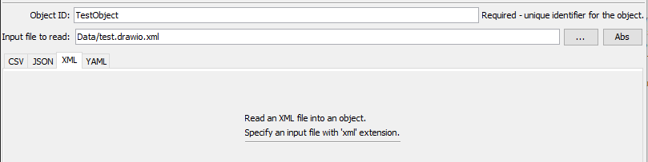
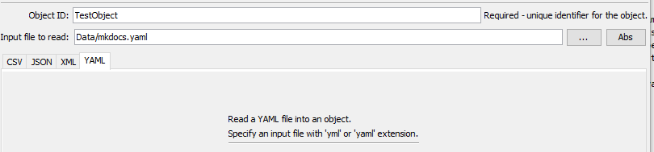

# TSTool / Command / NewObject #

*   [Overview](#overview)
    +   [CSV](#csv)
    +   [JSON](#json)
    +   [XML](#xml)
    +   [YAML](#yamlinput)
*   [Command Editor](#command-editor)
*   [Command Syntax](#command-syntax)
*   [Examples](#examples)
*   [Troubleshooting](#troubleshooting)
*   [See Also](#see-also)

-------------------------

## Overview ##

The `NewObject` command creates a new complex object from CSV, JSON, XML, or YAML text.
The open source [Jackson library](https://github.com/FasterXML/jackson)
is used to read content.

The object for hierarchical data is a dictionary (map) containing other objects,
where each object has a text name
and a value that is a primitive (string, number, or boolean), a map (dictionary), or a list (array).
This is suitable for complex objects.

The object for a list of objects is a list containing a map (dictionary) of each object in the list.
This is suitable for database and other tabular output.

These representations work well for most data.

Objects are not equivalent to TSTool properties,
which are simple objects used by TSTool to manage workflow execution.
The TSTool ***Results*** area has the ***Properties*** tabs for property objects and
the ***Objects*** tab for complex objects.
Use commands in the ***Commands / Object Processing*** menu to process objects into other forms,
including properties and tables.

Common uses for objects are:

*   hold GeoJSON spatial data layer, which can be manipulated using commands like
    [`SetObjectPropertiesFromTable`](../SetObjectPropertiesFromTable/SetObjectPropertiesFromTable.md)
*   hold data that are used to control a process or describe a dataset or product,
    such as configuration files for web content
*   hold ad-hoc data that are not suitable for a database but are more complex than
    simple formats such as comma-separated-value
*   as content for "no SQL" databases or relational databases that support JSON content

Characteristics of each object are as follows:

*   has an identifier, which is used by TSTool to manage the objects
*   has a top-level map or list object that holds the data and is used for input and output

Additional parameters will be added for each input format as more tests are developed.

### CSV ###

Minimal support for CSV files is currently enabled, with the following limitations.
The features will be enhanced in the future.

*   Input:
    +   The input file's first line must be a header indicating column names (which will be set to the object name).
    +   Comment lines are not allowed.
*   Output:
    +   Output is a list object, where each row is a map of data values
        (reading a top-level map object may be implemented in the future).
    +   All values are read as strings.

See the [`ReadTableFromDelimitedFile`](../ReadTableFromDelimitedFile/ReadTableFromDelimitedFile.md) command
to read a CSV file into a table.

### JSON ###

See the
[JavaScript Object Notation (JSON)](https://en.wikipedia.org/wiki/JSON) documentation.
An object typically has a root level that is one of:

*   A dictionary of objects surrounded by `{  }`.
*   An array of objects surrounded by `[  ]` (for example a representation of database table rows).

### XML ###

Minimal support for XML has been implemented.

See the [XML Wikipedia documentation](https://en.wikipedia.org/wiki/XML).

*   Input:
    +   Limited testing of XML files has occurred.
*   Output:
    +   A top-level `rootJsonNode` is output, corresponding to Jackson root node.

### YAML ###

Minimal support for YAML files is currently enabled, with the following limitations.
The features will be enhanced in the future.

See the [YAML Wikipedia documentation](https://en.wikipedia.org/wiki/YAML).

*   Input:
    -   Limited testing of YAML files has occurred.
*   Output:
    -   A single top-level object is output, which contains a hierarchy of data objects.

## Command Editor ##

The command is available in the following TSTool menu:

*   ***Commands / Object Processing***

The following dialog is used to edit the command and illustrates the command syntax.

**<p style="text-align: center;">

</p>**

**<p style="text-align: center;">
`NewObject` Command Editor for CSV Parameters (<a href="../NewObject-csv.png">see full-size image</a>)
</p>**

**<p style="text-align: center;">

</p>**

**<p style="text-align: center;">
`NewObject` Command Editor for JSON Parameters (<a href="../NewObject-json.png">see full-size image</a>)
</p>**

**<p style="text-align: center;">

</p>**

**<p style="text-align: center;">
`NewObject` Command Editor for XML Parameters (<a href="../NewObject-xml.png">see full-size image</a>)
</p>**

**<p style="text-align: center;">

</p>**

**<p style="text-align: center;">
`NewObject` Command Editor for YAML Parameters (<a href="../NewObject-yaml.png">see full-size image</a>)
</p>**

## Command Syntax ##

The command syntax is as follows:

```text
NewObject(Parameter="Value",...)
```
**<p style="text-align: center;">
Command Parameters
</p>**

| **Input Type** | **Parameter**&nbsp;&nbsp;&nbsp;&nbsp;&nbsp;&nbsp;&nbsp;&nbsp;&nbsp;&nbsp;&nbsp;&nbsp; | **Description** | **Default**&nbsp;&nbsp;&nbsp;&nbsp;&nbsp;&nbsp;&nbsp;&nbsp;&nbsp;&nbsp; |
| -- | --------------|-----------------|----------------- |
| ***All*** | `ObjectID`<br>**required**|Identifier for the object – should be unique among objects that are defined.  Can be specified using processor `${Property}`.|None – must be specified.|
| | `InputFile`|JSON input file to read.  The file extension indicates the type of file: <ul><li>`csv` - comma separated values (CSV)</li><li>`json`, `geojson` - JavaScript Object Notation (JSON)</li><li>`xml` - XML</li><li>`yaml` or `yml` - YAML</li></ul>  | None - must be specified (JSON format is the default). |
| ***JSON*** | `JSONText`|JSON text to use for object. **This is currently not implemented until quotes and other characters are properly handled (TSTool wraps command parameters in double quotes)**. | |

## Examples ##

See the [automated tests](https://github.com/OpenCDSS/cdss-app-tstool-test/tree/master/test/commands/NewObject).

## Troubleshooting ##

See the main [TSTool Troubleshooting](../../troubleshooting/troubleshooting.md) documentation.

## See Also ##

*   [`FreeObject`](../FreeObject/FreeObject.md) command
*   [`SetObjectPropertiesFromTable`](../SetObjectPropertiesFromTable/SetObjectPropertiesFromTable.md) command
*   [`SetObjectProperty`](../SetObjectProperty/SetObjectProperty.md) command
*   [`WriteObjectToJSON`](../WriteObjectToJSON/WriteObjectToJSON.md) command
