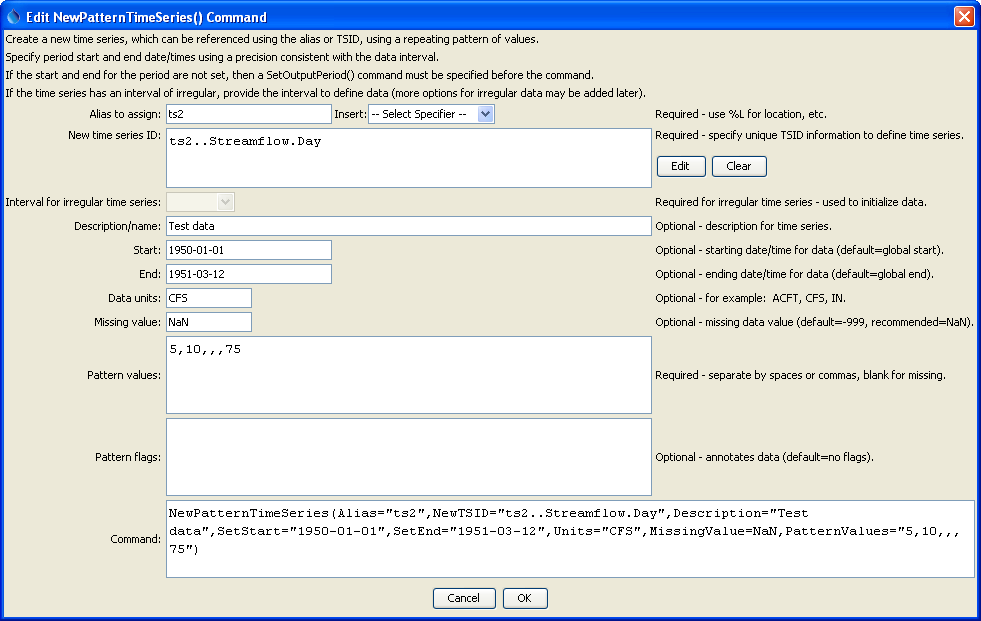

# TSTool / Command / NewPatternTimeSeries #

*   [Overview](#overview)
*   [Command Editor](#command-editor)
*   [Command Syntax](#command-syntax)
*   [Examples](#examples)
*   [Troubleshooting](#troubleshooting)
*   [See Also](#see-also)

-------------------------

## Overview ##

The `NewPatternTimeSeries` command creates a new time series containing a repeating pattern of numbers.
This command is useful for generating data to test other commands.

## Command Editor ##

The command is available in the following TSTool menu:

*   ***Commands / Create Time Series***

The following dialog is used to edit the command and illustrates the syntax of the command.

**<p style="text-align: center;">

</p>**

**<p style="text-align: center;">
`NewPatternTimeSeries` Command Editor (<a href="../NewPatternTimeSeries.png">see also the full-size image</a>)
</p>**

## Command Syntax ##

The command syntax is as follows:

```text
NewPatternTimeSeries(Parameter="Value",...)
```
The following older command syntax is updated to the above syntax when a command file is read:

```text
TS Alias = NewPatternTimeSeries(Parameter=Value,…)
```

**<p style="text-align: center;">
Command Parameters
</p>**

|**Parameter**&nbsp;&nbsp;&nbsp;&nbsp;&nbsp;&nbsp;&nbsp;&nbsp;&nbsp;&nbsp;&nbsp;&nbsp;&nbsp;&nbsp;&nbsp;&nbsp;&nbsp;&nbsp;&nbsp;|**Description**|**Default**&nbsp;&nbsp;&nbsp;&nbsp;&nbsp;&nbsp;&nbsp;&nbsp;&nbsp;&nbsp;&nbsp;&nbsp;&nbsp;&nbsp;&nbsp;&nbsp;&nbsp;&nbsp;&nbsp;&nbsp;&nbsp;&nbsp;&nbsp;&nbsp;&nbsp;&nbsp;&nbsp;|
|--------------|-----------------|-----------------|
|`Alias`<br>**required**|The alias to assign to the time series, as a literal string or using the special formatting characters listed by the command editor.  The alias is a short identifier used by other commands to locate time series for processing, as an alternative to the time series identifier (`TSID`).  Can be specified using processor `${Property}`.|None – must be specified.|
|`NewTSID`<br>**required**|The time series identifier to be assigned to the new time series, which is useful to avoid confusion with the original time series.  Can be specified using processor `${Property}`.|None – must be specified.|
|`IrregularInterval`| Interval to use when populating irregular interval time series.  It is recommended that the newer convention interval like `IrregHour` is used in the `NewTSID` rather than generic `Irregular`. In any case, this parameter defines the spacing of the irregular data (e.g., `06Hour` would result in 4 values per day for a time series with `IrregHour` interval). | Must be specified for irregular interval time series.|
|`Description`|Description for the time series.  Can be specified using processor `${Property}`.|None.|
|`SetStart`<br>**required**|Start date/time to set data.  Can be specified using processor `${Property}`.|None – must be specified.|
|`SetEnd`<br>**required**|End date/time to set data.  Can be specified using processor `${Property}`.|None – must be specified.|
|`Units`|Units for the data values.  Can be specified using processor `${Property}`.|None.|
|`MissingValue`|Value to use to indicate missing data values.  `-999` is the default for historical reasons; however, `NaN` (not a number) is being phased in and should be specified if possible.  Time series can be missing and be flagged.  Can be specified using processor `${Property}`.|`-999`|
|`PatternValues`<br>**required**|Data values, separated by commas.  Missing values can be omitted (e.g., indicate with adjacent commas).|None – must be specified.|
|`PatternFlags`|Short strings to assign to the values (used to annotate graphs and other output) separated by commas.  Missing flags can be omitted (e.g., indicate with adjacent commas).|No flags are assigned.|

## Examples ##

See the [automated tests](https://github.com/OpenCDSS/cdss-app-tstool-test/tree/master/test/commands/NewPatternTimeSeries).

The following example command file illustrates how to create a pattern time series for testing:

```
NewPatternTimeSeries(Alias=”ts1”,NewTSID="ts1..Streamflow.Day",Description="Test data",SetStart="1950-01-01",SetEnd="1951-03-12",Units="CFS",PatternValues="5,10,12,13,75")
WriteDateValue(OutputFile=",Example_NewPatternTimeSeries_out.dv")
```

## Troubleshooting ##

See the main [TSTool Troubleshooting](../../troubleshooting/troubleshooting.md) documentation.

## See Also ##

*   [`NewTimeSeries`](../NewTimeSeries/NewTimeSeries.md) command
