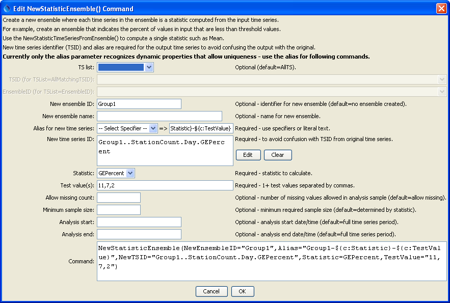

# Learn TSTool / Command / NewStatisticEnsemble #

* [Overview](#overview)
* [Command Editor](#command-editor)
* [Command Syntax](#command-syntax)
* [Examples](#examples)
* [Troubleshooting](#troubleshooting)
* [See Also](#see-also)

-------------------------

## Overview ##

The `NewStatisticEnsemble` command takes as input multiple related time series
(must have the same interval and units) and creates one or more output statistic time series,
and optionally an ensemble containing the time series.
This command facilitates computation of “histogram” types of
statistics such as counts and percentages.  Examples of use include:
	
* For all temperature time series in an area, show the percentage of stations reporting above various thresholds.
This indicates the variability of temperatures in an area.
* After computing the nonexceedance probability on cumulative precipitation time series,
compute the percentage of stations with different nonexceedance probabilities.
This is an indicator of drought in an area.
	
Statistics like `Mean` are not computed by this command because they can be computed
with the [`NewStatisticTimeSeriesFromEnsemble`](../NewStatisticTimeSeriesFromEnsemble/NewStatisticTimeSeriesFromEnsemble)
command and result in only one output time series,
whereas this command is designed to facilitate creating multiple output time series.

## Command Editor ##

The following dialog is used to edit the command and illustrates the syntax of the command.
<a href="../NewStatisticEnsemble.png">See also the full-size image.</a>



**<p style="text-align: center;">
`NewStatisticEnsemble` Command Editor
</p>**

## Command Syntax ##

The command syntax is as follows:

```text
NewStatisticEnsemble(Parameter="Value",...)
```
**<p style="text-align: center;">
Command Parameters
</p>**

|**Parameter**&nbsp;&nbsp;&nbsp;&nbsp;&nbsp;&nbsp;&nbsp;&nbsp;&nbsp;&nbsp;&nbsp;&nbsp;&nbsp;&nbsp;&nbsp;&nbsp;&nbsp;&nbsp;&nbsp;|**Description**|**Default**&nbsp;&nbsp;&nbsp;&nbsp;&nbsp;&nbsp;&nbsp;&nbsp;&nbsp;&nbsp;&nbsp;&nbsp;&nbsp;&nbsp;&nbsp;&nbsp;&nbsp;&nbsp;&nbsp;&nbsp;&nbsp;&nbsp;&nbsp;&nbsp;&nbsp;&nbsp;&nbsp;|
|--------------|-----------------|-----------------|
|`TSList`|Indicates the list of time series to be processed, one of:<br><ul><li>`AllMatchingTSID` – all time series that match the TSID (single TSID or TSID with wildcards) will be processed.</li><li>`AllTS` – all time series before the command.</li><li>`EnsembleID` – all time series in the ensemble will be processed (see the EnsembleID parameter).</li><li>`FirstMatchingTSID` – the first time series that matches the TSID (single TSID or TSID with wildcards) will be processed.</li><li>`LastMatchingTSID` – the last time series that matches the TSID (single TSID or TSID with wildcards) will be processed.</li><li>`SelectedTS` – the time series are those selected with the [`SelectTimeSeries`](../SelectTimeSeries/SelectTimeSeries) command.</li></ul> | `AllTS` |
|`TSID`|The time series identifier or alias for the time series to be processed, using the `*` wildcard character to match multiple time series.  Can be specified using `${Property}`.|Required if `TSList=*TSID`|
|`EnsembleID`|The ensemble to be processed, if processing an ensemble. Can be specified using `${Property}`.|Required if `TSList=*EnsembleID`|
|`NewEnsembleID`|The new ensemble identifier.  If not specified a new ensemble will not be created; however, statistic time series that are created will be available to other commands.|No ensemble will be created.|
|`NewEnsembleName`|The name for the new ensemble.|Blank.|
|`Alias`<br>**required**|The alias to assign to the new statistic time series, as a literal string or using the special formatting characters listed by the command editor.  The alias is a short identifier used by other commands to locate time series for processing, as an alternative to the time series identifier (TSID).  The following specifiers are recognized, using the command property notation:<ul><li>`${c:Statistic}` – the `Statistic` parameter value</ul><li>`${c:TestValue}` – the `TestValue` parameter value, assigned in order to output time series|None – must be specified.|
|`NewTSID`<br>**required**|The time series identifier to be assigned to the new time series.  This parameter currently does not allow the same dynamic properties as the `Alias` parameter, which results in duplicate TSIDs in output.  Therefore, use the alias in following commands.  **This issue will be resolved in a future software release**.|None – must be specified.|
|`Statistic`<br>**required**|See the Available Statistics table below.|None – must be specified.|
|`TestValue`|Test value(s) used when analyzing the statistic.  For example, if the statistic is `LECount`, then the test values are the values checked in order to determine the count.  Multiple values can be specified, separated by commas.|Required.|
|`AllowMissingCount`|The number of missing values in the sample for a date/time in order to compute the statistic.|Allow any number of missing values.|
|`MinimumSampleSize`|The minimum sample size for a date/time in order to compute the statistic.|No minimum, although the statistic may have requirements.|
|`AnalysisStart`|The starting date/time for the analysis using calendar dates (e.g., `2001-01-01`), with precision consistent with the time series interval.  This will limit the data being analyzed and defines the length of the output time series.|Analyze the full period.|
|`AnalysisEnd`|The ending date/time for the analysis using calendar dates (e.g., `2001-01-01`), with precision consistent with the time series interval.|Analyze the full period.|

The following statistics are computed from a sample determined using the input time series, for each date/time in the analysis period. 

**<p style="text-align: center;">
Available Statistic
</p>**

|**Statistic**&nbsp;&nbsp;&nbsp;&nbsp;&nbsp;&nbsp;&nbsp;&nbsp;&nbsp;&nbsp;&nbsp;|**Description**|**Limitations**|
|--------------|-----------------|-----------------|
|`GECount`|Count of values >= `TestValue`.||
|`GEPercent`|Percent of values >= `TestValue`, based on the number of non-missing values.|Set to missing if sample size is zero.|
|`GTCount`|Count of values > `TestValue`.||
|`GTPercent`|Percent of values > `TestValue`, based on the number of non-missing values.|Set to missing if sample size is zero.|
|`LECount`|Count of values <= `TestValue`.||
|`LEPercent`|Percent of values <= `TestValue`, based on the number of non-missing values.|Set to missing if sample size is zero.|
|`LTCount`|Count of values < `TestValue`.||
|`LTPercent`|Percent of values < `TestValue`, based on the number of non-missing values.|Set to missing if sample size is zero.|

## Examples ##

See the [automated tests](https://github.com/OpenWaterFoundation/cdss-app-tstool-test/tree/master/test/regression/commands/general/NewStatisticEnsemble).

The following example determines the percent of values that are >= several threshold values:

```
# Test creating a statistic ensemble for day interval time series, statistic=GEPercent
# The time series have different periods in order to test iteration logic
# Also sprinkle some missing values into the period
StartLog(LogFile="Results/Test_NewStatisticEnsemble_Day_GEPercent.TSTool.log")
RemoveFile(InputFile="Results/Test_NewStatisticEnsemble_Day_GEPercent_out.dv",IfNotFound=Ignore)
# Create enough time series to have a reasonable sample size
NewPatternTimeSeries(Alias="ts1",NewTSID="ts1..Precip.Day",Description="Test data 1",SetStart="1950-01-01",SetEnd="1951-03-12",Units="CFS",PatternValues="1.01,1.02,,1.04,1.04,1.06,1.07,1.08,1.09,1.10,1.11,1.12")
NewPatternTimeSeries(Alias="ts2",NewTSID="ts2..Precip.Day",Description="Test data 2",SetStart="1950-03-01",SetEnd="1951-05-12",Units="CFS",PatternValues="2.01,2.02,2.03,2.04,2.04,2.06,2.07,2.08,2.09,2.10,2.11,2.12")
NewPatternTimeSeries(Alias="ts3",NewTSID="ts3..Precip.Day",Description="Test data 3",SetStart="1950-01-01",SetEnd="1951-03-12",Units="CFS",PatternValues="3.01,3.02,3.03,3.04,3.04,3.06,3.07,3.08,3.09,3.10,3.11,3.12")
NewPatternTimeSeries(Alias="ts4",NewTSID="ts4..Precip.Day",Description="Test data 4",SetStart="1950-01-01",SetEnd="1951-05-12",Units="CFS",PatternValues="4.01,4.02,4.03,4.04,4.04,4.06,4.07,4.08,4.09,4.10,4.11,4.12")
NewPatternTimeSeries(Alias="ts5",NewTSID="ts5..Precip.Day",Description="Test data 5",SetStart="1950-01-01",SetEnd="1951-03-12",Units="CFS",PatternValues="5.01,5.02,5.03,5.04,5.04,5.06,5.07,,5.09,5.10,5.11,5.12")
NewPatternTimeSeries(Alias="ts6",NewTSID="ts6..Precip.Day",Description="Test data 6",SetStart="1950-01-01",SetEnd="1951-05-12",Units="CFS",PatternValues="6.01,6.02,6.03,6.04,6.04,6.06,6.07,6.08,6.09,6.10,6.11,6.12")
NewPatternTimeSeries(Alias="ts7",NewTSID="ts7..Precip.Day",Description="Test data 7",SetStart="1950-01-01",SetEnd="1951-03-12",Units="CFS",PatternValues="7.01,7.02,7.03,7.04,7.04,7.06,7.07,7.08,7.09,7.10,7.11,7.12")
NewPatternTimeSeries(Alias="ts8",NewTSID="ts8..Precip.Day",Description="Test data 8",SetStart="1950-01-01",SetEnd="1951-05-12",Units="CFS",PatternValues="8.01,8.02,8.03,8.04,8.04,8.06,8.07,8.08,8.09,,8.11,8.12")
NewPatternTimeSeries(Alias="ts9",NewTSID="ts9..Precip.Day",Description="Test data 9",SetStart="1950-01-01",SetEnd="1951-03-12",Units="CFS",PatternValues="9.01,9.02,9.03,9.04,9.04,9.06,9.07,9.08,9.09,9.10,9.11,9.12")
NewPatternTimeSeries(Alias="ts10",NewTSID="ts10..Precip.Day",Description="Test data 10",SetStart="1950-03-01",SetEnd="1951-05-12",Units="CFS",PatternValues="10.01,10.02,10.03,10.04,10.04,10.06,10.07,10.08,10.09,10.10,10.11,10.12")
# Create a statistic ensemble from the input
NewStatisticEnsemble(NewEnsembleID="Group1",Alias="Group1-${c:Statistic}-${c:TestValue}",NewTSID="Group1..StationCount.Day.GEPercent",Statistic=GEPercent,TestValue="11,7,2")
```

## Troubleshooting ##

## See Also ##

* [`NewStatisticTimeSeriesFromEnsemble`](../NewStatisticTimeSeriesFromEnsemble/NewStatisticTimeSeriesFromEnsemble) command
* [`SelectTimeSeries`](../SelectTimeSeries/SelectTimeSeries) command
