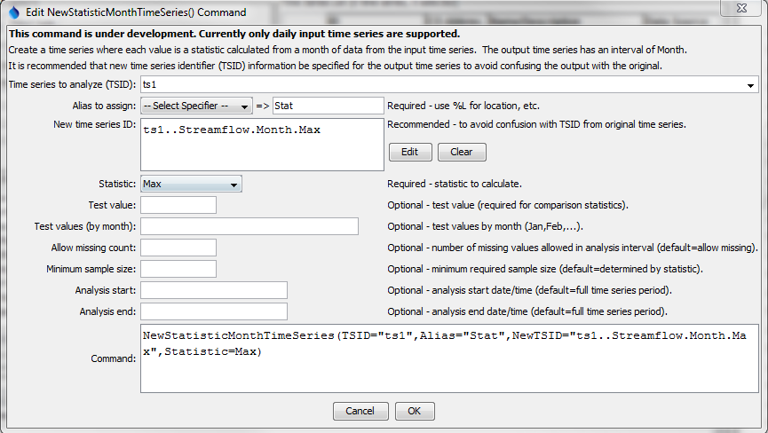

# TSTool / Command / NewStatisticMonthTimeSeries #

* [Overview](#overview)
* [Command Editor](#command-editor)
* [Command Syntax](#command-syntax)
* [Examples](#examples)
* [Troubleshooting](#troubleshooting)
* [See Also](#see-also)

-------------------------

## Overview ##

This command is under development.

The `NewStatisticMonthTimeSeries` command creates a new month interval time series,
where each monthly value in the resulting time series contains a statistic
determined from the data sample from the corresponding month in the original time series.
For example, if the original time series has a daily time step,
then the sample that is analyzed will contain 28-31 values (depending on leap year and month).

For hourly and finer interval, values are considered to be in a month when the
month in the date/time matches the month of interested.
This may lead to some issues if the last value in a month is actually recorded at
hour 0 or later of the following month.  **Handling other than daily data is not yet implemented**.

See also the [Statistic Examples](../../examples/examples.md#statistic-examples) for a list of commands that calculate statistics.

## Command Editor ##

The following dialog is used to edit the command and illustrates the syntax of the command.

**<p style="text-align: center;">

</p>**

**<p style="text-align: center;">
`NewStatisticMonthTimeSeries` Command Editor (<a href="../NewStatisticMonthTimeSeries.png">see also the full-size image</a>)
</p>**

## Command Syntax ##

The command syntax is as follows:

```text
NewStatisticMonthTimeSeries(Parameter="Value",...)
```
**<p style="text-align: center;">
Command Parameters
</p>**

|**Parameter**&nbsp;&nbsp;&nbsp;&nbsp;&nbsp;&nbsp;&nbsp;&nbsp;&nbsp;&nbsp;&nbsp;&nbsp;&nbsp;&nbsp;&nbsp;&nbsp;&nbsp;&nbsp;&nbsp;|**Description**|**Default**&nbsp;&nbsp;&nbsp;&nbsp;&nbsp;&nbsp;&nbsp;&nbsp;&nbsp;&nbsp;&nbsp;&nbsp;&nbsp;&nbsp;&nbsp;&nbsp;&nbsp;&nbsp;&nbsp;&nbsp;&nbsp;&nbsp;&nbsp;&nbsp;&nbsp;&nbsp;&nbsp;|
|--------------|-----------------|-----------------|
|`TSID`<br>**required**|The time series identifier (or alias) of the time series to analyze.  In the future this command will support processing multiple time series.|None – must be specified.|
|`Alias`<br>**required**|The alias to assign to the output time series, as a literal string or using the special formatting characters listed by the command editor (which will use properties of the input time series).  The alias is a short identifier used by other commands to locate time series for processing, as an alternative to the time series identifier (`TSID`).|None – must be specified.|
|`NewTSID`|The time series identifier to be assigned to the new time series, which is useful to avoid confusion with the original time series.|Use the same identifier as the original time series, with an interval of Month and a scenario matching the statistic.|
|`Statistic`<br>**required**|See the Available Statistics table below.|None – must be specified.|
|`TestValue`|A test value used when analyzing the statistic.|This parameter is required for some statistics and not used for others.  See the statistics table below.|
|`MonthTestValues`|Twelve monthly test values separated by commas, with January’s value first.|Single test value will be used.|
|`AllowMissingCount`|The number of missing values allowed in the source interval(s) in order to produce a result.|Allow any number of missing values.|
|`MinimumSampleSize`|The minimum sample size in order to compute the statistic.|No minimum, although the statistic may have requirements.|
|`AnalysisStart`|The starting date/time for the analysis using calendar dates (e.g., 2001-01), with month precision.  This will limit the data being analyzed and defines the output period.|Analyze the full period, extending the period to include full months.|
|`AnalysisEnd`|The starting date/time for the analysis using calendar dates (e.g., 2001-01), with month precision.  This will limit the data being analyzed and defines the output period.|Analyze the full period, extending the period to include full months.|

The following statistics are computed from a sample determined from each of data from the input time series.

**<p style="text-align: center;">
Available Statistics
</p>**

|**Parameter**&nbsp;&nbsp;&nbsp;&nbsp;&nbsp;&nbsp;&nbsp;&nbsp;&nbsp;&nbsp;&nbsp;&nbsp;&nbsp;&nbsp;&nbsp;&nbsp;&nbsp;&nbsp;&nbsp;|**Description**|**Limitations**&nbsp;&nbsp;&nbsp;&nbsp;&nbsp;&nbsp;&nbsp;&nbsp;&nbsp;&nbsp;&nbsp;&nbsp;&nbsp;&nbsp;&nbsp;&nbsp;&nbsp;&nbsp;&nbsp;&nbsp;&nbsp;&nbsp;&nbsp;&nbsp;&nbsp;&nbsp;&nbsp;|
|--------------|-----------------|-----------------|
|`DayOfCentroid`|The day of the month (1-31) that is the centroid of the values, computed as sum(DayOfMonth`*`value)/sum(values).|Input time series must be daily or smaller interval.|
|`DayOfFirstGE`|Day of the month (1-31) for the first data value >= `TestValue`.|Input time series must be daily or smaller interval.|
|`DayOfFirstGT`|Similar to `DayOfFirstGE`, for values > `TestValue`.|Input time series must be daily or smaller interval.|
|`DayOfFirstLE`|Similar to `DayOfFirstGE`, for values <= `TestValue`.|Input time series must be daily or smaller interval.|
|`DayOfFirstLT`|Similar to `DayOfFirstGE`, for values < `TestValue`.|Input time series must be daily or smaller interval.|
|`DayOfLastGE`|Day of the month (1-31) for the last data value >= `TestValue`.|Input time series must be daily or smaller interval.|
|`DayOfLastGT`|Similar to `DayOfLastGE`, for values > `TestValue`.|Input time series must be daily or smaller interval.|
|`DayOfLastLE`|Similar to `DayOfLastGE`, for values <= `TestValue`.|Input time series must be daily or smaller interval.|
|`DayOfLastLT`|Similar to `DayOfLastGE`, for values < `TestValue`.|Input time series must be daily or smaller interval.|
|`DayOfMax`|Day of the month (1-31) for the first maximum value in the time series.|Input time series must be daily or smaller interval.|
|`DayOfMin`|Day of the month (1-31) for the first minimum value in the time series.|Input time series must be daily or smaller interval.|
|`GECount`|Count of values in a month >= `TestValue`.||
|`GEPercent`|Percent of values in a month >= `TestValue`, based on the total number of points in the month.||
|`GTCount`|Count of values in a month > `TestValue`.||
|`GTPercent`|Percent of values in a month > `TestValue`, based on the total number of points in the month.||
|`LECount`|Count of values in a month <= `TestValue`.||
|`LEPercent`|Percent of values in a month <= `TestValue`, based on the total number of points in the month.||
|`LTCount`|Count of values in a month < `TestValue`.||
|`LTPercent`|Percent of values in a month < `TestValue`, based on the total number of points in the month.||
|`Max`|Maximum value in a month.||
|`Mean`|Mean of values in a month.||
|`Min`|Minimum value in a month.||
|`MissingCount`|Number of missing values in a month.||
|`MissingPercent`|Percent of missing values in a month.||
|`NonMissingCount`|Number of non-missing values in a month.||
|`NonMissingPercent`|Percent of non-missing values in a month.||
|`Total`|Total of values in a month.||

## Examples ##

See the [automated tests](https://github.com/OpenCDSS/cdss-app-tstool-test/tree/master/test/commands/NewStatisticMonthTimeSeries).

## Troubleshooting ##

## See Also ##

* [Statistic Examples](../../examples/examples.md#statistic-examples)
* [`CalculateTimeSeriesStatistic`](../CalculateTimeSeriesStatistic/CalculateTimeSeriesStatistic.md) command
* [`CheckTimeSeries`](../CheckTimeSeries/CheckTimeSeries.md) commands.
* [`NewStatisticTimeSeries`](../NewStatisticTimeSeries/NewStatisticTimeSeries.md) command
* [`NewStatisticTimeSeriesFromEnsemble`](../NewStatisticTimeSeriesFromEnsemble/NewStatisticTimeSeriesFromEnsemble.md) command
* [`NewStatisticYearTS`](../NewStatisticYearTS/NewStatisticYearTS.md) command
* [`SelectTimeSeries`](../SelectTimeSeries/SelectTimeSeries.md) command
